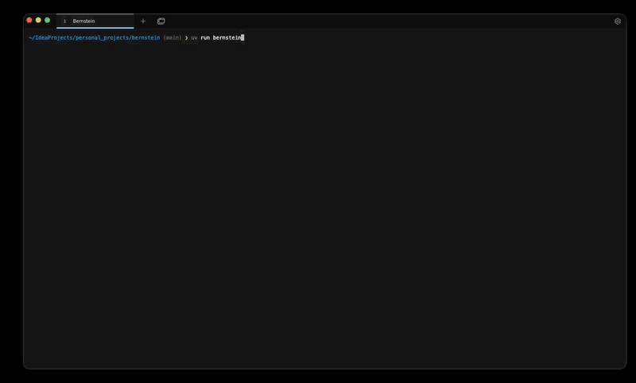

<div align="center">

<picture>
  <source media="(prefers-color-scheme: dark)" srcset="docs/assets/logo-dark.svg">
  <source media="(prefers-color-scheme: light)" srcset="docs/assets/logo-light.svg">
  
</picture>

<br>

> *"To achieve great things, two things are needed: a plan and not quite enough time."* — Leonard Bernstein

### Orchestrate any AI coding agent. Any model. One command.



[](https://github.com/chernistry/bernstein/actions/workflows/ci.yml)
[](https://pypi.org/project/bernstein/)
[](https://python.org)
[](LICENSE)

[Documentation](https://bernstein.readthedocs.io/) &middot; [Getting Started](docs/getting-started/GETTING_STARTED.md) &middot; [Glossary](docs/reference/GLOSSARY.md) &middot; [Limitations](docs/reference/KNOWN_LIMITATIONS.md)

</div>

---

Bernstein takes a goal, breaks it into tasks, assigns them to AI coding agents running in parallel, verifies the output, and merges the results. When agents succeed, the janitor merges verified work into main. Failed tasks retry or route to a different model.

### Why deterministic coordination

LLMs write code well. They schedule work across other LLMs badly. Most agent orchestrators use an LLM as the coordinator and hit the same failure modes: non-reproducible plans, silent coordination drift, token burn on meta-decisions a 200-line event loop does reliably. Bernstein inverts that. One LLM call upfront decomposes the goal; after that, scheduling, worktree isolation, quality gates, and HMAC-chained audit replay are all deterministic Python. Every run is bit-identically replayable.

No framework to learn. No vendor lock-in. Agents are interchangeable workers. Swap any agent, any model, any provider.

```bash
pipx install bernstein
cd your-project && bernstein init
bernstein -g "Add JWT auth with refresh tokens, tests, and API docs"
```

```
$ bernstein -g "Add JWT auth"
[manager] decomposed into 4 tasks
[agent-1] claude-sonnet: src/auth/middleware.py  (done, 2m 14s)
[agent-2] codex:         tests/test_auth.py      (done, 1m 58s)
[verify]  all gates pass. merging to main.
```

Also available via `pip`, `uv tool install`, `brew`, `dnf copr`, and `npx bernstein-orchestrator`. See [install options](#install).

#### Wall of fame

> *"lol, good luck, keep vibecoding shit that you have no idea about xD"* — [PeaceFirePL](https://www.reddit.com/r/coolgithubprojects/comments/1sc7pxn/comment/oel89qf/), Reddit

## Supported agents

Bernstein auto-discovers installed CLI agents. Mix them in the same run. Cheap local models for boilerplate, heavier cloud models for architecture.

17 CLI coding agents plus a generic wrapper for anything with `--prompt`.

| Agent | Models | Install |
|-------|--------|---------|
| [Claude Code](https://docs.anthropic.com/en/docs/claude-code) | Opus 4, Sonnet 4.6, Haiku 4.5 | `npm install -g @anthropic-ai/claude-code` |
| [Codex CLI](https://github.com/openai/codex) | GPT-5, GPT-5 mini | `npm install -g @openai/codex` |
| [Gemini CLI](https://github.com/google-gemini/gemini-cli) | Gemini 2.5 Pro, Gemini Flash | `npm install -g @google/gemini-cli` |
| [Cursor](https://www.cursor.com) | Sonnet 4.6, Opus 4, GPT-5 | [Cursor app](https://www.cursor.com) |
| [Aider](https://aider.chat) | Any OpenAI/Anthropic-compatible | `pip install aider-chat` |
| [Amp](https://ampcode.com) | Amp-managed | `npm install -g @sourcegraph/amp` |
| [Cody](https://sourcegraph.com/cody) | Sourcegraph-hosted | `npm install -g @sourcegraph/cody` |
| [Continue](https://continue.dev) | Any OpenAI/Anthropic-compatible | `npm install -g @continuedev/cli` (binary: `cn`) |
| [Goose](https://block.github.io/goose/) | Any provider Goose supports | See [Goose docs](https://block.github.io/goose/) |
| [IaC](https://www.terraform.io/) (Terraform/Pulumi) | Any provider the base agent uses | Built-in |
| [Kilo](https://kilo.dev) | Kilo-hosted | See [Kilo docs](https://kilo.dev) |
| [Kiro](https://kiro.dev) | Kiro-hosted | See [Kiro docs](https://kiro.dev) |
| [Ollama](https://ollama.ai) + Aider | Local models (offline) | `brew install ollama` |
| [OpenCode](https://opencode.ai) | Any provider OpenCode supports | See [OpenCode docs](https://opencode.ai) |
| [Qwen](https://github.com/QwenLM/qwen-code) | Qwen Code models | `npm install -g @qwen-code/qwen-code` |
| [Cloudflare Agents](https://developers.cloudflare.com/agents/) | Workers AI models | `bernstein cloud login` |
| **Generic** | Any CLI with `--prompt` | Built-in |

Any adapter also works as the **internal scheduler LLM**. Run the entire stack without any specific provider:

```yaml
internal_llm_provider: gemini            # or qwen, ollama, codex, goose, ...
internal_llm_model: gemini-2.5-pro
```

> [!TIP]
> Run `bernstein --headless` for CI pipelines. No TUI, structured JSON output, non-zero exit on failure.

## Quick start

```bash
cd your-project
bernstein init                    # creates .sdd/ workspace + bernstein.yaml
bernstein -g "Add rate limiting"  # agents spawn, work in parallel, verify, exit
bernstein live                    # watch progress in the TUI dashboard
bernstein stop                    # graceful shutdown with drain
```

For multi-stage projects, define a YAML plan:

```bash
bernstein run plan.yaml           # skips LLM planning, goes straight to execution
bernstein run --dry-run plan.yaml # preview tasks and estimated cost
```

## How it works

1. **Decompose**. The manager breaks your goal into tasks with roles, owned files, and completion signals.
2. **Spawn**. Agents start in isolated git worktrees, one per task. Main branch stays clean.
3. **Verify**. The janitor checks concrete signals: tests pass, files exist, lint clean, types correct.
4. **Merge**. Verified work lands in main. Failed tasks get retried or routed to a different model.

The orchestrator is a Python scheduler, not an LLM. Scheduling decisions are deterministic, auditable, and reproducible.

## Cloud execution (Cloudflare)

Bernstein can run agents on Cloudflare Workers instead of locally. The `bernstein cloud` CLI handles deployment and lifecycle.

- **Workers**. Agent execution on Cloudflare's edge, with Durable Workflows for multi-step tasks and automatic retry.
- **V8 sandbox isolation**. Each agent runs in its own isolate, no container overhead.
- **R2 workspace sync**. Local worktree state syncs to R2 object storage so cloud agents see the same files.
- **Workers AI** (experimental). Use Cloudflare-hosted models as the LLM provider, no external API keys required.
- **D1 analytics**. Task metrics and cost data stored in D1 for querying.
- **Vectorize**. Semantic cache backed by Cloudflare's vector database.
- **Browser rendering**. Headless Chrome on Workers for agents that need to inspect web output.
- **MCP remote transport**. Expose or consume MCP servers over Cloudflare's network.

```bash
bernstein cloud login      # authenticate with Bernstein Cloud
bernstein cloud deploy     # push agent workers
bernstein cloud run plan.yaml  # execute a plan on Cloudflare
```

A `bernstein cloud init` scaffold for `wrangler.toml` and bindings is planned.

## Capabilities

**Core orchestration**. Parallel execution, git worktree isolation, janitor verification, quality gates (lint, types, PII scan), cross-model code review, circuit breaker for misbehaving agents, token growth monitoring with auto-intervention.

**Intelligence**. Contextual bandit router for model/effort selection. Knowledge graph for codebase impact analysis. Semantic caching saves tokens on repeated patterns. Cost anomaly detection (burn-rate alerts). Behavior anomaly detection with Z-score flagging.

**Controls**. HMAC-chained audit logs, policy engine, PII output gating, WAL-backed crash recovery (experimental multi-worker safety), OAuth 2.0 PKCE. SSO/SAML/OIDC support is in progress.

**Observability**. Prometheus `/metrics`, OTel exporter presets, Grafana dashboards. Per-model cost tracking (`bernstein cost`). Terminal TUI and web dashboard. Agent process visibility in `ps`.

**Ecosystem**. MCP server mode, A2A protocol support, GitHub App integration, pluggy-based plugin system, multi-repo workspaces, cluster mode for distributed execution, self-evolution via `--evolve` (experimental).

Full feature matrix: [FEATURE_MATRIX.md](docs/reference/FEATURE_MATRIX.md)

## How it compares

| Feature | Bernstein | CrewAI | AutoGen [^autogen] | LangGraph |
|---------|-----------|--------|---------|-----------|
| Orchestrator | Deterministic code | LLM-driven | LLM-driven | Graph + LLM |
| Works with | Any CLI agent (17 adapters) | Python SDK classes | Python agents | LangChain nodes |
| Git isolation | Worktrees per agent | No | No | No |
| Verification | Janitor + quality gates | No | No | Conditional edges |
| Cost tracking | Built-in | No | No | No |
| State model | File-based (.sdd/) | In-memory + SQLite checkpoint | In-memory | Checkpointer |
| Self-evolution | Built-in | No | No | No |
| Declarative plans (YAML) | Yes | Yes | No | Partial (JSON config) |
| Model routing per task | Yes | No | No | Manual |
| MCP support | Yes | Yes | Yes (client) | Yes (client + server) |
| Agent-to-agent chat | Bulletin board | Yes | Yes | No |
| Web UI | TUI + web dashboard | Yes | Yes | Yes (Studio + LangSmith) |
| Cloud hosted option | Yes (Cloudflare) | Yes | No | Yes |
| Built-in RAG/retrieval | Yes (codebase FTS5 + BM25) | Yes | Yes | Yes |

*Last verified: 2026-04-17. See [full comparison pages](docs/compare/README.md) for detailed feature matrices.*

[^autogen]: AutoGen is in maintenance mode; successor is Microsoft Agent Framework 1.0.

## Monitoring

```bash
bernstein live       # TUI dashboard
bernstein dashboard  # web dashboard
bernstein status     # task summary
bernstein ps         # running agents
bernstein cost       # spend by model/task
bernstein doctor     # pre-flight checks
bernstein recap      # post-run summary
bernstein trace <ID> # agent decision trace
bernstein run-changelog --hours 48  # changelog from agent-produced diffs
bernstein explain <cmd>  # detailed help with examples
bernstein dry-run    # preview tasks without executing
bernstein dep-impact # API breakage + downstream caller impact
bernstein aliases    # show command shortcuts
bernstein config-path    # show config file locations
bernstein init-wizard    # interactive project setup
bernstein debug-bundle   # collect logs, config, and state for bug reports
bernstein skills list    # discoverable skill packs (progressive disclosure)
bernstein skills show <name>  # print a skill body with its references
```

```bash
bernstein fingerprint build --corpus-dir ~/oss-corpus  # build local similarity index
bernstein fingerprint check src/foo.py                 # check generated code against the index
```

## Install

| Method | Command |
|--------|---------|
| **pip** | `pip install bernstein` |
| **pipx** | `pipx install bernstein` |
| **uv** | `uv tool install bernstein` |
| **Homebrew** | `brew tap chernistry/bernstein && brew install bernstein` |
| **Fedora / RHEL** | `sudo dnf copr enable alexchernysh/bernstein && sudo dnf install bernstein` |
| **npm** (wrapper) | `npx bernstein-orchestrator` |

Editor extensions: [VS Marketplace](https://marketplace.visualstudio.com/items?itemName=alex-chernysh.bernstein) &middot; [Open VSX](https://open-vsx.org/extension/alex-chernysh/bernstein)

## Contributing

PRs welcome. See [CONTRIBUTING.md](CONTRIBUTING.md) for setup and code style.

## Support

If Bernstein saves you time: [GitHub Sponsors](https://github.com/sponsors/chernistry)

Contact: [forte@bernstein.run](mailto:forte@bernstein.run)

## Star History

[](https://star-history.com/#chernistry/bernstein&Date)

## License

[Apache License 2.0](LICENSE)

---

<!-- mcp-name: io.github.chernistry/bernstein -->
