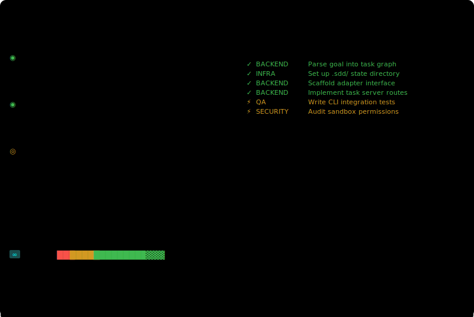
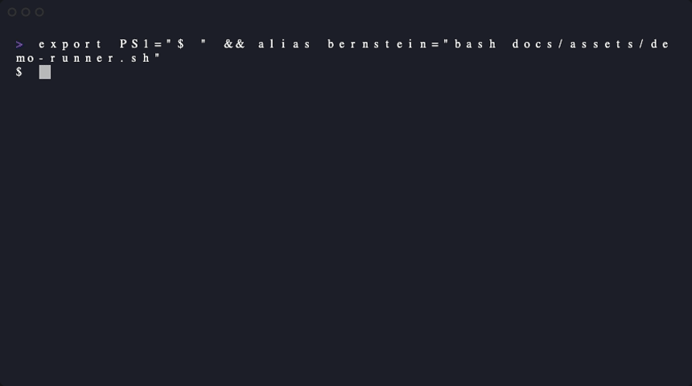

<div align="center">

<picture>
  <source media="(prefers-color-scheme: dark)" srcset="docs/assets/logo-dark.svg">
  <source media="(prefers-color-scheme: light)" srcset="docs/assets/logo-light.svg">
  
</picture>

<br>

### Declarative agent orchestration for engineering teams.
### One YAML. Multiple coding agents. Ship while you sleep.

<picture>
  <source media="(prefers-color-scheme: dark)" srcset="docs/assets/dashboard.svg">
  <source media="(prefers-color-scheme: light)" srcset="docs/assets/dashboard.svg">
  
</picture>

[](https://python.org)
[]()
[](LICENSE)
[](benchmarks/README.md)
[](docs/compatibility.md)
[](docs/compatibility.md)
[](https://github.com/sponsors/chernistry)
<!-- [](https://discord.gg/bernstein) -->

[Homepage](https://alexchernysh.com/bernstein) | [Documentation](https://chernistry.github.io/bernstein/) | [Known Limitations](docs/KNOWN_LIMITATIONS.md)

</div>

---

```bash
pipx install bernstein   # or: uv tool install bernstein
bernstein -g "Add JWT auth with refresh tokens, tests, and API docs"
```

> **Think of it as what Kubernetes did for containers, but for AI coding agents.** You declare a goal. The control plane decomposes it into tasks. Short-lived agents execute them in isolated worktrees — like pods. A janitor verifies the output before anything lands.

Bernstein takes a goal, breaks it into tasks, assigns them to AI coding agents running in parallel, verifies the output, and commits the results. You come back to working code, passing tests, and a clean git history.

**No framework to learn. No vendor lock-in.** If you have [Claude Code](https://docs.anthropic.com/en/docs/claude-code), [Codex CLI](https://github.com/openai/codex), [Cursor](https://www.cursor.com), [Gemini CLI](https://github.com/google-gemini/gemini-cli), or [Qwen](https://github.com/QwenLM/Qwen-Agent) installed, Bernstein uses them. Mix models in the same run — cheap free-tier agents for boilerplate, heavy models for architecture. Switch providers without rewriting anything. Agents spawn, work, exit. No context drift. No babysitting.

<picture>
  <source media="(prefers-color-scheme: dark)" srcset="docs/assets/architecture.svg">
  <source media="(prefers-color-scheme: light)" srcset="docs/assets/architecture.svg">
  
</picture>

The orchestrator is **deterministic Python** -- zero LLM tokens on coordination. A **janitor** verifies every result: tests pass, files exist, no regressions.

> **[Agentic engineering](https://thenewstack.io/vibe-coding-is-passe/)** is the practice of orchestrating AI agents to write code while humans own architecture and quality ([Karpathy, 2026](https://x.com/karpathy/status/1886192184808149383)). Most tools make you a **conductor** -- one agent, synchronous, pair-programming. Bernstein makes you an **orchestrator** -- multiple agents, parallel, asynchronous ([Osmani](https://addyosmani.com/blog/future-agentic-coding/)). No vibe coding. Deterministic scheduling, verified output, portable across providers.

> [!TIP]
> Run `bernstein --headless` for CI pipelines and overnight runs. Add `--evolve` for continuous self-improvement.

## Protocol Compatibility

Bernstein is tested against multiple protocol versions to ensure reliability across ecosystems:

- **MCP** (Model Context Protocol): [1.0, 1.1] ✅
- **A2A** (Agent-to-Agent): [0.2, 0.3] ✅
- **ACP** (Agent Communication Protocol): latest ✅

See the [Protocol Compatibility Matrix](docs/compatibility.md) for detailed test results and version support.

## Quick start

```bash
# 1. Install
pipx install bernstein          # or: uv tool install bernstein

# 2. Init (auto-detects project type, creates bernstein.yaml)
cd your-project
bernstein init

# 3. Run -- set a goal inline or edit bernstein.yaml first
bernstein -g "Add rate limiting and improve test coverage"
bernstein                       # reads from bernstein.yaml
```

See [`examples/quickstart/`](examples/quickstart/) for a ready-to-run example with a Flask app and pre-configured `bernstein.yaml`.

> **[The Bernstein Way](docs/the-bernstein-way.md)** — architecture tenets and default workflow

<!-- <details>
<summary><strong>Watch: terminal demo (GIF)</strong></summary>
<br>

</details> -->

<details>
<summary><strong>All CLI commands</strong></summary>

```bash
# Core
bernstein -g "goal"                # start orchestration with inline goal
bernstein                          # start from bernstein.yaml
bernstein init                     # initialize .sdd/ workspace
bernstein stop [--timeout N]       # graceful shutdown (--force for hard kill)
bernstein ps                       # show running agent processes
bernstein status                   # task summary, active agents, cost estimate
bernstein cost [--json] [--share]  # show cost, tokens, duration per model
bernstein demo [--real]            # zero-config demo (--real uses live agents)
bernstein quickstart               # zero-config demo: 3 tasks on Flask TODO API

# Monitoring
bernstein live [--classic]         # live TUI dashboard
bernstein dashboard                # open web dashboard in browser
bernstein doctor [--fix]           # health check: deps, keys, ports (--fix auto-repairs)
bernstein logs [-f] [-a AGENT]     # tail agent log output
bernstein trace <task_id>          # step-by-step agent decision trace
bernstein replay <run_id>          # re-run from a recorded trace
bernstein recap [--as-json]        # post-run summary: tasks, pass/fail, cost
bernstein diff <task_id>           # git diff for what an agent changed

# Task management
bernstein plan [--export]          # show task backlog (--export to JSON)
bernstein add-task TITLE           # inject a task into the running server
bernstein cancel <task_id>         # cancel a running or queued task
bernstein list-tasks [--status-filter] # list tasks with optional filters
bernstein sync                     # sync .sdd/backlog/open/ with task server
bernstein review                   # trigger immediate manager queue review
bernstein approve <task_id>        # approve a pending task review
bernstein reject <task_id>         # reject a pending task review
bernstein pending                  # list tasks waiting for approval

# Agent management
bernstein agents sync              # pull latest agent catalog
bernstein agents list              # list available agents
bernstein agents validate          # check catalog health
bernstein agents showcase          # show agent capabilities showcase
bernstein agents match QUERY       # find best agent for a task description
bernstein agents discover          # discover installed CLI agents

# CI autofix
bernstein ci fix <run-url>         # parse failing CI run, create fix task
bernstein ci watch <repo>          # continuous monitoring, auto-fix on failure

# Governance & audit
bernstein audit show               # recent audit log events
bernstein audit seal               # create Merkle seal of audit log
bernstein audit verify             # verify Merkle proof integrity
bernstein audit verify-hmac        # validate HMAC chain integrity
bernstein audit query              # search audit log (--event-type, --actor, --since)
bernstein verify --wal-integrity   # verify WAL hash chain
bernstein verify --determinism     # check execution fingerprint reproducibility
bernstein verify --memory-audit    # detect memory leaks in agent processes
bernstein verify --formal          # formal verification mode
bernstein manifest list            # list all run manifests
bernstein manifest show <run-id>   # display run manifest
bernstein manifest diff <a> <b>   # compare two run configurations

# Benchmarks & eval
bernstein benchmark run            # run golden benchmark suite
bernstein benchmark compare        # orchestrated vs. single-agent comparison
bernstein benchmark swe-bench      # run SWE-bench harness
bernstein eval run                 # run evaluation suite with scoring
bernstein eval report              # generate evaluation report
bernstein eval failures            # show evaluation failures

# Evolution
bernstein evolve run               # run autoresearch evolution loop
bernstein evolve review            # list evolution proposals
bernstein evolve approve <id>      # approve a proposal
bernstein evolve status            # show evolution pipeline status
bernstein evolve export            # export evolution proposals
bernstein ideate                   # creative evolution pipeline

# Advanced
bernstein chaos agent-kill         # kill a random agent (fault injection)
bernstein chaos rate-limit         # simulate API rate limiting
bernstein chaos file-remove        # remove files an agent depends on
bernstein chaos status             # show chaos experiment status
bernstein chaos slo                # check SLO compliance under chaos
bernstein gateway start            # start MCP gateway proxy
bernstein gateway replay <run-id>  # replay recorded MCP tool calls
bernstein workflow validate FILE   # validate a workflow YAML
bernstein workflow list            # list workflow DSL files
bernstein workflow show NAME       # show workflow details
bernstein mcp                      # run Bernstein as an MCP server
bernstein watch [DIR]              # monitor directory, re-run on changes
bernstein listen                   # voice command session (offline STT)
bernstein checkpoint [--goal]      # snapshot session progress
bernstein wrap-up [--stop]         # end session with structured brief

# Configuration & workspace
bernstein workspace                # show multi-repo workspace status
bernstein workspace clone          # clone missing repos
bernstein workspace validate       # check workspace health
bernstein config set KEY VALUE     # set a global config value
bernstein config get KEY           # show effective config value
bernstein config list              # list all config keys
bernstein config validate          # validate project configuration

# Utilities
bernstein retro [--since H]        # generate retrospective report
bernstein plugins                  # list active plugins
bernstein install-hooks            # install git hooks
bernstein completions              # generate shell completion scripts
bernstein self-update [--check]    # upgrade from PyPI (--rollback to revert)
bernstein worker --server URL      # join a cluster as a worker node
bernstein help-all                 # comprehensive help for all commands

# GitHub integration
bernstein github setup             # configure GitHub App integration
bernstein github test-webhook      # verify webhook configuration

# Quarantine
bernstein quarantine list          # list quarantined tasks
bernstein quarantine clear         # clear quarantine
```

</details>

## Agent catalogs

Hire specialist agents from [Agency](https://github.com/msitarzewski/agency-agents) (100+ agents, default) or plug in your own:

```yaml
# bernstein.yaml
catalogs:
  - name: agency
    type: agency
    source: https://github.com/msitarzewski/agency-agents
    priority: 100
  - name: my-team
    type: generic
    path: ./our-agents/
    priority: 50
```

## Self-evolution

Leave it running. It gets better.

```bash
bernstein --evolve --max-cycles 10 --budget 5.00
```

Analyzes metrics, proposes changes to prompts and routing rules, sandboxes them, and auto-applies what passes. Critical files are SHA-locked. Circuit breaker halts on test regression. Risk-stratified: L0 auto-apply, L1 sandbox-first, L2 human review, L3 blocked.

## Supported agents

| Agent | Provider | Models (Mar 2026) | CLI flag | Install |
|-------|----------|-------------------|----------|---------|
| [Aider](https://github.com/Aider-AI/aider) | OpenAI / Anthropic / any | any | `--cli aider` | `pip install aider-chat` |
| [Amp](https://ampcode.com) | Sourcegraph | opus 4.6, gpt-5.4 | `--cli amp` | `brew install amp` |
| [Claude Code](https://docs.anthropic.com/en/docs/claude-code) | Anthropic | opus 4.6, sonnet 4.6, haiku 4.5 | `--cli claude` | `npm install -g @anthropic-ai/claude-code` |
| [Codex CLI](https://github.com/openai/codex) | OpenAI | gpt-5.4, o3, o4-mini | `--cli codex` | `npm install -g @openai/codex` |
| [Cursor](https://www.cursor.com) | Cursor AI | sonnet 4.6, opus 4.6, gpt-5.4 | `--cli cursor` | Cursor app (sign in via app) |
| [Gemini CLI](https://github.com/google-gemini/gemini-cli) | Google | gemini-3-pro, 3-flash | `--cli gemini` | `npm install -g @google/gemini-cli` |
| [Qwen](https://github.com/QwenLM/Qwen-Agent) | Alibaba / OpenRouter | qwen3-coder, qwen-max | `--cli qwen` | `npm install -g qwen-code` |
| [Roo Code](https://github.com/RooVetGit/Roo-Code) | Anthropic / OpenAI / any | opus 4.6, sonnet 4.6, gpt-4o | `--cli roo-code` | VS Code extension (headless CLI) |
| Any CLI agent | Yours | pass-through | `--cli generic` | Provide `--cli-command` and `--prompt-flag` |

Mix and match in a single run — the orchestrator doesn't care which agent handles which task:

```bash
# Claude on architecture, Codex on tests, Gemini on docs
bernstein -g "Refactor auth module, add tests, update API docs" \
  --cli auto            # default: auto-detects installed agents
  # override per task via bernstein.yaml roles config
```

> **Why this matters:** every other agentic coding framework (OpenAI Agents SDK, Google ADK, Anthropic Agent SDK) ties your orchestration to one provider. Bernstein doesn't. Your prompts, task graphs, and agent roles are portable. Swap providers without touching your workflow.

See [`docs/adapters.html`](https://chernistry.github.io/bernstein/adapters.html) for a feature matrix and the "bring your own agent" guide.

<details>
<summary><strong>Specialist roles</strong></summary>

`manager` `backend` `frontend` `qa` `security` `architect` `devops` `reviewer` `docs` `ml-engineer` `prompt-engineer` `retrieval` `vp` `analyst` `resolver` `visionary`

Tasks default to `backend` if no role is specified. The orchestrator checks agent catalogs for a specialized match before falling back to built-in roles.

</details>

<details>
<summary><strong>Task server API</strong></summary>

```bash
# Create a task
curl -X POST http://127.0.0.1:8052/tasks \
  -H "Content-Type: application/json" \
  -d '{"title": "Add rate limiting", "role": "backend", "priority": 1}'

# List / status
curl http://127.0.0.1:8052/tasks?status=open
curl http://127.0.0.1:8052/status
```

Any tool, CI pipeline, Slack bot, or custom UI can create tasks and read status.

</details>

<details>
<summary><strong>How it compares</strong></summary>

|  | Bernstein | CrewAI | AutoGen | LangGraph | Ruflo |
|--|-----------|--------|---------|-----------|-------|
| Scheduling | Deterministic code | LLM-based | LLM-based | Graph | LLM-based |
| Agent lifetime | Short (minutes) | Long-running | Long-running | Long-running | Long-running |
| Verification | Built-in janitor | Manual | Manual | Manual | Manual |
| HMAC audit trail | Yes (tamper-evident) | No | No | No | No |
| Execution WAL | Yes (crash-safe, fingerprinted) | No | No | No | No |
| CI autofix | Yes (`bernstein ci fix`) | No | No | No | No |
| Self-evolution | Yes (risk-gated) | No | No | No | Yes |
| CLI agents | Claude/Codex/Gemini/Qwen/Amp/Roo/Aider | API-only | API-only | API-only | Claude-only |
| Model lock-in | **None** | Soft (LiteLLM) | Soft (LiteLLM) | Soft (LiteLLM) | **Claude-only** |
| Agent catalogs | Yes (Agency + custom) | No | No | No | No |

CrewAI, AutoGen, and LangGraph work with any model via API wrappers — but they require you to write Python code to orchestrate. Ruflo uses self-evolution but ties you to Claude. Bernstein works with installed CLI agents (no API key plumbing, no SDK) and doesn't care which provider you use.

**[Full comparison pages →](docs/compare/README.md)** — detailed feature matrices, benchmark data, and "when to use X instead" guides for Conductor, Dorothy, Parallel Code, Crystal, Stoneforge, [GitHub Agent HQ](docs/compare/bernstein-vs-github-agent-hq.md), and single-agent workflows.

</details>

## Noteworthy capabilities

Beyond core orchestration, Bernstein ships several features that are useful but easy to miss in `--help` output:

| Capability | Command | What it does |
|------------|---------|--------------|
| **Chaos engineering** | `bernstein chaos` | Fault injection (kill agents, rate-limit APIs, remove files) to test resilience. SLO compliance checks. |
| **Cryptographic audit** | `bernstein audit seal/verify` | Tamper-evident execution logs with Merkle proofs. HMAC chain integrity verification. |
| **Gateway proxy** | `bernstein gateway start` | Transparent MCP gateway that records and replays tool calls between agents and providers. |
| **Workflow DSL** | `bernstein workflow` | Declarative YAML-based task pipelines with validation, listing, and inspection. |
| **MCP server mode** | `bernstein mcp` | Runs Bernstein itself as an MCP tool server, exposable to other agents or editors. |
| **Trace & replay** | `bernstein trace/replay` | Record agent decisions step-by-step, then deterministically replay any run. |
| **Formal verification** | `bernstein verify --formal` | Experimental formal verification of execution invariants. |
| **File watching** | `bernstein watch` | Monitors directories and re-triggers task execution on file changes. |
| **Voice commands** | `bernstein listen` | Offline speech-to-text mapped to CLI commands. Experimental. |
| **Cluster worker** | `bernstein worker` | Join a remote Bernstein cluster as a worker node for distributed orchestration. |
| **Task delegation** | (not yet wired) | Agents and scripts can submit tasks programmatically via `delegate` command. |
| **Event triggers** | (not yet wired) | Define event-driven triggers (file changes, webhooks, schedules) that create tasks automatically. |

These features vary in maturity. Chaos engineering, audit, and trace/replay are production-tested. Voice commands and formal verification are experimental. See `docs/FEATURE_MATRIX.md` for full documentation coverage status.

## Observability

```bash
bernstein ps          # which agents are running, what role, which model
bernstein doctor      # pre-flight check: Python, CLI tools, API keys, ports
bernstein trace T-042 # step-by-step view of what agent did and why
```

Agents are visible in Activity Monitor / `ps` as `bernstein: <role> [<session>]` — no more hunting for mystery Python processes.

**Prometheus metrics** at `/metrics` — wire up Grafana, set alerts, monitor cost.

## Extensibility

Pluggy-based plugin system. Hook into any lifecycle event:

```python
from bernstein.plugins import hookimpl

class SlackNotifier:
    @hookimpl
    def on_task_completed(self, task_id, role, result_summary):
        slack.post(f"#{role} finished {task_id}: {result_summary}")
```

Install via entry points (`pip install bernstein-plugin-slack`) or local config in `bernstein.yaml`.

## GitHub App integration

Install a GitHub App on your repository to automatically convert GitHub events into Bernstein tasks. Issues become backlog items, PR review comments become fix tasks, and pushes trigger QA verification.

```bash
bernstein github setup       # print setup instructions
bernstein github test-webhook  # verify configuration
```

Set `GITHUB_WEBHOOK_SECRET` and point webhooks at `POST /webhooks/github`. See [`deploy/github-app/README.md`](deploy/github-app/README.md) for step-by-step setup.

## Comparisons

- [Bernstein vs. GitHub Agent HQ](docs/compare/bernstein-vs-github-agent-hq.md) — open-source alternative to GitHub's multi-agent system
- [Full comparison index](docs/compare/README.md) — Conductor, Crystal, Stoneforge, single-agent baseline, and more
- [Benchmark data](benchmarks/README.md) — 1.78× faster, 23% lower cost vs. single-agent baseline

## Origin

Built during a 47-hour sprint: 12 AI agents on a single laptop, 737 tickets closed (15.7/hour), 826 commits. [Full write-up](docs/rag-challenge-swarm-architecture.md). Every design decision here is a direct response to those findings.

## Roadmap

Bernstein's roadmap is public. Near-term work focuses on adoption and the governance moat; longer-term work on enterprise standards and distribution.

### Shipped

| Area | What | Status |
|------|------|--------|
| **Governance** | Lifecycle governance kernel — guarded state transitions, typed events | Done |
| **Governance** | Governed workflow mode — deterministic phases, hashable definitions | Done |
| **Governance** | Model routing policy — provider allow/deny lists | Done |
| **Governance** | Immutable HMAC-chained audit log — tamper-evident, daily rotation | Done |
| **Governance** | Execution WAL — hash-chained write-ahead log, crash recovery, determinism fingerprinting | Done |
| **Adoption** | CI autofix pipeline — `bernstein ci fix <url>` and `bernstein ci watch` | Done |
| **Adoption** | Comparative benchmark suite — orchestrated vs. single-agent proof | Done |
| **Adoption** | Agent run manifest — hashable workflow spec for SOC2 evidence | Done |
| **Adoption** | `bernstein demo` — zero-config first-run experience | Done |

### Now (P1)

| Area | What |
|------|------|
| **Adoption** | VS Code / Cursor extension publish + UX polish |
| **Standards** | Execution evidence bundle — exportable compliance artifact |
| **Distribution** | First-party GitHub Action for CI-triggered orchestration |
| **DX** | Deterministic replay — reproduce any orchestration run from its trace |
| **DX** | Error DX — structured error codes, diagnostics, retry suggestions |
| **Routing** | MCP gateway proxy — transparent recording and replay of tool calls |
| **Routing** | Agent voting protocol — multi-model consensus with configurable quorum |
| **Routing** | ML-predicted task duration — learned estimates for scheduling |

### Later (P2+)

Distributed worker daemon, web dashboard, workflow DSL, agent marketplace, cluster federation.

Track progress on [GitHub Issues](https://github.com/chernistry/bernstein/issues).

## Support Bernstein

Love Bernstein? Support the project by becoming a sponsor. GitHub Sponsors and Open Collective let you give back with zero friction — every contribution helps us ship faster.

### Sponsorship Tiers

| Tier | Amount | Benefits |
|------|--------|----------|
| **Supporter** | $5/mo | Your name in the supporters list |
| **Priority Support** | $25/mo | Priority response to your GitHub issues |
| **Featured** | $100/mo | Your logo in the README + priority support |
| **Advocate** | $500/mo | Logo + monthly consulting call + priority support |

### Sponsor Now

- **[GitHub Sponsors](https://github.com/sponsors/chernistry)** — support via GitHub, integrated billing
- **[Open Collective](https://opencollective.com/bernstein)** — transparent spending, receipt for companies

All sponsorship proceeds fund development, infrastructure, and open-source sustainability.

---

## Contributing

PRs welcome. [CONTRIBUTING.md](CONTRIBUTING.md) | [Issues](https://github.com/chernistry/bernstein/issues)

## License

[Apache License 2.0](LICENSE)
