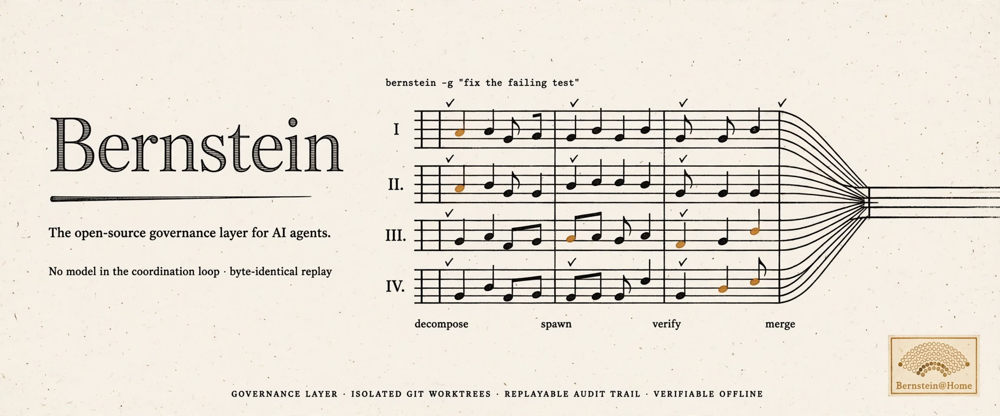

<div align="center">

<picture>
  <source media="(prefers-color-scheme: dark)" srcset="docs/assets/logo-dark.svg">
  <source media="(prefers-color-scheme: light)" srcset="docs/assets/logo-light.svg">
  
</picture>

<br>



<br>

> *"To achieve great things, two things are needed: a plan and not quite enough time."* - Leonard Bernstein

### deterministic multi-agent CLI orchestration

[](https://github.com/sipyourdrink-ltd/bernstein/actions/workflows/ci.yml)
[](https://pypi.org/project/bernstein/)
[](https://ghcr.io/sipyourdrink-ltd/bernstein)
[](https://python.org)
[](https://github.com/sipyourdrink-ltd/bernstein/blob/main/LICENSE)
[](https://scorecard.dev/viewer/?uri=github.com/sipyourdrink-ltd/bernstein)
[](https://github.com/sipyourdrink-ltd/bernstein/actions/workflows/codeql.yml)
[](https://codespaces.new/sipyourdrink-ltd/bernstein?quickstart=1)
[](https://mcptoplist.com/server/io.github.sipyourdrink-ltd%2Fbernstein)

[website](https://bernstein.run) &middot; [docs](https://bernstein.readthedocs.io/) &middot; [install](https://github.com/sipyourdrink-ltd/bernstein/blob/main/docs/getting-started/install.md) &middot; [first run](https://github.com/sipyourdrink-ltd/bernstein/blob/main/docs/getting-started/first-run.md) &middot; [glossary](https://github.com/sipyourdrink-ltd/bernstein/blob/main/docs/reference/GLOSSARY.md) &middot; [limitations](https://github.com/sipyourdrink-ltd/bernstein/blob/main/docs/reference/KNOWN_LIMITATIONS.md) &middot; [sponsor](https://github.com/sponsors/chernistry)

</div>

---

Bernstein is a deterministic orchestrator for CLI coding agents (Claude Code, Codex, Gemini CLI, and 40+ more). Scheduling is plain Python - no LLM in the coordination loop - so runs are reproducible end to end. Every task runs in its own git worktree behind lint/type/test gates. Results stay checkable after the fact: an always-on lineage spine and replay journal, plus an opt-in HMAC-chained audit log (`--audit`) with receipts you can verify offline. Air-gap install profile included. Apache-2.0.

### at a glance

Four things set it apart; everything after is detail.

- **No LLM in the coordination loop.** Scheduling is plain Python, so a run is reproducible end to end. Replay yesterday's plan and get yesterday's task graph.
- **Checkable after the fact.** The lineage spine and replay journal record every run; the opt-in audit chain adds receipts you verify offline. Non-determinism surfaces as a hash mismatch at the exact step, not a flaky re-run.
- **Isolated by construction.** Each task gets its own git worktree behind merge gates. No shared mutable state between agents.
- **Broad and local.** 40+ CLI agent adapters plus a generic `--prompt` wrapper, file-based state, no SaaS hop, no third-party data plane.

The full list is on the [capabilities page](https://github.com/sipyourdrink-ltd/bernstein/blob/main/docs/reference/capabilities.md); the [feature matrix](https://github.com/sipyourdrink-ltd/bernstein/blob/main/docs/reference/FEATURE_MATRIX.md) is the exhaustive index.

### install in 30 seconds

```bash
pipx install bernstein
bernstein init
bernstein -g "fix the failing test in tests/test_foo.py"
```

pip, uv, brew, dnf, npm, Docker, and the air-gapped wheelhouse are covered in the [install guide](https://github.com/sipyourdrink-ltd/bernstein/blob/main/docs/getting-started/install.md).


### prove a run

Determinism here is something you check, not something you take on faith. Run once with audit enabled, then verify what was recorded:

```bash
BERNSTEIN_AUDIT=1 bernstein -g "fix the failing test in tests/test_foo.py"
bernstein replay list                 # run ids recorded on disk
bernstein replay latest --verify      # recompute the journal head, name the first divergent step
bernstein lineage verify <run_id>     # recompute the always-on lineage spine
bernstein audit verify                # HMAC chain + Merkle seal (written because audit was enabled)
```

The journal and the lineage spine are written on every run. `bernstein audit verify` only has a chain to check when the run was started with `--audit`, `BERNSTEIN_AUDIT=1`, or a compliance preset.

### how it works

Each goal moves through four stages:

1. **Decompose**. The manager breaks your goal into tasks with roles, owned files, and completion signals. One LLM call, then plain Python from there.
2. **Spawn**. Agents start in isolated [git worktrees](https://git-scm.com/docs/git-worktree), one per task. Main branch stays clean.
3. **Verify**. The janitor checks concrete signals: tests pass, files exist, lint clean, types correct.
4. **Merge**. Verified work lands in main. Failed tasks get retried or routed to a different model.

Why the scheduler is plain Python, and what that trades away: [why deterministic](https://github.com/sipyourdrink-ltd/bernstein/blob/main/docs/architecture/WHY_DETERMINISTIC.md).

### everyday commands

```bash
cd your-project
bernstein init                    # creates .sdd/ workspace + bernstein.yaml
bernstein -g "Add rate limiting"  # agents spawn, work in parallel, verify, exit
bernstein live                    # watch progress in the TUI dashboard
bernstein run plan.yaml           # multi-stage plan: skip LLM planning, execute directly
bernstein stop                    # graceful shutdown with drain
```

The full operator surface (PR automation, schedules, chat bridges, the autofix daemon) is in [operator commands](https://github.com/sipyourdrink-ltd/bernstein/blob/main/docs/operations/commands.md).

### supported agents

Claude Code, Codex CLI, Gemini CLI, GitHub Copilot CLI, Cursor, Aider, Goose, OpenAI Agents SDK, Amp, Cody, Continue, Devin Terminal, Junie, Kilo, Kiro, AWS Q Developer, Ollama, OpenCode, OpenHands, Open Interpreter, gptme, Plandex, AIChat, Letta Code, Qwen, and more. The [adapter index](https://github.com/sipyourdrink-ltd/bernstein/blob/main/docs/adapters/index.md) carries the full table with install commands; anything else with a `--prompt` flag works through the generic wrapper.

Mix agents in the same run: cheap local models for boilerplate, heavier cloud models for architecture. `bernstein integrations list --installed` shows what is available on your machine.

### beyond the front page

Everything deep lives on the [docs site](https://bernstein.readthedocs.io/):

| | |
|---|---|
| [capabilities](https://github.com/sipyourdrink-ltd/bernstein/blob/main/docs/reference/capabilities.md) | the full capability list: MCP server mode, signed agent cards, sandbox backends, artifact sinks, regulatory mappings |
| [who this is for](https://github.com/sipyourdrink-ltd/bernstein/blob/main/docs/use-cases.md) | where the value lands, and where Bernstein is the wrong tool |
| [workflows](https://github.com/sipyourdrink-ltd/bernstein/blob/main/docs/operations/workflow-manifests.md) | declarative YAML DAGs of agent / command / loop nodes |
| [web UI](https://github.com/sipyourdrink-ltd/bernstein/blob/main/docs/gui/index.md) | browser dashboard on the same API the TUI uses |
| [cloud execution](https://github.com/sipyourdrink-ltd/bernstein/blob/main/docs/cloudflare/cloudflare-overview.md) | run agents on Cloudflare Workers with R2 workspace sync |
| [security](https://github.com/sipyourdrink-ltd/bernstein/blob/main/docs/operations/security.md) | scorecard, fuzzing, hardening |
| [architecture](https://github.com/sipyourdrink-ltd/bernstein/blob/main/docs/architecture/ARCHITECTURE.md) | how it works under the hood |

### why the name?

Bernstein is named after Leonard Bernstein, the American conductor and composer. The project orchestrates a crew of CLI coding agents the way Bernstein conducted the New York Philharmonic: every player on cue, the score deterministic, the conductor accountable for the result. He is the original orchestrator the project takes its name from.

i wrote bernstein because i was paying $400/month in claude bills running three coding agents in parallel and getting nondeterministic merges. Apache 2.0, solo maintained. Live stats: [bernstein.run](https://bernstein.run).

### mentioned in

Listed in [vinta/awesome-python](https://github.com/vinta/awesome-python), covered in Augment Code's [open-source agent orchestrators](https://www.augmentcode.com/tools/open-source-agent-orchestrators) roundup, cited by [awesome-agentic-patterns](https://github.com/nibzard/awesome-agentic-patterns/blob/main/patterns/deterministic-zero-llm-orchestration.md) as the production implementation of deterministic zero-LLM orchestration, and featured in [Python Weekly #742](https://www.pythonweekly.com/p/python-weekly-issue-742-april-23-2026).

<details>
<summary>All coverage: 20+ awesome lists, directories, newsletters, and peer citations</summary>
<br>

The full tracked list, including every awesome-list entry, catalog listing, prior-art citation, and newsletter mention, lives in [docs/mentions.md](https://github.com/sipyourdrink-ltd/bernstein/blob/main/docs/mentions.md). Entries are added as they appear; corrections welcome by issue or PR.

</details>

### contributing, support, license

PRs welcome; [CONTRIBUTING.md](https://github.com/sipyourdrink-ltd/bernstein/blob/main/CONTRIBUTING.md) has setup and code style. Security reports go through [SECURITY.md](https://github.com/sipyourdrink-ltd/bernstein/blob/main/SECURITY.md). If Bernstein saves you time: [GitHub Sponsors](https://github.com/sponsors/chernistry). Contact: [forte@bernstein.run](mailto:forte@bernstein.run).

Citation metadata lives in [CITATION.cff](https://github.com/sipyourdrink-ltd/bernstein/blob/main/CITATION.cff). License: [Apache-2.0](https://github.com/sipyourdrink-ltd/bernstein/blob/main/LICENSE).

---

[Alex Chernysh](https://alexchernysh.com) &middot; [GitHub](https://github.com/chernistry) &middot; [X](https://x.com/alex_chernysh) &middot; [bernstein.run](https://bernstein.run)

<!-- mcp-name: io.github.sipyourdrink-ltd/bernstein -->
