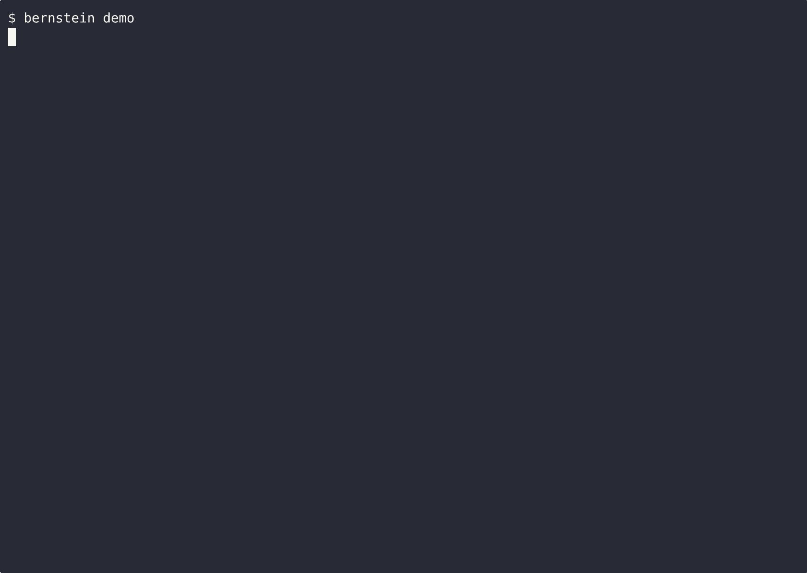

<div align="center">

<picture>
  <source media="(prefers-color-scheme: dark)" srcset="docs/assets/logo-dark.svg">
  <source media="(prefers-color-scheme: light)" srcset="docs/assets/logo-light.svg">
  
</picture>

<br>

> *"To achieve great things, two things are needed: a plan and not quite enough time."* - Leonard Bernstein

</div>

### why the name?

Bernstein is named after Leonard Bernstein, the American conductor and composer. The project orchestrates a crew of CLI coding agents the way Bernstein conducted the New York Philharmonic: every player on cue, the score deterministic, the conductor accountable for the result. He is the original orchestrator the project takes its name from.

<div align="center">

### deterministic multi-agent CLI orchestration

[](https://github.com/sipyourdrink-ltd/bernstein/actions/workflows/ci.yml)
[](https://pypi.org/project/bernstein/)
[](https://ghcr.io/sipyourdrink-ltd/bernstein)
[](https://python.org)
[](LICENSE)
[](https://scorecard.dev/viewer/?uri=github.com/sipyourdrink-ltd/bernstein)
[](https://github.com/sipyourdrink-ltd/bernstein/actions/workflows/codeql.yml)
[](https://codespaces.new/sipyourdrink-ltd/bernstein?quickstart=1)

[website](https://bernstein.run) &middot; [docs](https://bernstein.readthedocs.io/) &middot; [install](docs/getting-started/install.md) &middot; [first run](docs/getting-started/first-run.md) &middot; [glossary](docs/reference/GLOSSARY.md) &middot; [limitations](docs/reference/KNOWN_LIMITATIONS.md) &middot; [sponsor](https://github.com/sponsors/chernistry)

</div>

---

Bernstein is a deterministic Python scheduler that runs a crew of CLI coding agents (Claude Code, Codex, Gemini CLI, and 40 more) against a single goal in parallel git worktrees, with an HMAC-signed audit chain over every step.

### at a glance

- **44 CLI agent adapters** in v2.2.x: 41 third-party wrappers, 2 leaf-node delegators, plus a generic `--prompt` wrapper. Source of truth: the [supported agents](#supported-agents) table below.
- **HMAC-SHA256 audit chain** per [RFC 2104](https://datatracker.ietf.org/doc/html/rfc2104), one record per scheduling decision, tamper-evident. Operator guide: [docs/security/audit-log.md](docs/security/audit-log.md).
- **Bearer-token task server** authenticates the manager and every worker. Per-session zero-trust JWT in `.sdd/runtime/agent_tokens/`, legacy `BERNSTEIN_AUTH_TOKEN` fallback, opt-out via `BERNSTEIN_AUTH_DISABLED=1`. Flow + diagnostics: [docs/security/manager-auth.md](docs/security/manager-auth.md).
- **Signed agent cards** use detached JWS ([RFC 7515 §A.5](https://datatracker.ietf.org/doc/html/rfc7515#appendix-A.5)) over [RFC 8785 (JCS)](https://datatracker.ietf.org/doc/html/rfc8785) canonicalization, with [Ed25519 / EdDSA](https://datatracker.ietf.org/doc/html/rfc8037) keys. Code: [src/bernstein/core/security/agent_card_signer.py](src/bernstein/core/security/agent_card_signer.py).
- **Per-artefact lineage** records every adapter file write, without per-adapter opt-in, as one Merkle-chained, HMAC-tagged entry in an always-on lineage spine (`.sdd/lineage/<run_id>/spine.jsonl`). The chain head hash is the run's artifact-provenance identity. CLI: `bernstein lineage verify <run_id>` (recompute the chain, distinct `NO ENTRIES` status for empty runs) and `bernstein lineage replay <run_id>`.
- **Content credentials**: a C2PA 2.2 manifest for any produced artifact is a deterministic projection of that artifact's lineage-spine subtree, signed with the install-identity key so one attestation root covers both who ran it and what was produced. Stripping the spine makes the manifest unproducible, not merely unsigned. Watermark/fingerprint soft-binding layers are pluggable. CLI: `bernstein credential emit <artifact> --run-id <run_id>` and `bernstein credential verify <artifact>`.
- **Tamper-evident memory**: every cross-session memory write is an append-only, HMAC-tagged chained record attributing a claim to an actor at a time (`entry_hash = H(prev, source_hash, actor, claim, model, timestamp, ...)`), stored per identity scope (user / agent / run / app) under `.sdd/memory/chain/<scope>/<namespace>.jsonl` and anchored to the lineage spine that produced it. Forgetting appends a signed tombstone rather than deleting, so the original stays provable. CLI: `bernstein memory verify --scope <s> --namespace <ns>` (proves a fact was written by the claimed actor and never edited), `bernstein memory why <fact> ...` (returns the originating run and step), and `bernstein memory forget <entry_hash> ...`.
- **Always-on replay journal**: every run records into one Merkle-chained event journal (`.sdd/runs/<run_id>/journal.jsonl`) whose head hash is the run identity; no on/off flag, `BERNSTEIN_REPLAY_RETENTION` caps disk. Non-determinism surfaces as a hash mismatch: `bernstein replay <run_id> --verify` recomputes the head and reports the exact first divergent step, and `bernstein replay <run_id> --from-step N` rebuilds deterministic state. The journal head is sealed into the lineage spine so replay identity and artefact provenance share one root.
- **Compaction receipts**: every context compaction of a long-running worker is validated mechanically (code blocks and error text must survive) and recorded as an HMAC-chained receipt. CLI: `bernstein compaction log --task <id>`. Operator guide: [docs/operations/context-compaction.md](docs/operations/context-compaction.md).
- **Deterministic scheduler**: zero LLM in the coordination loop. Plain Python decides who runs, where, with what budget. Replay yesterday's plan, get yesterday's task graph.
- **Signed OTel span projection**: the OpenTelemetry GenAI export is a deterministic projection of the run event journal rather than random-id telemetry. Every span id is derived from the journal entry hash it projects, each span carries `bernstein.journal.entry_hash`, and the whole span set is signed with the install identity. Two replays export a byte-identical trace, a tampered span breaks the entry-hash binding, and the local JSONL store emits even with no OTLP endpoint set. CLI: `bernstein trace project <run_id>` and `bernstein trace verify-projection <run_id>`.
- **Verifiable spending mandates**: when an agent spends against an external service, the signed intent, the tool calls it authorized, and the settlement reference become one journal-anchored consent receipt binding `{mandate_hash, authorized_tool_calls_hash, settlement_ref, journal_entry_hash}`, so "this payment was authorized by this exact intent" is provable offline. AP2-style Intent and Cart mandates are signed and revocable; per-task spend caps are enforced by the cost ledger and a cap breach is refused; revocation appends a signed entry so subsequent actions are refused. The authorized action set is a deterministic projection of `(mandate, state, time)`, and the HTTP 402 pay-and-retry settlement (x402 / AP2 shapes) is bound into the receipt so decision-to-pay and settlement cross-verify. CLI: `bernstein mandate emit`, `bernstein mandate verify <mandate_hash>` (proves the action was authorized by the recorded intent), and `bernstein mandate revoke <mandate_hash>`.
- **Journal-anchored native subagent delegation**: the deterministic scheduler keeps the coordination plan and delegates each leaf's mechanical execution to a native subagent (Claude Code, Codex) with per-agent model / effort / tools / background / batch settings. Each native structured result is schema-validated at the worker boundary (hallucinated keys and missing fields rejected) and anchored into the run event journal as a `subagent.delegation` entry carrying a replay-invariant node hash plus the result content hash. The outer DAG is a pure function of the plan, so it replays byte-identically even when inner execution is stochastic; non-interactive fan-out runs on the batch tier and its discount plus prompt-cache reads are attributed in the spend ledger.
- **Stateless MCP core**: the open stateless MCP protocol drops the `initialize` handshake and `Mcp-Session-Id`, so any request can land on any server instance and the protocol no longer provides cross-call ordering. Bernstein carries client capabilities in a per-request `_meta` field, emits W3C Trace Context (`traceparent`/`tracestate`/`baggage`) whose span id is derived from the call's content hash and trace id from the run root hash (two replays emit byte-identical `_meta`), and resolves the deprecated Sampling in-orchestrator with no LLM callback into the client. An `InputRequiredResult` retry base64-encodes its `requestState` so a different server instance resumes with no shared session memory. Each call is an ordered entry in the run event journal with its content-derived span id and is anchored into the HMAC audit chain, so cross-call continuity is chain-anchored rather than session-anchored; a cache hit references the content hash of the run that produced it. Deprecated Roots/Sampling/Logging stay behind a 12-month compatibility shim.
- **Attested PR review receipts**: a review run emits one signed receipt binding the issue body, the plan, the run journal head (every executed tool call), and the diff into `{issue_hash, plan_hash, journal_head, diff_hash, findings, verdict}`, signed with the install's Ed25519 identity and anchored in the review lineage spine, so "this PR was reviewed against this ticket without operator override" is provable offline. `bernstein review-receipt verify --pr <url>` recomputes `issue_hash` and `diff_hash` from the PR inputs and checks the signature and spine anchor; a tampered diff fails because `diff_hash` no longer matches. Autofix runs a reviewer finding's fix in an isolated git worktree, runs the gate, and emits a second receipt linking finding to fix-commit to test-result. The tracker comment is a projection of the receipt (short verdict + verify command), never the receipt body.
- **Verifiable governance (RBAC, budgets, seats)**: for teams, every access check, budget check, and per-seat attribution is a deterministic projection over the signed lineage spine rather than mutable, separately-logged database state. Each decision is a signed, anchored record binding `{subject, action, verdict, inputs_hash, journal_entry_hash}`: a denied action writes a signed `deny` record and a budget breach a signed `refuse` that blocks the action. IDP groups map to roles via signed role bindings, and per-profile spend caps are enforced against per-subject spend recomputed from the cost ledger (never a stored counter). `bernstein governance verify <run>` re-resolves and re-projects every recorded access and budget decision from the presented bindings and ledger and confirms the recorded verdicts; a tampered verdict, a widened permission binding, or a diverged ledger fails the check. Two replays of a governance-gated run produce byte-identical decision records.

### why this exists

i wrote bernstein because i was paying $400/month in claude bills running three coding agents in parallel and getting nondeterministic merges.

Apache 2.0, solo maintained. Live stats: [bernstein.run](https://bernstein.run).

### install in 30 seconds

```bash
pipx install bernstein
bernstein init
bernstein run -g "fix the failing test in tests/test_foo.py"
```

See installed integrations: `bernstein integrations list --installed`.

## sponsor

If Bernstein routed a model that saved you a Claude bill, $25 covers a month of my coffee.

[github.com/sponsors/chernistry](https://github.com/sponsors/chernistry)

## who this is for

Specific shapes where the value lands:

- engineering teams running >=3 CLI coding agents in parallel: each agent gets its own git worktree, the merge queue serialises landings, no race conditions
- operators running compliance-sensitive workflows: every routing decision is plaintext, the audit log is HMAC-signed and tamper-evident, no SaaS hop, no third-party data plane
- platform teams that need an audit log of agent decisions: the orchestrator writes one row per scheduling decision, you can grep it
- anyone burning more than $1k/mo on coding agents who wants determinism: you can replay yesterday's plan and get yesterday's task graph
- forward-deployed engineers dropping into a client repo: credentials stay in your env, not the client's; agents you spawn are whichever CLI tool the client already trusts

If you nodded at two of those bullets, this fits.

## who this is NOT for

- "I want one pair-programmer to chat with about my code": a single CLI agent is fine. Bernstein adds orchestration overhead you don't need.
- prototypes where merge gates are overkill: the lint/types/tests/cross-model-review pipeline is value when the cost of a bad merge is real, friction when you're throwing the repo away on Friday.
- non-coding tasks (research, writing, data analysis pipelines): Bernstein wraps CLI coding agents specifically, not generic LLM workflows.
- anyone who wants a SaaS wrapper with a credit-card form: Bernstein is on-prem only by design.
- teams that need a vendor with a support SLA and a contract: solo open-source project. GitHub issues are how support happens.
- research-shape "let the agents collaborate emergently" use cases: the deterministic scheduler is a hard wall there.

## how it compares

Closest neighbours in this category live in [docs/compare/README.md](docs/compare/README.md). What Bernstein does well is the auditability surface: HMAC-chained audit, signed agent cards, per-artefact lineage, air-gap deploy profile, plus the widest CLI adapter coverage.

---

### what is this, in one paragraph

You tell Bernstein what you want built. It splits the work across several AI coding agents, runs them in parallel inside isolated git worktrees, records every handoff in an HMAC-SHA256-chained audit log (RFC 2104), runs the tests, and merges the code that actually passes. File-based state (`.sdd/`), per-agent credential scoping, signed audit trail.

### other install methods

```bash
curl -fsSL https://bernstein.run/install.sh | sh        # macOS / Linux one-liner
irm https://bernstein.run/install.ps1 | iex             # Windows PowerShell
pip install bernstein                                   # pip
uv tool install bernstein                               # uv
brew tap chernistry/tap && brew install bernstein       # Homebrew
```

See the full [install matrix](#install) for `dnf copr`, `npx`, optional extras, and the wheelhouse path for air-gapped sites.

### why the scheduler is plain Python

Most agent orchestrators use an LLM to decide who does what. That is non-deterministic and burns tokens on scheduling instead of code. Bernstein does one LLM call to break down your goal, then the rest (running agents in parallel, isolating their git branches, running tests, routing retries) is plain Python. Every run is reproducible. Every step is logged and replayable.

No framework to learn. No vendor lock-in. Swap any agent, any model, any provider.



What you see while it runs:

```
$ bernstein -g "Add JWT auth"
[manager] decomposed into 4 tasks
[agent-1] claude-sonnet: src/auth/middleware.py  (done, 2m 14s)
[agent-2] codex:         tests/test_auth.py      (done, 1m 58s)
[verify]  all gates pass. merging to main.
```

### YAML workflow manifests (optional)

When `bernstein run -g "<goal>"` is too coarse-grained, `bernstein workflow` runs a declarative DAG of agent / command / loop nodes. Manifests are plain YAML, validated up-front, dispatched through the same `AgentSpawner` the rest of Bernstein uses.

```bash
bernstein workflow list                          # bundled + user-installed
bernstein workflow run idea-to-pr -g "Add JWT auth"
bernstein workflow init my-flow                  # scaffold a starter manifest
bernstein workflow validate path/to/flow.yaml
```

Stock workflows shipping in the wheel: `idea-to-pr`, `refactor-with-tests`, `security-review`, `doc-update`, `dependency-bump`, `hot-fix`. Loop nodes re-fire until a bash predicate exits 0. `fresh_context: true` mints a new agent session per iteration. Per-step CLI/model routing: [docs/workflows/per-step-routing.md](docs/workflows/per-step-routing.md).

## use cases

- forward-deployed engineering: drop the crew onto a client repo when you arrive, take it with you when you leave.
- self-evolving projects: point Bernstein at its own repo and let it execute the backlog (this codebase is one).
- CI fleets: run a crew of agents in parallel on PRs, with per-agent credential scoping and signed audit trail.
- air-gapped deployment: install from a signed wheelhouse, run with `--profile airgap` to deny outbound by default. See [Air-gap installation](docs/installation/air-gap.md).

## supported agents

Bernstein auto-discovers installed CLI agents. Mix them in the same run. Cheap local models for boilerplate, heavier cloud models for architecture.

44 CLI agent adapters: 41 third-party wrappers, 2 leaf-node delegators, plus a generic wrapper for anything with `--prompt`.

| Agent | Models | Install |
|-------|--------|---------|
| [Claude Code](https://docs.anthropic.com/en/docs/claude-code) | Opus 4, Sonnet 4.6, Haiku 4.5 | `npm install -g @anthropic-ai/claude-code` |
| [Codex CLI](https://github.com/openai/codex) | GPT-5, GPT-5 mini | `npm install -g @openai/codex` |
| [OpenAI Agents SDK v2](https://openai.github.io/openai-agents-python/) | GPT-5, GPT-5 mini, o4 | `pip install 'bernstein[openai]'` |
| [GitHub Copilot CLI](https://docs.github.com/en/copilot/github-copilot-in-the-cli) | Copilot-managed (GPT-5, Sonnet 4.6) | `npm install -g @github/copilot` |
| [Gemini CLI](https://github.com/google-gemini/gemini-cli) | Gemini 2.5 Pro, Gemini Flash | `npm install -g @google/gemini-cli` |
| [Cursor](https://www.cursor.com) | Sonnet 4.6, Opus 4, GPT-5 | [Cursor app](https://www.cursor.com) |
| [Devin Terminal](https://devin.ai) (Cognition) | Devin-managed | `curl -fsSL https://cli.devin.ai/install.sh \| bash` then `devin auth login` |
| [Aider](https://aider.chat) | Any OpenAI/Anthropic-compatible | `pip install aider-chat` |
| [Amp](https://ampcode.com) | Amp-managed | `npm install -g @sourcegraph/amp` |
| [CLM gateway](docs/adapters/clm.md) (sovereign / on-prem LLM) | Any OpenAI-compatible CLM endpoint | `pip install aider-chat`, then set `CLM_ENDPOINT` / `CLM_TOKEN` |
| [Cody](https://sourcegraph.com/cody) | Sourcegraph-hosted | `npm install -g @sourcegraph/cody` |
| [Continue](https://continue.dev) | Any OpenAI/Anthropic-compatible | `npm install -g @continuedev/cli` (binary: `cn`) |
| [Goose](https://block.github.io/goose/) | Any provider Goose supports | See [Goose docs](https://block.github.io/goose/) |
| [IaC](https://www.terraform.io/) (Terraform/Pulumi) | Any provider the base agent uses | Built-in |
| [Junie](https://junie.jetbrains.com) | BYOK (Anthropic, OpenAI, Google, xAI, OpenRouter, Copilot) | `curl -fsSL https://junie.jetbrains.com/install.sh \| bash` |
| [Kilo](https://kilo.dev) | Kilo-hosted | See [Kilo docs](https://kilo.dev) |
| [Kiro](https://kiro.dev) | Kiro-hosted | See [Kiro docs](https://kiro.dev) |
| [AWS Q Developer](https://docs.aws.amazon.com/amazonq/latest/qdeveloper-ug/command-line.html) | Amazon Q-managed (Claude-backed) | `brew install --cask amazon-q` then `q login` |
| [Ollama](https://ollama.ai) + Aider | Local models (offline) | `brew install ollama` |
| [OpenCode](https://opencode.ai) | Any provider OpenCode supports | See [OpenCode docs](https://opencode.ai) |
| [Qwen](https://github.com/QwenLM/qwen-code) | Qwen Code models | `npm install -g @qwen-code/qwen-code` |
| [Cloudflare Agents](https://developers.cloudflare.com/agents/) | Workers AI models | `bernstein cloud login` |
| [OpenHands](https://github.com/OpenHands/OpenHands) | Any LiteLLM-supported (Anthropic, OpenAI, ...) | `uv tool install openhands --python 3.12` |
| [Open Interpreter](https://github.com/OpenInterpreter/open-interpreter) | Any (LiteLLM-backed) | `pip install open-interpreter` |
| [gptme](https://github.com/gptme/gptme) | Anthropic, OpenAI, OpenRouter | `pipx install gptme` |
| [Plandex](https://github.com/plandex-ai/plandex) | Plandex Cloud or self-hosted models | `curl -sL https://plandex.ai/install.sh \| bash` |
| [AIChat](https://github.com/sigoden/aichat) | OpenAI, Anthropic, OpenRouter, Groq, Gemini | `cargo install aichat` |
| [Letta Code](https://github.com/letta-ai/letta-code) | Letta-routed (Anthropic, OpenAI) | `npm install -g @letta-ai/letta-code` |
| **Generic** | Any CLI with `--prompt` | Built-in |

Any adapter also works as the internal scheduler LLM:

```yaml
internal_llm_provider: gemini            # or qwen, ollama, codex, goose, ...
internal_llm_model: gemini-3.1-pro
```

> [!TIP]
> Run `bernstein --headless` for CI pipelines. No TUI, structured JSON output, non-zero exit on failure.

## quick start

```bash
cd your-project
bernstein init                    # creates .sdd/ workspace + bernstein.yaml
bernstein -g "Add rate limiting"  # agents spawn, work in parallel, verify, exit
bernstein live                    # watch progress in the TUI dashboard
bernstein stop                    # graceful shutdown with drain
```

For multi-stage projects, define a YAML plan:

```bash
bernstein run plan.yaml           # skips LLM planning, goes straight to execution
bernstein run --dry-run plan.yaml # preview tasks and estimated cost
```

## web UI

`v2.0.0` ships a minimal web UI (operator-requested; UI is a side surface, core orchestrator is the priority).

```bash
bernstein gui serve               # http://127.0.0.1:8052/ui/
bernstein gui serve --dev         # expects `npm run dev` on :5173
bernstein gui serve --minimal     # skip the full /api/v1/* surface
```

The Vite bundle is committed under `src/bernstein/gui/static/`, so wheel installs work without a Node toolchain. Surface tour + per-task drawer: [docs/web-ui.md](docs/web-ui.md).

## how it works

Bernstein runs a four-stage pipeline per goal:

1. **Decompose**. The manager breaks your goal into tasks with roles, owned files, and completion signals. One LLM call, then plain Python from there.
2. **Spawn**. Agents start in isolated [git worktrees](https://git-scm.com/docs/git-worktree), one per task. Main branch stays clean.
3. **Verify**. The janitor checks concrete signals: tests pass, files exist, lint clean, types correct.
4. **Merge**. Verified work lands in main. Failed tasks get retried or routed to a different model.

The orchestrator is a Python scheduler, not an LLM. Scheduling decisions are deterministic, auditable, and reproducible. Every step writes a record to the HMAC-chained audit log (`.sdd/audit/YYYY-MM-DD.jsonl`) per [RFC 2104](https://datatracker.ietf.org/doc/html/rfc2104).

## cloud execution (Cloudflare)

`bernstein cloud` runs agents on Cloudflare Workers with R2-backed workspace sync. See [docs/cloudflare/](docs/cloudflare/).

```bash
bernstein cloud login      # authenticate with Bernstein Cloud
bernstein cloud deploy     # push agent workers
bernstein cloud run plan.yaml  # execute a plan on Cloudflare
```

## capabilities

Bernstein ships parallel execution + worktree isolation + a janitor that gates merges on tests/lint/types, signed lineage records, MCP server mode, an HMAC-SHA256 audit chain, and 44 CLI adapters out of the box. Pluggable sandbox backends (worktree, Docker, [E2B](https://e2b.dev), [Modal](https://modal.com)), pluggable artifact sinks (local, S3, GCS, Azure Blob, R2), progressive-disclosure skill packs, and a [lethal-trifecta capability gate](docs/security/lethal-trifecta.md) round it out.

Full feature matrix: [docs/reference/FEATURE_MATRIX.md](docs/reference/FEATURE_MATRIX.md). Recent features: [docs/whats-new.md](docs/whats-new.md).

### regulatory anchors

Regulatory mappings (EU AI Act Article 12, SOC 2 CC4/CC7, DORA / NIS2, OWASP ASI06, RFC 2104/7515/8785/8037/7636/8707) live in [docs/compliance/](docs/compliance/). These are mappings, not certifications.

## operator commands

Highest-value commands; full list in [docs/operations/commands.md](docs/operations/commands.md).

| Command | What it does |
|---------|--------------|
| `bernstein pr` | Auto-creates a GitHub PR from a completed session; body carries the janitor's gate results and cost breakdown. |
| `bernstein from-ticket <url>` | Imports a Linear / GitHub Issues / Jira ticket as a Bernstein task. |
| `bernstein autofix` | Daemon that monitors open Bernstein PRs; spawns a fixer agent when CI fails. |
| `bernstein hooks` | Lifecycle hooks (`pre_task`, `post_task`, `pre_merge`, etc.) as shell scripts or pluggy `@hookimpl`s. |
| `bernstein backlog claim --role reviewer` | Atomically claims one eligible row from `.sdd/runtime/task-backlog.json` for external workers. |
| `bernstein chat serve --platform=telegram\|discord\|slack` | Drive runs from chat with `/run`, `/status`, `/approve`, `/reject`. |
| `bernstein workflow run <name>` | Run a YAML workflow manifest. |
| `bernstein schedule add\|list\|run` | Manage operator-registered recurring schedules; `schedule audit` walks persisted fire receipts to prove the sequence is replayable. |
| `bernstein templates compress <role>\|--all` | Operator-gated, one-time LLM compression of role prompt templates: mechanically validated (fenced blocks, headings, URLs, placeholders, completion contract stay byte-equal), originals backed up out of tree by content hash, receipt chained to the audit log. `bernstein templates restore <role>` reverses it byte-identically; savings appear in `bernstein cost --by role`. |
| `bernstein identity keydir` | Prints the install-identity key directory (JWKS) - the Ed25519 public keys that verify the RFC 9421 HTTP Message Signatures Bernstein places on its outbound agent-facing requests (also served at `/.well-known/http-message-signatures-directory`). Set `BERNSTEIN_HTTP_SIGNING_REQUIRED=1` to refuse unsigned outbound paths. |
| `bernstein delegation verify <run>` | Reconstructs the `principal -> orchestrator -> sub-agent` delegation chain for a run from HMAC-chained per-hop receipts and confirms it is intact offline; exits non-zero on any tamper or deleted hop. |

### retrieval & caching: what's actually under the hood

Bernstein deliberately uses **no neural embeddings, no vector databases, and no external embedding APIs**. There are two retrieval/caching layers, both keyword/lexical:

- **Codebase RAG** (`core/knowledge/rag.py`): [SQLite FTS5](https://sqlite.org/fts5.html) with [BM25](https://en.wikipedia.org/wiki/Okapi_BM25) ranking and AST-aware chunking for Python files.
- **Semantic cache** (`core/knowledge/semantic_cache.py`): TF (term-frequency) cosine similarity over word counts, not learned embeddings.

If you need real semantic retrieval (vector DB, neural embeddings), wire it yourself via the retrieval role/skill in `templates/`; nothing in core performs vector search.

## install

| Method | Command |
|--------|---------|
| **One-liner (macOS / Linux)** | `curl -fsSL https://bernstein.run/install.sh \| sh` |
| **One-liner (Windows)** | `irm https://bernstein.run/install.ps1 \| iex` |
| **pip** | `pip install bernstein` |
| **pipx** | `pipx install bernstein` |
| **uv** | `uv tool install bernstein` |
| **Homebrew** | `brew tap chernistry/tap && brew install bernstein` |
| **Fedora / RHEL** | `sudo dnf copr enable alexchernysh/bernstein && sudo dnf install bernstein` |
| **npm** (wrapper) | `npx bernstein-orchestrator` |
| **Docker (GHCR)** | `docker run --rm -v "$PWD:/work" -w /work -e ANTHROPIC_API_KEY ghcr.io/sipyourdrink-ltd/bernstein:latest run -g "fix tests/test_foo.py"` |

The one-liner scripts check for Python 3.12+, bootstrap pipx when it's missing, fix PATH for the current session, and install (or upgrade) `bernstein`. Script sources: [install.sh](scripts/install.sh) &middot; [install.ps1](scripts/install.ps1).

### optional extras

Provider SDKs are optional so the base install stays lean.

| Extra | Enables |
|-------|---------|
| `bernstein[openai]` | OpenAI Agents SDK v2 adapter (`openai_agents`) |
| `bernstein[docker]` | Docker sandbox backend |
| `bernstein[e2b]` | [E2B](https://e2b.dev) microVM sandbox backend (needs `E2B_API_KEY`) |
| `bernstein[modal]` | [Modal](https://modal.com) sandbox backend, optional GPU (needs `MODAL_TOKEN_ID` / `MODAL_TOKEN_SECRET`) |
| `bernstein[s3]` | S3 artifact sink (via `boto3`) |
| `bernstein[gcs]` | Google Cloud Storage artifact sink |
| `bernstein[azure]` | Azure Blob artifact sink |
| `bernstein[r2]` | Cloudflare R2 artifact sink (S3-compatible `boto3`) |
| `bernstein[grpc]` | gRPC bridge |
| `bernstein[k8s]` | Kubernetes integrations |

Combine extras with brackets, e.g. `pip install 'bernstein[openai,docker,s3]'`.

Editor extensions: [VS Marketplace](https://marketplace.visualstudio.com/items?itemName=alex-chernysh.bernstein) &middot; [Open VSX](https://open-vsx.org/extension/alex-chernysh/bernstein)

## security

- **OpenSSF Scorecard.** Weekly run via `.github/workflows/scorecard.yml`. Results uploaded to GitHub Code Scanning. Badge above.
- **Fuzzing.** ClusterFuzzLite config at `.clusterfuzzlite/` plus a `cifuzz-pr` workflow (`.github/workflows/cifuzz-pr.yml`) provide an OSSF-recognized fuzzing harness on top of the existing Hypothesis property-test suite.
- **Vulnerability disclosure.** See [SECURITY.md](SECURITY.md).

## contributing

PRs welcome. See [CONTRIBUTING.md](CONTRIBUTING.md) for setup and code style.

## support

If Bernstein saves you time: [GitHub Sponsors](https://github.com/sponsors/chernistry).

Contact: [forte@bernstein.run](mailto:forte@bernstein.run).

## featured in

- [**Augment Code - 9 Open-Source Agent Orchestrators for AI Coding (2026)**](https://www.augmentcode.com/tools/open-source-agent-orchestrators); editorial roundup.
- [**nibzard/awesome-agentic-patterns**](https://github.com/nibzard/awesome-agentic-patterns/blob/main/patterns/deterministic-zero-llm-orchestration.md); Bernstein cited as the production implementation of the "deterministic zero-LLM orchestration" pattern.
- [**Python Weekly**](https://www.pythonweekly.com/p/python-weekly-issue-742-april-23-2026); newsletter mention.
- [**Future Digest**](https://futuredigestnews.substack.com/p/your-claude-bill-just-hit-874-heres); cost-cutting playbook write-up.

<details>
<summary>More awesome-lists, MCP catalogs, and prior-art citations</summary>

Awesome lists: [Jenqyang/Awesome-AI-Agents](https://github.com/Jenqyang/Awesome-AI-Agents), [jamesmurdza/awesome-ai-devtools](https://github.com/jamesmurdza/awesome-ai-devtools), [jim-schwoebel/awesome_ai_agents](https://github.com/jim-schwoebel/awesome_ai_agents), [Piebald-AI/awesome-gemini-cli](https://github.com/Piebald-AI/awesome-gemini-cli), [ComposioHQ/awesome-codex-skills](https://github.com/ComposioHQ/awesome-codex-skills), [punkpeye/awesome-mcp-servers](https://github.com/punkpeye/awesome-mcp-servers), [jxzhangjhu/Awesome-LLM-RAG](https://github.com/jxzhangjhu/Awesome-LLM-RAG), [rohitg00/awesome-claude-code-toolkit](https://github.com/rohitg00/awesome-claude-code-toolkit), [numtide/llm-agents.nix](https://github.com/numtide/llm-agents.nix), [andyrewlee/awesome-agent-orchestrators](https://github.com/andyrewlee/awesome-agent-orchestrators), [bradAGI/awesome-cli-coding-agents](https://github.com/bradAGI/awesome-cli-coding-agents), [milisp/awesome-codex-cli](https://github.com/milisp/awesome-codex-cli), [yaolifeng0629/Awesome-independent-tools](https://github.com/yaolifeng0629/Awesome-independent-tools), [caramaschiHG/awesome-ai-agents-2026](https://github.com/caramaschiHG/awesome-ai-agents-2026), [ai-for-developers/awesome-vibe-coding](https://github.com/ai-for-developers/awesome-vibe-coding), [taishi-i/awesome-ChatGPT-repositories](https://github.com/taishi-i/awesome-ChatGPT-repositories), [eudk/awesome-ai-tools](https://github.com/eudk/awesome-ai-tools), [killop/anything_about_game](https://github.com/killop/anything_about_game), [vinta/awesome-python](https://github.com/vinta/awesome-python), [Zijian-Ni/awesome-ai-agents-2026](https://github.com/Zijian-Ni/awesome-ai-agents-2026), [rohitg00/awesome-devops-mcp-servers](https://github.com/rohitg00/awesome-devops-mcp-servers), [Glama MCP Catalog](https://glama.ai/mcp/servers/sipyourdrink-ltd/bernstein). Mirrors: [icopy-site/awesome](https://github.com/icopy-site/awesome), [icopy-site/awesome-cn](https://github.com/icopy-site/awesome-cn), [trackawesomelist/trackawesomelist](https://github.com/trackawesomelist/trackawesomelist).

Prior-art citations by peer projects: [mkb23/overcode](https://github.com/mkb23/overcode/blob/main/docs/design/bakeoffs/overcode-vs-bernstein.md), [Vintersong/NOVA-Cognition-Framework](https://github.com/Vintersong/NOVA-Cognition-Framework), [AJV009/drupal-contrib-workbench](https://github.com/AJV009/drupal-contrib-workbench), [danielvaughan/codex-blog](https://github.com/danielvaughan/codex-blog/blob/main/_posts/2026-04-09-loki-mode-autonomous-execution.md).

Directories: [AlternativeTo](https://alternativeto.net/software/bernstein/).

</details>

## cite

Machine-readable metadata lives in [CITATION.cff](CITATION.cff) (CFF 1.2.0); GitHub renders the "Cite this repository" button automatically. A Zenodo DOI will be minted on the next release.

## license

[Apache License 2.0](LICENSE)

---

[Alex Chernysh](https://alexchernysh.com) &middot; [GitHub](https://github.com/chernistry) &middot; [X](https://x.com/alex_chernysh) &middot; [bernstein.run](https://bernstein.run)

Translations available in 11 languages: see [docs/i18n/](docs/i18n/).

<!-- mcp-name: io.github.sipyourdrink-ltd/bernstein -->
