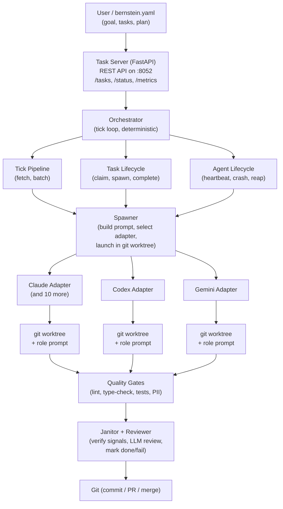

# Bernstein Architecture

## Overview

Bernstein is a deterministic orchestrator for CLI coding agents. Think Kubernetes for containers, but for AI coding agents: you declare what you want, the control plane schedules it, short-lived agents execute in isolated worktrees, and a janitor verifies the output before anything lands.

The orchestrator is **deterministic Python** — zero LLM tokens on coordination. Every scheduling decision, every retry, every spawn is auditable code, not a model response.

---

## System diagram



---

## Why file-based state

Bernstein stores everything in `.sdd/` files — no databases, no hidden memory. This is a deliberate design choice:

- **Inspectable**: `cat .sdd/backlog/open/*.yaml` — read task specs as plain text
- **Recoverable**: copy `.sdd/` to another machine, restart Bernstein, resume
- **Auditable**: every metric, trace, and lesson is a JSONL file you can grep
- **Git-friendly**: back up `.sdd/backlog/` and `.sdd/metrics/` alongside your code

Runtime state (`.sdd/runtime/`) is ephemeral — PIDs, logs, signals. Never commit it.

---

## Core modules

Each module has one responsibility. The split follows the pattern: thin façades, isolated logic.

### Task Server (`core/server.py`, `core/routes/`)

FastAPI application exposing the REST API. Central coordination point for all agents. State persists to `.sdd/runtime/tasks.jsonl` as a recovery checkpoint. Routes are split across `core/routes/tasks.py`, `status.py`, `costs.py`, `agents.py`, `plans.py`, `quality.py`, `graduation.py`, `slack.py`, `webhooks.py`, `dashboard.py`, and `auth.py`.

### Orchestrator (`core/orchestrator.py`)

The public façade. Runs the tick loop: fetch open tasks, batch by role, spawn agents, monitor heartbeats, handle completion. The actual logic is split into three sub-modules:

- **Tick pipeline** (`core/tick_pipeline.py`) — data containers and task fetching
- **Task lifecycle** (`core/task_lifecycle.py`) — claim, spawn, complete, retry, decompose
- **Agent lifecycle** (`core/agent_lifecycle.py`) — heartbeat, crash detection, reaping, loop/deadlock detection

### Spawner (`core/spawner.py`)

Launches CLI agents for task batches. Builds the prompt (system role prompt + task context), selects the appropriate adapter via the registry, and spawns the process inside a git worktree. Wraps every command with `build_worker_cmd()` for process visibility (`bernstein ps`).

### Router (`core/router.py`)

Routes tasks to the appropriate model and effort level. Tier-aware: knows which providers are free/standard/premium, respects cost optimization, and applies skill-profile routing. Separate from `cascade_router.py` which handles cost-aware cascading (try cheap model first, escalate on failure).

### Janitor (`core/janitor.py`)

Verifies task completion via concrete signals: file exists, glob matches, tests pass, file contains expected content. Moves tasks from `claimed/` to `done/` or `failed/` based on signal results. Does not trust agent claims — verifies them.

### Reviewer (`core/reviewer.py`)

LLM-powered quality review of completed work. Runs after the janitor. Can push corrections back into the queue if the produced code doesn't meet quality standards. Separate concern from janitor: janitor checks signals, reviewer checks quality.

### Quality Gates (`core/quality_gates.py`)

Automated gates that run after task completion: lint, type-check, test suite, PII scan, mutation testing, benchmark regression detection. Configurable in `.bernstein/quality_gates.yaml`. Blocking or non-blocking modes. Gates execute in parallel via `asyncio.gather`.

### Agent Signals (`core/agent_signals.py`)

File-based protocol for agent communication: `WAKEUP` (start work), `SHUTDOWN` (stop gracefully), `HEARTBEAT` (still alive). Agents write these to `.sdd/runtime/signals/<role>-<session>/`. The orchestrator polls them each tick. Circuit breaker writes `SHUTDOWN` when it detects purpose violations.

### Token Monitor (`core/token_monitor.py`)

Tracks per-agent token consumption in real time. Detects runaway token growth and triggers auto-intervention (log warning, pause spawning, or kill the expensive agent). Integrates with cost anomaly detection (`core/cost_anomaly.py`) which uses Z-score analysis on historical spend.

---

## Supporting subsystems

| Module | What it does |
|--------|-------------|
| `core/circuit_breaker.py` | Halts agents that repeatedly violate purpose or crash — sends SHUTDOWN signal |
| `core/cost_tracker.py` | Per-run cost budget tracking with threshold warnings |
| `core/cost_history.py` | Persisted cost history and alert logic |
| `core/cross_model_verifier.py` | Routes completed diffs to a different model for independent review |
| `core/bulletin.py` | Append-only bulletin board for cross-agent communication |
| `core/agent_discovery.py` | Auto-detect installed CLI agents, check login status, register capabilities |
| `core/agent_lifecycle.py` | Heartbeat monitoring, stall detection, crash reaping |
| `core/approval.py` | Configurable approval gates between janitor verification and merge |
| `core/ci_fix.py` | Parse failing CI logs, create fix tasks, route to responsible agent |
| `core/cluster.py` | Multi-node coordination: node registration, heartbeats, topology |
| `core/file_locks.py` | File-level locking for concurrent agent safety |
| `core/git_basic.py` | Git operations: run, status, staging, committing |
| `core/git_ops.py` | Centralized git write operations for Bernstein |
| `core/git_pr.py` | PR creation and branching operations |
| `core/guardrails.py` | Output guardrails: secret detection, scope enforcement, dangerous operations |
| `core/knowledge_base.py` | Codebase indexing and task context enrichment |
| `core/lessons.py` | Agent lesson propagation — tag-matched, confidence-decayed over time |
| `core/llm.py` | Async native LLM client for the manager and external models |
| `core/manager.py` | LLM-powered task decomposition and review (splits across `manager_models.py`, `manager_parsing.py`, `manager_prompts.py`) |
| `core/merge_queue.py` | FIFO merge queue for serialized branch merging with conflict routing |
| `core/metric_collector.py` | Metrics collection and recording |
| `core/metrics.py` | Performance metrics facade |
| `core/multi_cell.py` | Multi-cell orchestrator — each cell has its own manager + workers |
| `core/notifications.py` | Webhook notification system for run events |
| `core/policy.py` | Model routing policy: tier optimization and provider routing |
| `core/preflight.py` | Pre-flight checks: validate CLI, API key, port availability |
| `core/quality_gates.py` | Automated quality gates: lint, type-check, test gates |
| `core/quarantine.py` | Cross-run task quarantine — track repeatedly-failing tasks |
| `core/rate_limit_tracker.py` | Per-provider throttle tracking and 429 detection |
| `core/seed.py` | Seed file parser for bernstein.yaml |
| `core/session.py` | Session state persistence for fast resume after stop/restart |
| `core/signals.py` | Pivot signal system for strategic re-evaluation |
| `core/store.py` / `store_postgres.py` / `store_redis.py` | Pluggable storage backends |
| `core/sync.py` | Sync `.sdd/backlog/*.yaml` with the task server |
| `core/task_store.py` | Thread-safe in-memory task store with JSONL persistence |
| `core/upgrade_executor.py` | Autonomous upgrade executor with transaction-like safety |
| `core/worker.py` | `bernstein-worker`: visible process wrapper for spawned CLI agents |
| `core/workspace.py` | Multi-repo workspace orchestration |
| `core/worktree.py` | Git worktree lifecycle for agent session isolation |
| `core/context_degradation_detector.py` | Monitor agent quality over time; restart when degraded |
| `core/loop_detector.py` | Agent loop and file-lock deadlock detection |
| `core/log_redact.py` | PII redaction filter installed globally at bootstrap |
| `core/cost_anomaly.py` | Cost anomaly detection with Z-score signaling |

---

## Data flow

```
1. User creates task → Task Server (POST /tasks or bernstein.yaml)
2. Orchestrator tick loop fetches open tasks via tick pipeline
3. Router assigns model and effort per task properties
4. Spawner launches agents in isolated git worktrees
5. Agents work in parallel, writing heartbeats and signal files
6. Agent completes task → git commit in worktree
7. Janitor verifies completion signals (files exist, tests pass)
8. Quality gates run (lint, type-check, PII scan)
9. Reviewer optionally performs LLM quality review
10. Metrics recorded to .sdd/metrics/*.jsonl
11. Task marked done or failed
```

---

## Adapter architecture

All adapters implement the `CLIAdapter` ABC from `adapters/base.py`:

```python
class CLIAdapter(ABC):
    @abstractmethod
    def spawn(self, *, prompt, workdir, model_config, session_id, mcp_config=None) -> SpawnResult: ...
    @abstractmethod
    def is_alive(self, pid: int) -> bool: ...
    @abstractmethod
    def kill(self, pid: int) -> None: ...
    @abstractmethod
    def name(self) -> str: ...
    def detect_tier(self) -> ApiTierInfo | None: ...  # optional
```

The `CachingAdapter` wrapper in `adapters/caching_adapter.py` transparently deduplicates system prompt prefixes across agents, saving tokens on repeated spawns.

Adapters must use `build_worker_cmd()` for process visibility — this sets the process title and writes the PID metadata file that `bernstein ps` reads.

---

## Key design decisions

| Decision | Why |
|----------|-----|
| Short-lived agents | No persistent processes to manage. Spawn per task batch, exit when done. No "sleep" problem. |
| File-based state | `.sdd/` is git-friendly, inspectable, recoverable. No hidden databases. |
| Deterministic orchestrator | Scheduling is code, not LLM. Predictable, auditable, testable. |
| Agent-agnostic | Works with any CLI agent. No vendor lock-in. |
| Git worktree isolation | Main branch never dirty. Each agent works on its own branch. |
| Janitor verification | Concrete signals, not trust. Tests must pass, files must exist. |
| Branch is `main` | Never `master`. PRs target `main`. CI enforces this. |
| OOP where useful, pure funcs where better | Small classes for stateful collaborators; pure functions for deterministic transforms. |

---

## What to read next

- **[Getting Started](GETTING_STARTED.md)** — install, init, run, monitor
- **[Feature Matrix](FEATURE_MATRIX.md)** — shipped vs. partial vs. roadmap
- **[Benchmarks](BENCHMARKS.md)** — performance baseline and methodology
- **[AGENTS.md](../AGENTS.md)** — engineering doctrine and contribution guide
