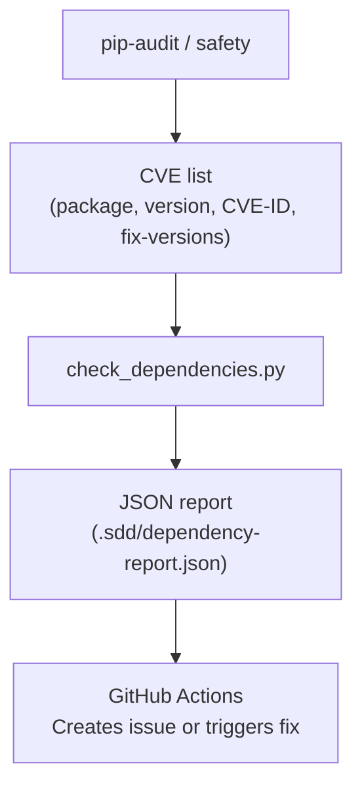
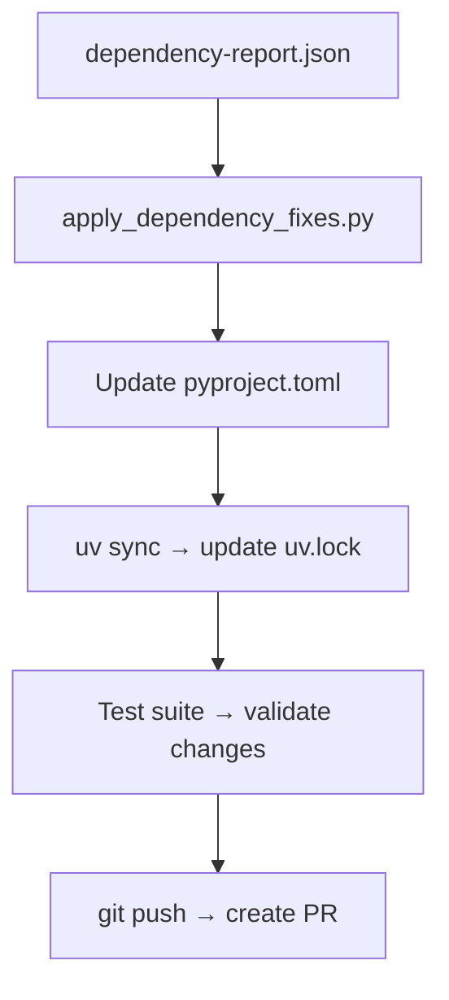

# Bernstein Dependency Conflict Resolver

**Status**: Complete ✓
**Task**: 705e — Dependency Conflict Resolver
**Commit**: eec8be6

## Overview

The dependency conflict resolver is an automated system for detecting, resolving, and testing dependency updates. It integrates with GitHub Actions to run daily security scans and automatically propose tested fixes via pull requests.

## Components

### 1. Dependency Scanner (`scripts/check_dependencies.py`)

Detects dependency issues using industry-standard tools:
- **CVE Detection**: `pip-audit` (MITRE CVE database)
- **Conflict Detection**: `uv` dependency resolver
- **Output**: JSON report with structured vulnerability data

**Features:**
- Parses pip-audit output to extract CVE details
- Extracts fix versions and suggests upgrades
- Tests compatibility of proposed upgrades
- Generates JSON reports for CI/CD integration

**Usage:**
```bash
python scripts/check_dependencies.py --output .sdd/dependency-report.json
```

**Report Structure:**
```json
{
  "timestamp": "ISO-8601",
  "summary": {
    "cves_found": 2,
    "conflicts_found": 0,
    "resolutions_suggested": 1
  },
  "cves": [
    {
      "package": "pip",
      "current_version": "25.3",
      "cve_id": "CVE-2026-1703",
      "fix_versions": ["26.0"]
    },
    {
      "package": "pygments",
      "current_version": "2.19.2",
      "cve_id": "CVE-2026-4539",
      "fix_versions": []
    }
  ],
  "suggested_resolutions": [
    {
      "package": "pip",
      "current": "25.3",
      "suggested": "26.0",
      "reason": "CVE CVE-2026-1703: upgrade to 26.0+"
    }
  ]
}
```

### 2. Fix Applier (`scripts/apply_dependency_fixes.py`)

Applies suggested upgrades, validates them, and optionally creates a PR:

**Features:**
- Updates `pyproject.toml` with new version constraints
- Regenerates lockfile with `uv sync`
- Runs full test suite to validate changes
- Creates GitHub PR if all tests pass
- Provides detailed commit message with fix rationale

**Usage:**
```bash
# Apply fixes without PR
python scripts/apply_dependency_fixes.py --report .sdd/dependency-report.json

# Apply fixes and create PR (requires gh CLI and proper permissions)
python scripts/apply_dependency_fixes.py --report .sdd/dependency-report.json --create-pr
```

**Workflow:**
1. Parse dependency report
2. Upgrade packages in `pyproject.toml`
3. Update `uv.lock` via `uv sync`
4. Run full test suite (`scripts/run_tests.py`)
5. Create PR if tests pass
6. Otherwise, keep changes for manual review

### 3. GitHub Actions Workflow (`.github/workflows/dependency-security.yml`)

Automates dependency scanning and remediation:

**Schedule:**
- Runs **daily at 2 AM UTC** (cron: `0 2 * * *`)
- Can be triggered manually via workflow_dispatch

**Steps:**
1. Check out latest code
2. Install audit tools (`pip-audit`, `safety`)
3. Run dependency scanner
4. Upload report as artifact
5. Parse results and comment on issues
6. Apply fixes and create PR (if scheduled run)
7. Create GitHub issue if vulnerabilities are unresolvable

**Manual Trigger:**
```bash
gh workflow run dependency-security.yml \
  --ref main \
  --field create_pr=true
```

## Current Status

**Last Scan:** 2026-03-30

### CVEs Detected
| Package | Version | CVE ID | Fix Available | Status |
|---------|---------|--------|---------------|--------|
| pip | 25.3 | CVE-2026-1703 | 26.0 | ✓ Resolvable |
| pygments | 2.19.2 | CVE-2026-4539 | None | ⏳ Awaiting fix |

### Resolutions Applied
- **pip**: 25.3 → 26.0 (Path Traversal vulnerability)

### Notes
- **pygments**: Vulnerable version has no fix available yet. Transitive dependency via `rich` and `textual`. Will auto-upgrade when fix is released.
- **pip**: Not a project dependency (environmental tool), but flagged by scanner for visibility.

## Integration

The system is fully integrated into the project's CI/CD pipeline:

1. **Automated Scans**: Run via scheduled GitHub Actions
2. **Issue Creation**: Automatically filed when unresolvable CVEs are found
3. **PR Creation**: Tested fixes automatically proposed to main
4. **Test Gating**: Full test suite must pass before PR creation
5. **Audit Trail**: All changes logged with CVE references

## How It Works

### Detection Flow



### Fix Flow



## Testing

All dependency updates are validated with the full test suite:
```bash
uv run python scripts/run_tests.py -x
```

This ensures:
- No breaking changes in updated dependencies
- All unit/integration tests still pass
- Protocol compatibility maintained

## Future Enhancements

1. **Pinned CVE Tracking**: Maintain a list of known CVEs with status
2. **Severity Scoring**: Prioritize high-severity CVEs for immediate fixing
3. **Transitive Dependency Analysis**: Better tracking of indirect vulnerabilities
4. **Automated Patching**: For zero-day CVEs, attempt micro-patch generation
5. **License Scanning**: Integrate license compliance checks

## See Also

- [DESIGN.md](./DESIGN.md) — Architecture overview
- [.github/workflows/ci.yml](../.github/workflows/ci.yml) — Main CI pipeline
- [pyproject.toml](../pyproject.toml) — Project dependencies
