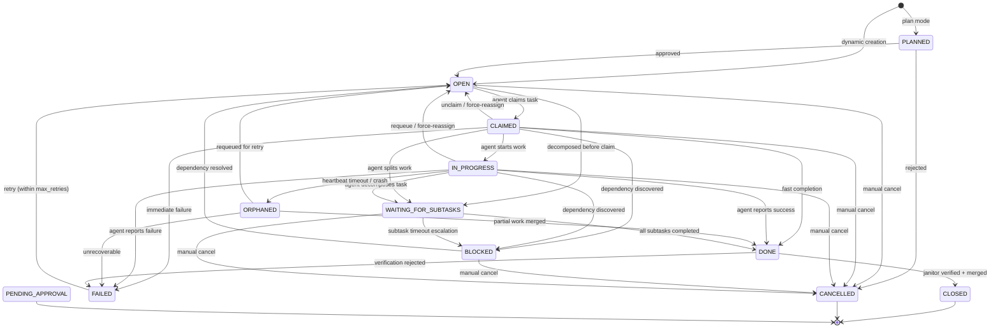
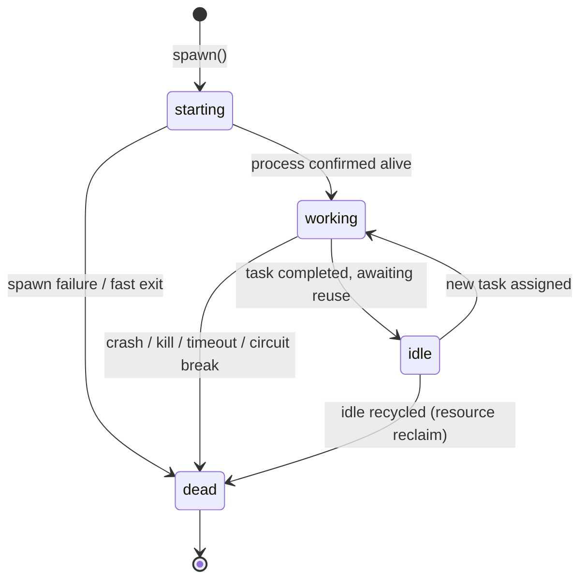
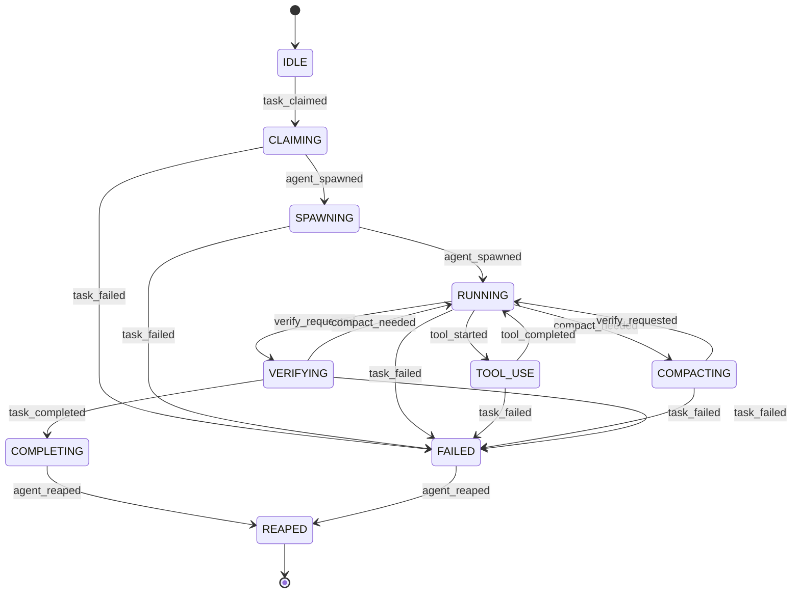

# Bernstein Design

This document describes the current architecture of Bernstein as implemented in the codebase today, with explicit boundaries for partial features.

---

## Core design principles

- Short-lived workers: agents are spawned for focused work and then exit.
- File-first state: runtime state is persisted under `.sdd/`.
- Deterministic orchestration: scheduling and lifecycle decisions are code-driven.
- Verification before closure: task completion passes through janitor/quality logic.
- Multi-adapter runtime: Bernstein is CLI-agent agnostic via adapter interfaces.

---

## High-level architecture

```text
CLI (src/bernstein/cli/)
  -> Task server (src/bernstein/core/server.py shim -> core/server/)
    -> Route modules (src/bernstein/core/routes/)
      -> Store + lifecycle + orchestration (core/ sub-packages)
        -> Adapter-based process spawning (adapters/)
```

Since v1.6, `core/` is organized into 22 sub-packages. Top-level modules like `core/server.py`, `core/orchestrator.py`, `core/spawner.py`, `core/task_lifecycle.py`, and `core/models.py` are thin re-export shims that redirect to their sub-packages.

Primary orchestration modules:

- `src/bernstein/core/orchestrator.py` (shim) -> `src/bernstein/core/orchestration/orchestrator.py`
- `src/bernstein/core/orchestration/tick_pipeline.py`
- `src/bernstein/core/tasks/task_lifecycle.py`
- `src/bernstein/core/agents/agent_lifecycle.py`

Key runtime subsystems (in sub-packages):

- Routing/cost: `core/routing/router.py`, `core/routing/cascade_router.py`, `core/cost/cost.py`, `core/cost/cost_history.py`, `core/cost/cost_anomaly.py`
- Reliability: `core/agents/heartbeat.py`, `core/cost/completion_budget.py`, `core/observability/loop_detector.py`
- Verification: `core/quality/janitor.py`, `core/quality/quality_gates.py`, `core/security/approval.py`, `core/quality/reviewer.py`
- Context and memory: `core/agents/spawn_prompt.py`, `core/tokens/context.py`, `core/knowledge/lessons.py`, `core/knowledge/knowledge_base.py`, `core/knowledge/rag.py`

---

## API surface (current)

The task server composes router modules from `src/bernstein/core/routes/`, including:

- `tasks.py`
- `status.py`
- `agents.py`
- `costs.py`
- `dashboard.py`
- `quality.py`
- `plans.py`
- `graduation.py`
- `webhooks.py`
- `slack.py`
- `auth.py`
- `observability.py`

Notable implemented endpoint groups:

- Task CRUD, claims, completion/fail, dependencies graph
- Agent heartbeats and process/session inspection
- Cluster node registration/heartbeat/status/task-steal primitives
- Status/events/metrics (including Prometheus-compatible metrics endpoint)
- Cost and quality reporting endpoints
- Trigger/webhook ingestion routes

---

## Trigger architecture

Trigger orchestration is implemented and centered on:

- `src/bernstein/core/orchestration/trigger_manager.py`
- `src/bernstein/core/tasks/models.py` (`TriggerEvent`, trigger config models)

Current source adapters:

- `src/bernstein/core/trigger_sources/github.py`
- `src/bernstein/core/trigger_sources/gitlab.py`
- `src/bernstein/core/trigger_sources/slack.py`
- `src/bernstein/core/trigger_sources/discord.py`
- `src/bernstein/core/trigger_sources/file_watch.py`
- `src/bernstein/core/trigger_sources/webhook.py`

Configuration source:

- `.sdd/config/triggers.yaml`

Boundary: trigger infrastructure is real and usable, but project-specific rule libraries and operational runbooks are still evolving.

---

## Cluster and remote execution

Implemented pieces:

- Worker CLI: `src/bernstein/cli/commands/worker_cmd.py`
- Cluster data model/policy: `src/bernstein/core/protocols/cluster.py`
- Cluster API routes in `src/bernstein/core/routes/task_cluster.py` and `src/bernstein/core/routes/tasks.py`

Boundary:

- Distributed operation works as an advanced deployment pattern.
- It is not presented as a fully managed autoscaling platform.

---

## Plugins and extensibility

Plugin system is pluggy-based and implemented under:

- `src/bernstein/plugins/hookspecs.py`
- `src/bernstein/plugins/manager.py`

Current hooks include task/agent/evolution lifecycle callbacks.

Boundary:

- Hook surface is stable for common extensions.
- Advanced plugin packaging/marketplace workflows are still light on guardrails.

---

## Observability and telemetry

Implemented:

- Status/event streaming routes
- Prometheus metrics export
- Cost and quality metrics files under `.sdd/metrics/`
- Observability route module for heartbeat/stall insights
- OTLP telemetry configuration hooks in core models/bootstrap path

Boundary:

- Prometheus and OTLP are real integrations.
- Turnkey production dashboards/alert packs are not bundled.

---

## Evolution and planning

Implemented:

- Evolution package (`src/bernstein/evolution/`)
- Plan execution and approval modules (`core/planning/planner.py`, `core/security/plan_approval.py`, plan routes)
- Retrospective/reporting command path (`retro`)

Boundary:

- End-to-end autonomous self-evolution exists with safety controls, but should be treated as operator-supervised in production settings.

---

## `.sdd/` state model (current)

Common active paths:

- `.sdd/backlog/open|claimed|closed/`
- `.sdd/runtime/`
- `.sdd/metrics/`
- `.sdd/traces/`
- `.sdd/memory/`
- `.sdd/caching/`
- `.sdd/agents/`

Exact files vary by enabled features and run mode.

---

## Lifecycle state machines

All task and agent status changes are governed by a deterministic FSM in
`src/bernstein/core/tasks/lifecycle.py`. Every transition is validated against an
explicit table; illegal moves raise `IllegalTransitionError` and emit a typed
`LifecycleEvent` for audit and replay.

See [LIFECYCLE.md](LIFECYCLE.md) for the full state tables, transition metadata,
`TransitionReason`/`AbortReason` enumerations, and abort-chain hierarchy.

### Task FSM (12 states)



> **Note — `PENDING_APPROVAL`:** Set directly by the approval subsystem; has no entry or exit in `TASK_TRANSITIONS`. See [LIFECYCLE.md](LIFECYCLE.md#terminal-states) for details.

### Agent FSM (4 states)



### Agent Turn FSM (10 states)

Tracks the lifecycle of a single task-handling turn within an agent process.
Source: `src/bernstein/core/agents/agent_turn_state.py`.



See [LIFECYCLE.md](LIFECYCLE.md#agent-turn-states-10-states) for the full
transition table and events reference.

---

## Non-goals for this document

- This file is not a roadmap backlog.
- This file is not a generated protocol matrix.
- This file is not a per-command CLI reference (see `GETTING_STARTED.md` and `bernstein --help`).
