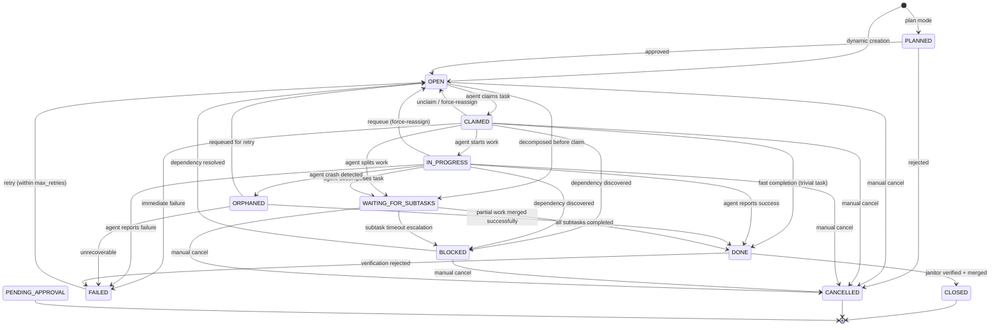
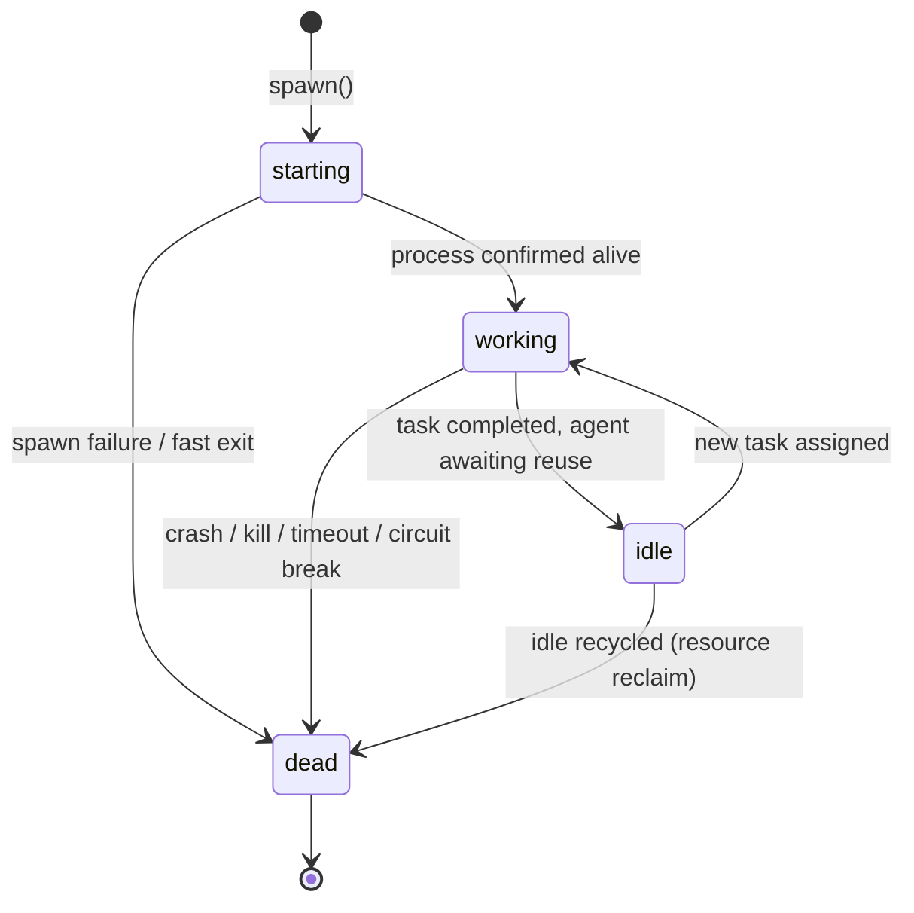
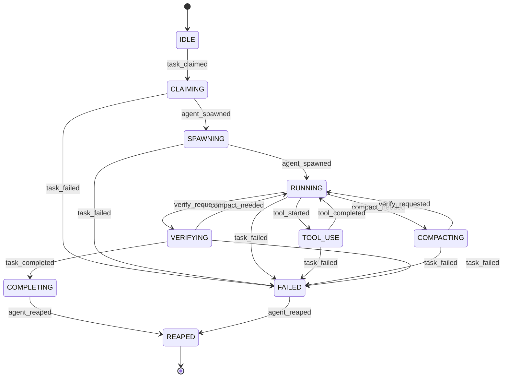

# Lifecycle State Machines

Bernstein uses deterministic finite state machines (FSMs) for both task and agent
lifecycle management. All transitions flow through the Lifecycle Governance Kernel
(`core/tasks/lifecycle.py`), which validates transitions against an explicit transition
table, rejects illegal moves with `IllegalTransitionError`, and emits typed
`LifecycleEvent` records for audit, replay, and metrics.

Source of truth: `src/bernstein/core/tasks/lifecycle.py` (transition tables),
`src/bernstein/core/tasks/models.py` (`TaskStatus` enum, `AgentSession` dataclass).

---

## Task States (12 states)

| Status | Description |
|--------|-------------|
| `PLANNED` | Awaiting human approval before execution (plan mode). Tasks created from plan YAML files start here. |
| `OPEN` | Ready for an agent to claim. The default starting state for dynamically created tasks. |
| `CLAIMED` | An agent has claimed this task but has not yet started work. |
| `IN_PROGRESS` | Agent is actively working on the task. |
| `DONE` | Agent reported completion. Pending janitor verification and merge. |
| `CLOSED` | Verified and merged. Terminal state. |
| `FAILED` | Agent reported failure or verification rejected the result. Can be retried. |
| `BLOCKED` | Waiting on an external dependency (another task, resource, or approval). |
| `WAITING_FOR_SUBTASKS` | Parent task waiting for child subtasks to complete (agent decomposed work). |
| `CANCELLED` | Manually or programmatically cancelled. Terminal state. |
| `ORPHANED` | Agent crashed mid-task; pending crash recovery by the orchestrator. |
| `PENDING_APPROVAL` | Task completed but requires human approval before taking effect. |

### Task State Diagram



> **Note — `PENDING_APPROVAL`:** This state exists in the `TaskStatus` enum and is used by the approval subsystem (see `src/bernstein/core/security/approval.py`). It is set directly rather than through the `TASK_TRANSITIONS` table, so it has no FSM-managed entry or exit path. Tasks in this state await human review and cannot progress further without manual intervention.

### Task Transition Table (exhaustive)

Every allowed transition is listed below. The guard function for all transitions
is `_always` (unconditional). Any transition not in this table raises
`IllegalTransitionError`.

| From | To | Trigger |
|------|----|---------|
| PLANNED | OPEN | Human approves the planned task |
| PLANNED | CANCELLED | Human rejects the planned task |
| OPEN | CLAIMED | Agent calls `claim_next()` or `claim_by_id()` |
| OPEN | WAITING_FOR_SUBTASKS | Task decomposed before agent assignment |
| OPEN | CANCELLED | Manual cancellation |
| CLAIMED | IN_PROGRESS | Agent begins execution |
| CLAIMED | OPEN | Unclaim / force-reassign to different agent |
| CLAIMED | DONE | Fast completion (task was trivial) |
| CLAIMED | FAILED | Immediate failure (e.g., scope violation) |
| CLAIMED | CANCELLED | Manual cancellation |
| CLAIMED | WAITING_FOR_SUBTASKS | Agent splits task into subtasks |
| CLAIMED | BLOCKED | Dependency discovered after claim |
| IN_PROGRESS | DONE | Agent reports successful completion |
| IN_PROGRESS | FAILED | Agent reports failure |
| IN_PROGRESS | BLOCKED | External dependency blocks progress |
| IN_PROGRESS | WAITING_FOR_SUBTASKS | Agent decomposes task mid-execution |
| IN_PROGRESS | OPEN | Force-requeue for different agent |
| IN_PROGRESS | CANCELLED | Manual cancellation |
| IN_PROGRESS | ORPHANED | Heartbeat timeout / agent crash detected |
| ORPHANED | DONE | Partial work saved and merged |
| ORPHANED | FAILED | Crash recovery failed |
| ORPHANED | OPEN | Requeued for retry by another agent |
| BLOCKED | OPEN | Blocking dependency resolved |
| BLOCKED | CANCELLED | Manual cancellation |
| WAITING_FOR_SUBTASKS | DONE | All child subtasks completed |
| WAITING_FOR_SUBTASKS | BLOCKED | Subtask timeout escalation (parent blocked waiting on unresponsive subtask) |
| WAITING_FOR_SUBTASKS | CANCELLED | Manual cancellation |
| FAILED | OPEN | Retry (respects `max_retries`, default 3) |
| DONE | CLOSED | Janitor verification passed + branch merged |
| DONE | FAILED | Janitor verification rejected the result |

### Terminal States

Terminal states have no outbound transitions. Computed by the lifecycle kernel:
- `CLOSED`
- `CANCELLED`
- `PENDING_APPROVAL` (awaits external action; no programmatic exit)

### Adaptive Timeout

Task timeouts are not static. The adaptive timeout system (`src/bernstein/core/orchestration/adaptive_timeout.py`) adjusts wall-clock timeouts based on historical task durations. Default scope-based timeouts are defined in `src/bernstein/core/defaults.py` (`TASK.scope_timeout_s`): small=15 min, medium=30 min, large=60 min, XL=120 min.

### Graduated Access Control

The graduated access control system (`src/bernstein/core/security/graduated_access.py`) gates which lifecycle transitions an agent is permitted to perform based on its trust level and track record. New agents start with restricted permissions that expand as they demonstrate reliability.

---

## Agent States (4 states)

| Status | Description |
|--------|-------------|
| `starting` | Agent process has been spawned but has not yet confirmed readiness. |
| `working` | Agent is actively executing a task. |
| `idle` | Agent finished its current task and is available for new work. |
| `dead` | Agent process has exited (success, crash, kill, timeout, or recycled). Terminal state. |

### Agent State Diagram



### Agent Transition Table (exhaustive)

| From | To | Trigger |
|------|----|---------|
| starting | working | Process started successfully, heartbeat received |
| starting | dead | `SpawnError`, `RateLimitError`, or fast exit detection |
| working | idle | Agent finished current task, session still alive |
| working | dead | Process crash (SIGKILL/OOM), manual kill, timeout watchdog, or circuit breaker |
| idle | working | Orchestrator assigns a new task to the existing session |
| idle | dead | Idle recycling (orchestrator reclaims resources from idle agents) |

### Transition Metadata

Every transition produces a `LifecycleEvent` with:
- `timestamp` (Unix epoch)
- `entity_type` ("task" or "agent")
- `entity_id` (task ID or session ID)
- `from_status` / `to_status`
- `actor` (who triggered it: "task_store", "spawner", "janitor", "plan_approval", etc.)
- `reason` (human-readable explanation)
- `transition_reason` (canonical `TransitionReason` enum, when applicable)
- `abort_reason` (canonical `AbortReason` enum, for abnormal agent termination)

### TransitionReason Values

These canonical reasons classify why a lifecycle transition occurred:

| Value | Meaning |
|-------|---------|
| `completed` | Normal successful completion |
| `aborted` | Explicit abort requested |
| `retry` | Task being retried after failure |
| `prompt_too_long` | Input exceeded model context window |
| `max_output_tokens` | Model hit output token limit |
| `max_turns` | Agent reached max conversation turns |
| `provider_413` | Provider returned 413 (payload too large) |
| `provider_529` | Provider returned 529 (overloaded) |
| `compaction_failed` | Context compaction/summarization failed |
| `stop_hook_blocked` | A stop hook prevented the transition |
| `permission_denied` | Insufficient permissions for the operation |
| `sibling_aborted` | A sibling agent in the same group was aborted |
| `orphan_recovered` | Orphaned task was automatically recovered |

### AbortReason Values

These classify abnormal agent terminations:

| Value | Meaning |
|-------|---------|
| `user_interrupt` | SIGINT (Ctrl+C) |
| `shutdown_signal` | SIGTERM (graceful shutdown) |
| `timeout` | Watchdog timer expired (exit code 124) |
| `oom` | Out of memory (exit code 137 / SIGKILL) |
| `permission_denied` | Exit code 126 |
| `provider_error` | API provider returned an unrecoverable error |
| `bash_error` | A bash tool invocation caused a fatal error |
| `sibling_aborted` | Cascading abort from sibling agent failure |
| `parent_aborted` | Cascading abort from parent session |
| `compact_failure` | Context window compaction failed |
| `unknown` | Unclassified termination |

---

## TUI Visual States (7 classifications)

The Bernstein terminal dashboard classifies agents into **visual states** derived from session metadata — not from the FSM directly. These presentation-layer states help operators understand agent health at a glance.

Source: `src/bernstein/tui/agent_states.py` (`AgentState`, `classify_agent_state`).

| Visual State | Indicator | Color | Meaning |
|-------------|-----------|-------|---------|
| `SPAWNING` | ◔ | yellow | Agent process is launching. Timeout: 60 s before reclassified as `DEAD`. |
| `RUNNING` | ● | green | Agent is actively working with a recent heartbeat (`in_progress`/`running` status). |
| `STALLED` | ◐ | dark orange | Agent has a PID and active status but no heartbeat for > 5 minutes. |
| `MERGING` | ⇄ | blue | Agent is committing, pushing, or merging results. |
| `DEAD` | ○ | red | Session ended (`done`, `failed`, `cancelled`, `killed`), or spawn timed out, or no PID on a non-active status. |
| `IDLE` | □ | gray | Agent is waiting for a new task (`idle`, `waiting`, or `paused` status). |
| `UNKNOWN` | ◌ | dim | Unrecognized status string or unexpected metadata combination. |

### Mapping to Core FSM States

TUI visual states are derived from the core FSM state (`starting`, `working`, `idle`, `dead`) plus process-level metadata (PID presence, heartbeat timestamp, elapsed time). They do **not** correspond 1:1 to FSM states.

| Core FSM State | TUI Visual State | Condition |
|----------------|-----------------|-----------|
| `starting` | `SPAWNING` | Spawn age < 60 s |
| `starting` | `DEAD` | Spawn age ≥ 60 s (timeout) |
| `working` | `RUNNING` | Last heartbeat < 5 min ago |
| `working` | `STALLED` | Last heartbeat ≥ 5 min ago |
| `working` | `MERGING` | Status string is `merging` / `committing` / `pushing` |
| `idle` | `IDLE` | Agent awaiting next task |
| `dead` | `DEAD` | Session ended |
| (any) | `UNKNOWN` | Unclassified metadata combination |

> **Thresholds** (configurable via `AgentStateThresholds`): stall threshold = 300 s (5 min), spawn timeout = 60 s.

---

## Agent Turn States (10 states)

The agent turn FSM operates at a finer granularity than the agent session FSM above.
It tracks the lifecycle of a **single task handling turn** within an agent process —
from the moment a task is claimed through to cleanup.

Source of truth: `src/bernstein/core/agents/agent_turn_state.py` (`AgentTurnState`,
`AgentTurnEvent`, `AgentTurnStateMachine`).

| State | Description |
|-------|-------------|
| `IDLE` | No active turn — agent is between tasks or not yet assigned. |
| `CLAIMING` | A task has been claimed; worktree is being prepared. |
| `SPAWNING` | Agent process has been launched but hasn't started executing yet. |
| `RUNNING` | Agent process is actively working on the task. |
| `TOOL_USE` | Agent is executing an external tool (file editor, shell, search, etc.). |
| `COMPACTING` | Context window is near its limit; compaction/summarization is in progress. |
| `VERIFYING` | Task work is done; janitor or LLM verification is pending. |
| `COMPLETING` | Verification passed; task is being marked done and metrics emitted. |
| `FAILED` | An error, crash, or verification failure occurred. |
| `REAPED` | Cleanup is complete (worktree removed, metrics flushed). Terminal. |

### Agent Turn State Diagram

Events that drive transitions are shown on each arrow.



### Agent Turn Transition Table (exhaustive)

| From | Event | To | Notes |
|------|-------|----|-------|
| `IDLE` | `task_claimed` | `CLAIMING` | Orchestrator picks up the next open task |
| `CLAIMING` | `agent_spawned` | `SPAWNING` | Worktree ready; CLI process launched |
| `CLAIMING` | `task_failed` | `FAILED` | Worktree setup failed (permission error, git conflict) |
| `SPAWNING` | `agent_spawned` | `RUNNING` | Process confirmed alive and active |
| `SPAWNING` | `task_failed` | `FAILED` | Spawn error or adapter rejected the task |
| `RUNNING` | `tool_started` | `TOOL_USE` | Agent invoked a tool (Edit, Bash, Glob, etc.) |
| `RUNNING` | `compact_needed` | `COMPACTING` | Context window approaching the model's limit |
| `RUNNING` | `verify_requested` | `VERIFYING` | Agent signals it is done; verification begins |
| `RUNNING` | `task_failed` | `FAILED` | Runtime error or abort during execution |
| `TOOL_USE` | `tool_completed` | `RUNNING` | Tool call finished; agent resumes |
| `TOOL_USE` | `task_failed` | `FAILED` | Fatal error inside the tool invocation |
| `COMPACTING` | `verify_requested` | `RUNNING` | Compaction done; context summarized; agent continues |
| `COMPACTING` | `task_failed` | `FAILED` | Compaction itself failed (`compact_failure` abort) |
| `VERIFYING` | `task_completed` | `COMPLETING` | All completion signals satisfied |
| `VERIFYING` | `compact_needed` | `RUNNING` | Context grew during verification; must compact first |
| `VERIFYING` | `task_failed` | `FAILED` | Janitor rejected the result |
| `COMPLETING` | `agent_reaped` | `REAPED` | Task marked done; worktree removed; metrics flushed |
| `FAILED` | `agent_reaped` | `REAPED` | Error handled; resources cleaned up |

### Events Reference

| Event | Fired by | Meaning |
|-------|----------|---------|
| `task_claimed` | Spawner / orchestrator | A task was successfully reserved for this agent |
| `agent_spawned` | Adapter / spawner | CLI process started (fires twice: at launch and at readiness confirmation) |
| `tool_started` | Agent turn monitor | Agent began a tool call |
| `tool_completed` | Agent turn monitor | Tool call returned |
| `compact_needed` | Token monitor | Context window usage crossed the compaction threshold |
| `verify_requested` | Agent / orchestrator | Agent declared the task finished |
| `task_completed` | Janitor | All completion signals confirmed |
| `task_failed` | Any layer | Unrecoverable error at the current phase |
| `agent_reaped` | Janitor / spawner | Cleanup of process and worktree is complete |

---

## Abort Chain Hierarchy

Agent aborts follow a three-level containment hierarchy:

```
TOOL  <  SIBLING  <  SESSION
```

| Scope | Effect | Cascade |
|-------|--------|---------|
| **TOOL** | Single tool invocation aborted; agent session continues | No cascade |
| **SIBLING** | Sibling agents (same parent) receive SHUTDOWN signal | Does not affect parent unless `AbortPolicy.sibling_to_session` is set |
| **SESSION** | Full agent session torn down; SHUTDOWN cascades to all descendants | Propagates to all children via `propagate_abort()` |

Escalation between levels is opt-in via `AbortPolicy`. By default, each level
contains its failure without propagating upward.
