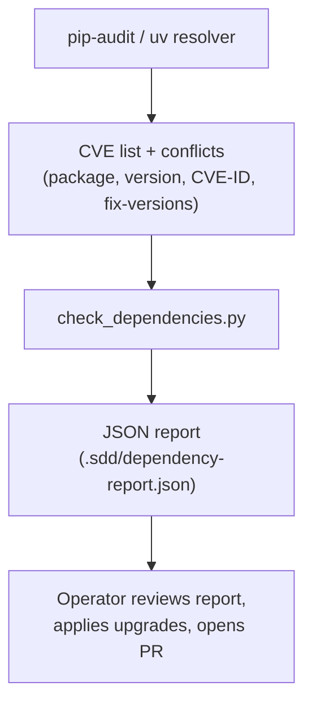

# Bernstein Dependency Conflict Resolver

## Overview

`scripts/check_dependencies.py` detects dependency problems and suggests
tested upgrade resolutions. It is an operator-run script; run it locally
or wire it into your own automation.

## What it does

- **CVE detection**: runs `pip-audit` and parses the findings
- **Conflict detection**: runs `uv pip compile pyproject.toml --resolution highest` and captures resolver conflicts
- **Resolution suggestions**: for each CVE with a fix version, proposes the upgrade and dry-run-tests it (`uv pip install <pkg>==<version> --dry-run`)
- **Output**: a JSON report plus a Rich console summary

## Usage

```bash
uv run python scripts/check_dependencies.py --output .sdd/dependency-report.json
```

`--output` defaults to `.sdd/dependency-report.json`. The script exits 1
when any CVE or conflict is found, 0 otherwise, so it can gate a shell
pipeline.

## Report structure

```json
{
  "timestamp": "ISO-8601",
  "summary": {
    "cves_found": 2,
    "conflicts_found": 0,
    "resolutions_suggested": 1
  },
  "cves": [
    {
      "package": "example-package",
      "current_version": "1.2.3",
      "cve_id": "CVE-XXXX-YYYY",
      "fix_versions": ["1.2.4"]
    }
  ],
  "conflicts": [],
  "suggested_resolutions": [
    {
      "package": "example-package",
      "current": "1.2.3",
      "suggested": "1.2.4",
      "reason": "CVE CVE-XXXX-YYYY: upgrade to 1.2.4+"
    }
  ]
}
```

Point-in-time scan results live in the generated report, not in this
page.

## Detection flow



## Applying a resolution

The script suggests and dry-run-tests upgrades; applying them is a
manual step:

1. Update the constraint in `pyproject.toml`.
2. Regenerate the lockfile with `uv sync`.
3. Validate with the full test suite: `uv run python scripts/run_tests.py -x`.
4. Open a PR referencing the CVE ids from the report.

## Related CI coverage

Dependency security is continuously covered by separate mechanisms:

- the `pip-audit (deps)` job in [`.github/workflows/ci.yml`](https://github.com/sipyourdrink-ltd/bernstein/blob/main/.github/workflows/ci.yml)
- `.github/workflows/dependency-review.yml` on pull requests
- Dependabot version and security updates

## See Also

- [DESIGN.md](./DESIGN.md) - Architecture overview
- [pyproject.toml](https://github.com/sipyourdrink-ltd/bernstein/blob/main/pyproject.toml) - Project dependencies
