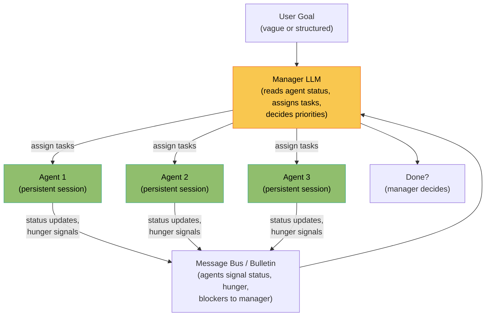
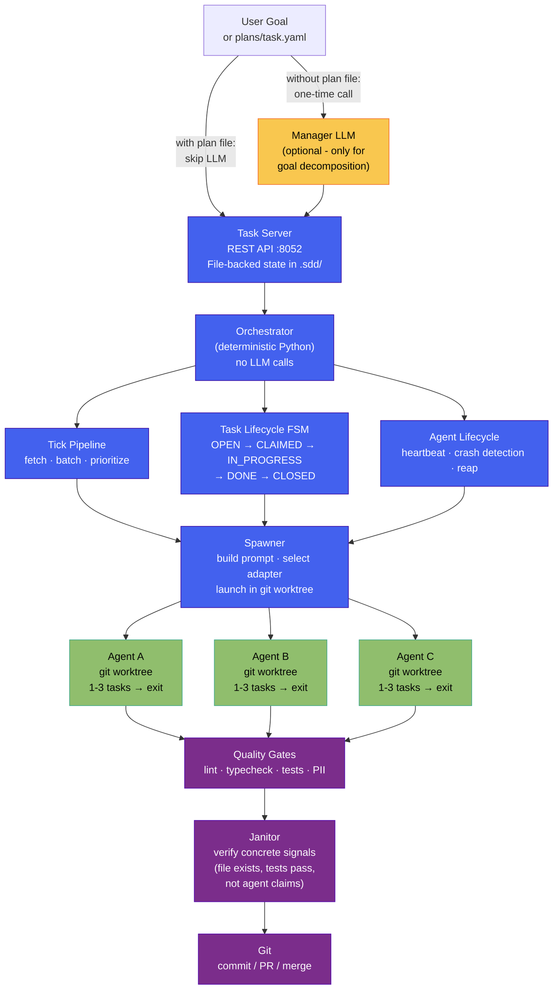
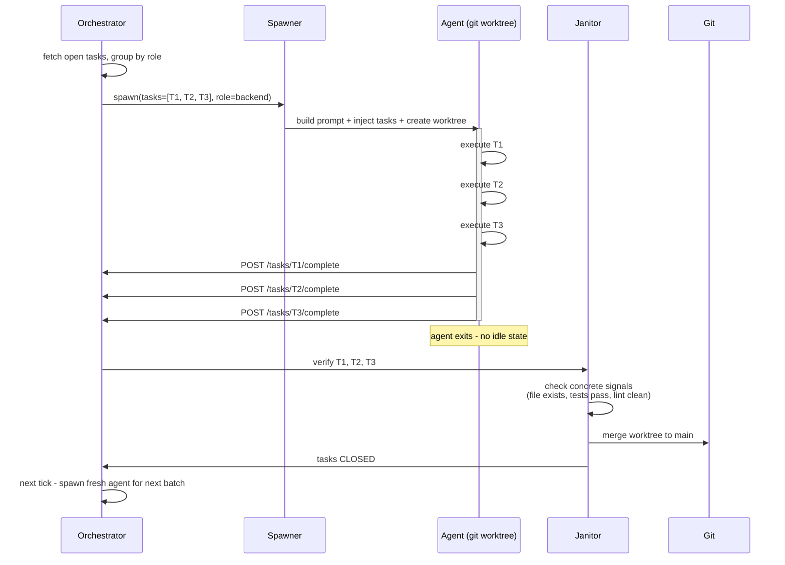

# Deterministic vs. LLM-Based Orchestration

A side-by-side comparison of two approaches to multi-agent coordination, with
architecture diagrams showing the structural differences.

---

## The two approaches

### LLM-based orchestration

An LLM (the "manager agent") sits in the control plane. It reads status from
running agents, reasons about priorities, assigns tasks, and decides when work
is complete. This is the model used by hierarchical-process frameworks,
group-chat coordinators, and supervisor-node graph runtimes.

**What goes wrong at scale:** the LLM manager stalls and every queue drains behind it, workers spin on idle "hunger" signals instead of committing code, and phantom agents spawned without identity flood the bus with noise. This failure mode is documented with measured numbers (agent counts, bulletin volume, useful-work ratio) in [Why Deterministic Orchestration](../architecture/WHY_DETERMINISTIC.md#why-this-matters-the-rag_challenge-evidence).

---

### Deterministic orchestration (Bernstein)

A Python process owns the control plane. It is a scheduler - it applies rules
mechanically, makes no LLM calls, and has no concept of "reasoning." Agents are
spawned with pre-assigned tasks, execute them, and exit. There is no idle state.

---

## Task state machine (deterministic FSM)

The task lifecycle is a state machine implemented in Python: every transition has a defined trigger, and there are no judgment calls. The canonical state diagram and the exhaustive transition table live in [Lifecycle State Machines](../architecture/LIFECYCLE.md#task-state-diagram); this page links to it rather than carrying a second copy that can drift.

---

## Agent lifecycle (short-lived by design)

Agents are born with work and die when done. There is no idle state, no hunger
state, no polling loop.

---

## Structural comparison

| Property | LLM-based | Deterministic (Bernstein) |
|----------|-----------|--------------------------|
| **Control plane** | LLM manager agent | Python scheduler (no LLM calls) |
| **Scheduling decisions** | LLM reasoning on each tick | Code: priority queue + role grouping |
| **Token cost of coordination** | Thousands/tick (manager context) | Zero |
| **Agent lifetime** | Persistent session (indefinite) | Bounded: 1-3 tasks then exit |
| **Idle state** | Yes - agents poll, spam hunger signals | No - agents are dead when not working |
| **Sleep failure mode** | Critical - unrecoverable without human | Impossible - dead agents cannot sleep |
| **Context drift** | Yes - long sessions accumulate stale context | No - fresh context on every spawn |
| **Scheduling reproducibility** | Non-deterministic (LLM sampling) | Deterministic - same input = same decision |
| **Debuggability** | Cannot reproduce scheduling bugs | Unit-testable state machine |
| **Verification** | Agent claims ("I finished X") | Concrete signals (file exists, tests pass) |
| **Manager failure mode** | Cascading - all agents starve | N/A - no manager |
| **Scalability** | O(agents × tasks) in manager context | O(1) per agent per tick |
| **Coordination auditability** | LLM response logs (non-reproducible) | Python call stack (fully traceable) |

---

## Token cost model

The coordination cost is the sharpest structural difference.

**LLM-based** - every scheduling tick pays for the manager's context and response (roughly 5,000-20,000 tokens in, 500-2,000 out, growing with task and agent count), and idle agents burn more tokens polling and signalling. The manager's reasoning is pure coordination overhead: it produces no code.

**Deterministic** - the orchestrator spends zero tokens on scheduling (a tick is sub-millisecond Python). The only tokens a Bernstein run spends are on task execution: a one-time system prompt per spawn (~1,500-3,000 tokens), amortised to ~500-1,000 tokens per task across a 3-task batch.

For the measured overhead of a real 12-agent LLM-orchestrated run (tens of millions of coordination tokens, roughly a 25% useful-work ratio), see [Why Deterministic Orchestration](../architecture/WHY_DETERMINISTIC.md#2-token-cost-of-coordination).

---

## When each approach makes sense

### Use LLM-based orchestration when:

- Task count is small (< ~20) and agent count is small (< 4)
- Tasks are loosely structured and require creative routing decisions
- You want a demo that explains itself in plain language
- The orchestration logic itself is your product (you're selling the reasoning)

### Use deterministic orchestration when:

- Running more than a handful of parallel agents
- Task definitions are concrete (clear acceptance criteria)
- You need predictable cost (budget limits, production use)
- You need the system to run unattended for hours without human babysitting
- Debugging and auditability matter
- You're using agents as workers, not collaborators

---

## Related documents

- [ADR-001: Agent Lifecycle Model](../decisions/001-agent-lifecycle.md) - Full analysis of hunger vs. pull vs. short-lived models with multi-agent pilot data
- [ADR-006: No Embedded LLM in the Orchestrator](../decisions/006-no-embedded-llm.md) - Why the control plane is deterministic code
- [Why Deterministic Orchestration](../architecture/WHY_DETERMINISTIC.md) - Narrative explainer with first-principles reasoning
- [Architecture](../architecture/ARCHITECTURE.md) - Full system diagram and module breakdown
