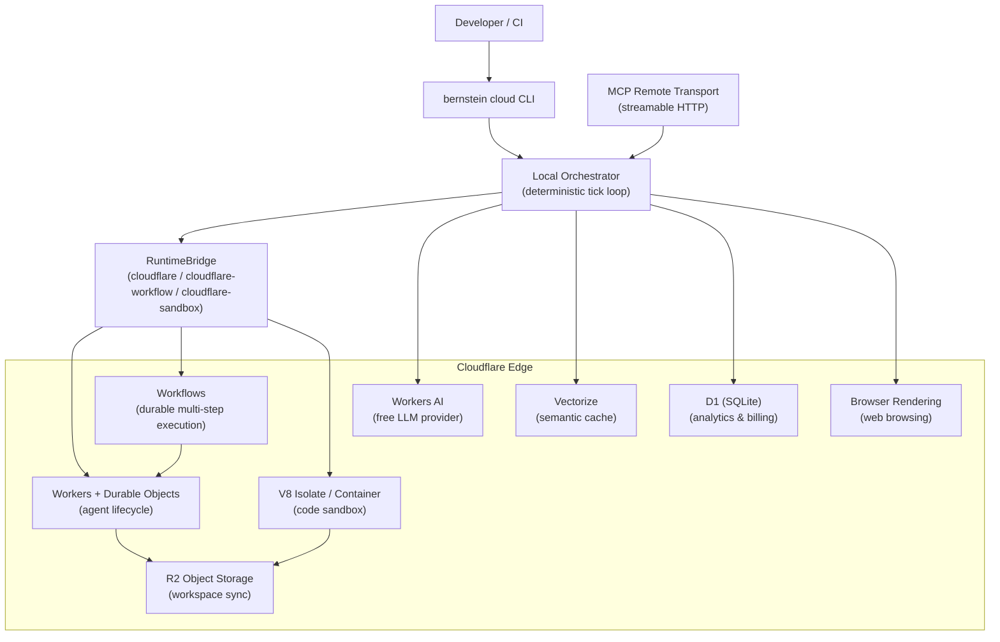

# Cloudflare Integration Overview

Bernstein can run agents locally or in the cloud. The Cloudflare integration lets you execute agents on Cloudflare's edge infrastructure using Workers, Durable Objects, Workflows, and V8 isolate sandboxes -- while the orchestrator stays deterministic and local.

---

## When to use cloud vs local

| Scenario | Recommended | Why |
|----------|-------------|-----|
| Solo developer, small codebase | Local | Zero setup, fastest iteration |
| CI/CD pipeline | Local (Docker/K8s) | Full filesystem access, no network hops |
| Team with shared orchestration | Cloudflare | Centralized billing, no shared server to maintain |
| Untrusted code execution | Cloudflare sandbox | V8 isolate/container isolation, no host access |
| Global team, low-latency agent dispatch | Cloudflare Workers | Edge execution near developers |
| SaaS / hosted Bernstein | Cloudflare (full stack) | D1 analytics, R2 storage, Vectorize caching |

---

## Architecture

---

## Module map

| Module | Import path | Purpose |
|--------|-------------|---------|
| Workers RuntimeBridge | `bernstein.bridges.cloudflare` | Spawn agents on Cloudflare Workers with Durable Objects |
| Workflow Bridge | `bernstein.bridges.cloudflare_workflow` | Durable multi-step workflows with auto-retry and approval gates |
| Sandbox Bridge | `bernstein.bridges.cloudflare_sandbox` | Isolated V8 or container execution for untrusted code |
| Browser Rendering | `bernstein.bridges.browser_rendering` | Headless browsing, screenshots, scraping, PDF generation |
| R2 Workspace Sync | `bernstein.bridges.r2_sync` | Content-addressed file sync between local and R2 |
| Workers AI Provider | `bernstein.core.routing.cloudflare_ai` | Free-tier LLM completions for planning and decomposition |
| Cloudflare Agents Adapter | `bernstein.adapters.cloudflare_agents` | Spawn agents via `npx wrangler dev` locally |
| Codex-on-Cloudflare Adapter | `bernstein.adapters.codex_cloudflare` | Run OpenAI Codex inside Cloudflare sandboxes |
| D1 Analytics | `bernstein.core.cost.d1_analytics` | Usage metering, billing tiers, quota enforcement |
| Vectorize Cache | `bernstein.core.memory.vectorize_cache` | Semantic cache for LLM responses using vector similarity |
| MCP Remote Transport | `bernstein.mcp.remote_transport` | Streamable HTTP transport for remote MCP server access |
| Cloud CLI | `bernstein.cli.commands.cloud_cmd` | `bernstein cloud` subcommands (login, run, status, cost, deploy) |

---

## What you need

At minimum:

- A Cloudflare account (free tier works for Workers AI and basic Workers)
- A Cloudflare API token with appropriate permissions
- Your Cloudflare account ID

For the full stack, you also need:

- An R2 bucket for workspace sync
- A D1 database for analytics
- A Vectorize index for semantic caching

See [Setup](cloudflare-setup.md) for step-by-step provisioning instructions.

---

## What to read next

- **[Setup Guide](cloudflare-setup.md)** -- provision Cloudflare resources
- **[Bridges](cloudflare-bridges.md)** -- runtime, workflow, and sandbox bridges
- **[Adapters](cloudflare-adapters.md)** -- Cloudflare Agents SDK and Codex-on-CF
- **[Workers AI](cloudflare-ai.md)** -- free LLM provider for planning
- **[Analytics & Caching](cloudflare-analytics.md)** -- D1 billing and Vectorize cache
- **[Cloud CLI](cloudflare-cli.md)** -- `bernstein cloud` commands
- **[MCP Remote](cloudflare-mcp.md)** -- remote MCP transport
