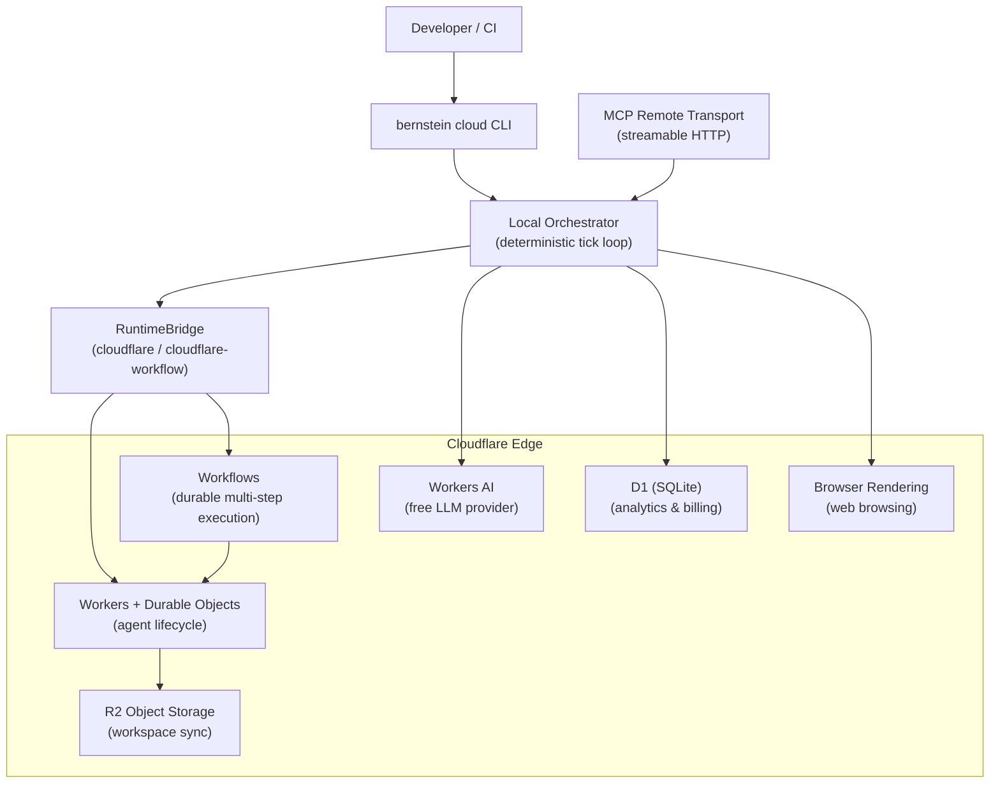

# Cloudflare Integration Overview

> **Preview:** The Cloud / Cloudflare surfaces are under active hardening. The hosted API (api.bernstein.run) does not resolve in DNS, so bernstein cloud commands report the service unreachable and exit non-zero. Rows graduate out of Preview individually as smoke coverage lands.

!!! warning "Experimental; hosted API not yet available"
    Cloud execution is experimental. Workers, R2, D1, and Workers AI run
    against **your own** Cloudflare account. The hosted Bernstein Cloud API at
    `api.bernstein.run` does not resolve in DNS, so `bernstein cloud login`,
    `run`, `status`, `runs`, and `cost` report that the service is unreachable
    and exit non-zero.

Bernstein can run agents locally or in the cloud. The Cloudflare integration lets you execute agents on Cloudflare's edge infrastructure using Workers, Durable Objects, and Workflows -- while the orchestrator stays deterministic and local.

---

## When to use cloud vs local

| Scenario | Recommended | Why |
|----------|-------------|-----|
| Solo developer, small codebase | Local | Zero setup, fastest iteration |
| CI/CD pipeline | Local (Docker/K8s) | Full filesystem access, no network hops |
| Team with shared orchestration | Cloudflare | Centralized billing, no shared server to maintain |
| Global team, low-latency agent dispatch | Cloudflare Workers | Edge execution near developers |
| SaaS / hosted Bernstein | Cloudflare (full stack) | D1 analytics, R2 storage |

---

## Architecture

---

## Module map

| Module | Import path | Purpose |
|--------|-------------|---------|
| Workers RuntimeBridge | `bernstein.bridges.cloudflare` | Spawn agents on Cloudflare Workers with Durable Objects |
| Workflow Bridge | `bernstein.bridges.cloudflare_workflow` | Durable multi-step workflows with auto-retry and approval gates |
| Browser Rendering | `bernstein.bridges.browser_rendering` | Headless browsing, screenshots, scraping, PDF generation |
| R2 Workspace Sync | `bernstein.bridges.r2_sync` | Content-addressed file sync between local and R2 |
| Workers AI Provider | `bernstein.core.routing.cloudflare_ai` | Free-tier LLM completions for planning and decomposition |
| Codex-on-Cloudflare Adapter | `bernstein.adapters.codex_cloudflare` | Runs Codex in a sandbox container via an operator-deployed `@cloudflare/sandbox` bridge Worker; needs a Workers Paid plan |
| D1 Analytics | `bernstein.core.cost.d1_analytics` | Usage metering, billing tiers, quota enforcement |
| MCP Remote Transport | `bernstein.mcp.remote_transport` | Streamable HTTP transport for remote MCP server access |
| Cloud CLI | `bernstein.cli.commands.cloud_cmd` | `bernstein cloud` subcommands (init, deploy are local; login/run/status/cost target the experimental, currently-unavailable `api.bernstein.run`) |

---

## What you need

At minimum:

- A Cloudflare account (free tier works for Workers AI and basic Workers)
- A Cloudflare API token with appropriate permissions
- Your Cloudflare account ID

For the full stack, you also need:

- An R2 bucket for workspace sync
- A D1 database for analytics

See [Setup](cloudflare-setup.md) for step-by-step provisioning instructions.

---

## What to read next

- **[Setup Guide](cloudflare-setup.md)** -- provision Cloudflare resources
- **[Bridges](cloudflare-bridges.md)** -- runtime and workflow bridges
- **[Adapters](cloudflare-adapters.md)** -- Codex-on-Cloudflare
- **[Workers AI](cloudflare-ai.md)** -- free LLM provider for planning
- **[Analytics & Billing](cloudflare-analytics.md)** -- D1 usage metering and billing tiers
- **[Cloud CLI](cloudflare-cli.md)** -- `bernstein cloud` commands
- **[MCP Remote](cloudflare-mcp.md)** -- remote MCP transport
