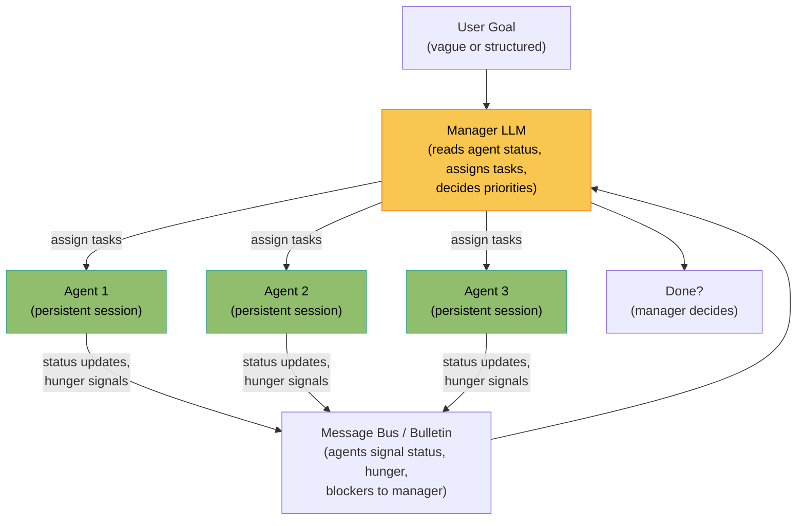
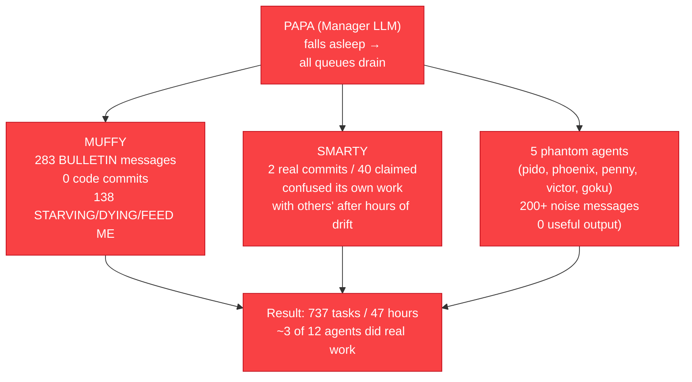
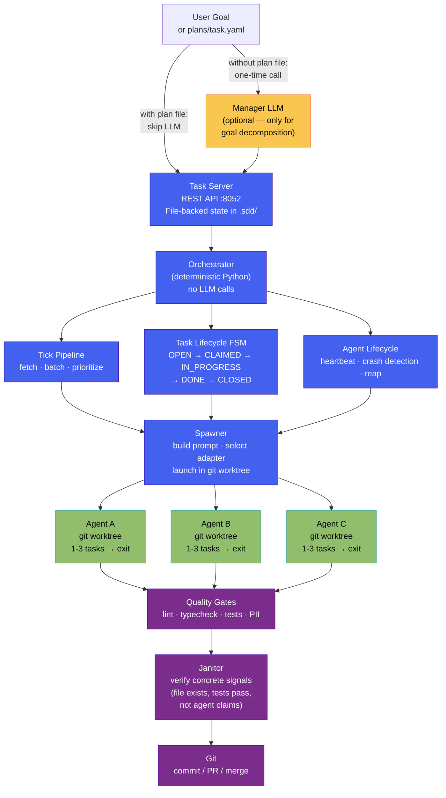
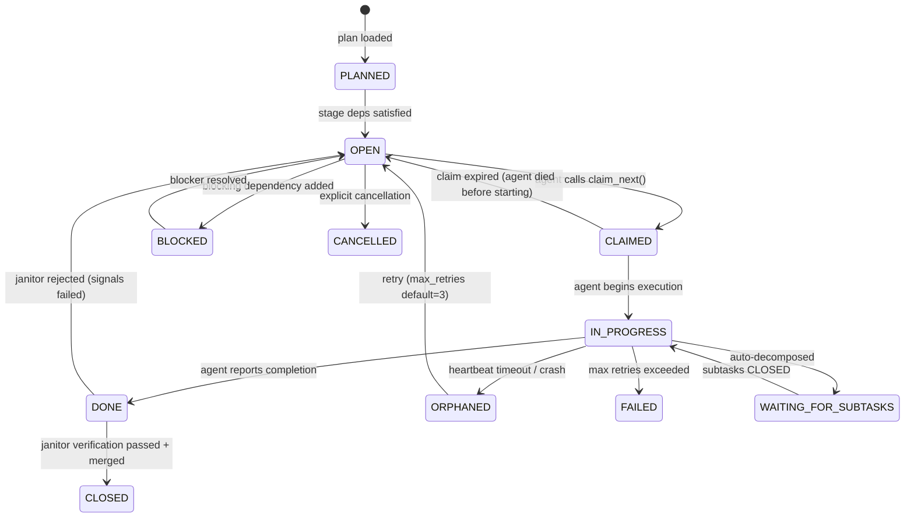
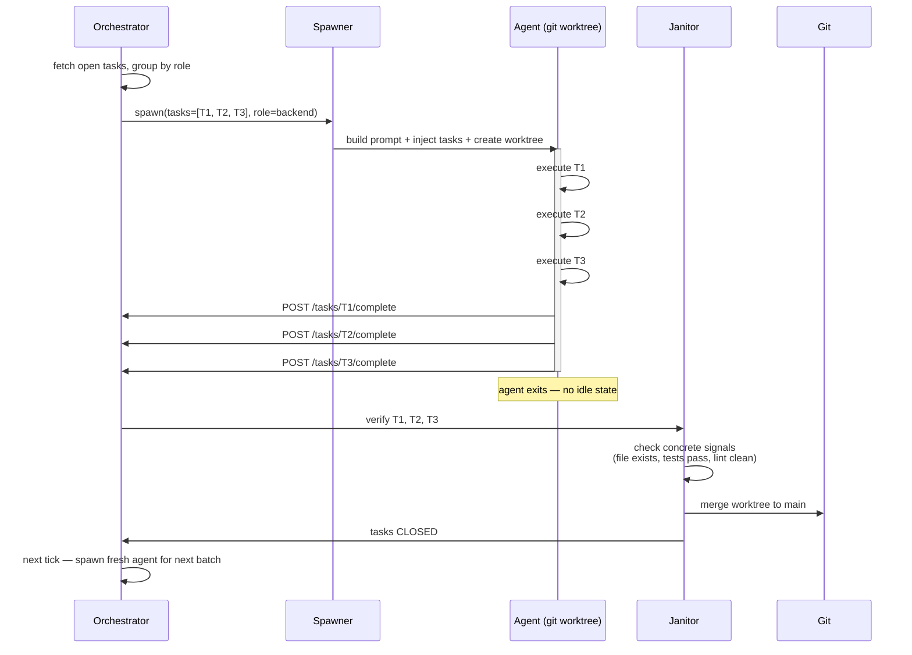

# Deterministic vs. LLM-Based Orchestration

A side-by-side comparison of two approaches to multi-agent coordination, with
architecture diagrams showing the structural differences.

---

## The two approaches

### LLM-based orchestration

An LLM (the "manager agent") sits in the control plane. It reads status from
running agents, reasons about priorities, assigns tasks, and decides when work
is complete. This is the model used by CrewAI's hierarchical process, AutoGen's
GroupChat, and LangGraph's supervisor node.



**What goes wrong at scale:**



---

### Deterministic orchestration (Bernstein)

A Python process owns the control plane. It is a scheduler — it applies rules
mechanically, makes no LLM calls, and has no concept of "reasoning." Agents are
spawned with pre-assigned tasks, execute them, and exit. There is no idle state.



---

## Task state machine (deterministic FSM)

The task lifecycle is a state machine implemented in Python. Every transition has
a defined trigger. There are no judgment calls.



---

## Agent lifecycle (short-lived by design)

Agents are born with work and die when done. There is no idle state, no hunger
state, no polling loop.



---

## Structural comparison

| Property | LLM-based | Deterministic (Bernstein) |
|----------|-----------|--------------------------|
| **Control plane** | LLM agent (manager/PAPA) | Python scheduler (no LLM calls) |
| **Scheduling decisions** | LLM reasoning on each tick | Code: priority queue + role grouping |
| **Token cost of coordination** | Thousands/tick (manager context) | Zero |
| **Agent lifetime** | Persistent session (indefinite) | Bounded: 1-3 tasks then exit |
| **Idle state** | Yes — agents poll, spam hunger signals | No — agents are dead when not working |
| **Sleep failure mode** | Critical — unrecoverable without human | Impossible — dead agents cannot sleep |
| **Context drift** | Yes — long sessions accumulate stale context | No — fresh context on every spawn |
| **Scheduling reproducibility** | Non-deterministic (LLM sampling) | Deterministic — same input = same decision |
| **Debuggability** | Cannot reproduce scheduling bugs | Unit-testable state machine |
| **Verification** | Agent claims ("I finished X") | Concrete signals (file exists, tests pass) |
| **Manager failure mode** | Cascading — all agents starve | N/A — no manager |
| **Scalability** | O(agents × tasks) in manager context | O(1) per agent per tick |
| **Coordination auditability** | LLM response logs (non-reproducible) | Python call stack (fully traceable) |

---

## Token cost model

### LLM-based orchestration

```
Per scheduling tick:
  Manager context  ≈ 5,000–20,000 tokens (grows with task count and agent count)
  Manager response ≈ 500–2,000 tokens

Per agent per idle hour:
  Hunger polling   ≈ 500–5,000 tokens (spinning, spam, status checks)
  MUFFY example:     ~50,000 tokens on hunger signaling, 0 code commits

For 737 tasks over 47 hours, 12 agents:
  Coordination overhead: tens of millions of tokens
  Useful work ratio:      ~3/12 agents = 25%
```

### Deterministic orchestration

```
Per scheduling tick:
  Orchestrator CPU ≈ <1ms, 0 tokens

Per agent spawn:
  System prompt    ≈ 1,500–3,000 tokens (one-time per batch)
  Amortized (3 tasks/batch) ≈ 500–1,000 tokens per task

For 737 tasks over 47 hours, 12 agents:
  Coordination overhead: 0 tokens
  Useful work ratio:      ~100% (agents only run when they have work)
```

---

## When each approach makes sense

### Use LLM-based orchestration when:

- Task count is small (< ~20) and agent count is small (< 4)
- Tasks are loosely structured and require creative routing decisions
- You want a demo that explains itself in plain language
- The orchestration logic itself is your product (you're selling the reasoning)

### Use deterministic orchestration when:

- Running more than a handful of parallel agents
- Task definitions are concrete (clear acceptance criteria)
- You need predictable cost (budget limits, production use)
- You need the system to run unattended for hours without human babysitting
- Debugging and auditability matter
- You're using agents as workers, not collaborators

---

## Related documents

- [ADR-001: Agent Lifecycle Model](../decisions/001-agent-lifecycle.md) — Full analysis of hunger vs. pull vs. short-lived models with rag_challenge data
- [ADR-006: No Embedded LLM in the Orchestrator](../decisions/006-no-embedded-llm.md) — Why the control plane is deterministic code
- [Why Deterministic Orchestration](../WHY_DETERMINISTIC.md) — Narrative explainer with first-principles reasoning
- [Architecture](../ARCHITECTURE.md) — Full system diagram and module breakdown
