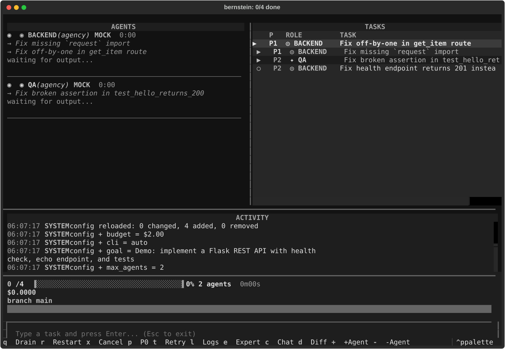

# Render freshness

The repository publishes renders of its two operator surfaces. A screenshot is
committed once and then quietly describes a version of the tool that no longer
exists — the front page keeps showing a dashboard nobody would recognise, and
nothing fails. Both renders are gated in the **Repo hygiene** CI job, next to
`bernstein agents-md verify`, on the same principle: a generated artefact is not
allowed to drift from the thing that generates it.

The two surfaces need different checks, because only one of them is
reproducible.

## Terminal — `bernstein live`

`docs/assets/tui-live.svg` is not a photograph. It is produced by driving the
real Textual dashboard headless against a committed fixture and exporting its
screen through Textual's own screenshot path.

```bash
uv run python scripts/render_tui_snapshot.py            # verify (what CI runs)
uv run python scripts/render_tui_snapshot.py --update   # regenerate
```



Regenerate and commit the new SVG whenever the dashboard's layout, colours or
widget content change on purpose. On drift the check names the region that
moved — `AGENTS`, `TASKS`, `ACTIVITY` — and prints the differing lines, because
"the SVG differs" tells a reader nothing about where to look. Attribution reads
the column as well as the row: the dashboard draws AGENTS and TASKS side by
side, so a terminal row crosses both panels.

The comparison is byte-exact, which only works because three sources of
non-determinism are pinned:

| source | how it is pinned |
|---|---|
| the poll clock and every elapsed-time cell | `frozen_now` in the fixture, patched over `time.time` |
| the activity log's wall-clock stamps | a frozen `datetime.now()`, so a UTC runner and a laptop agree |
| Rich's per-export id namespace | rewritten to a constant; it changes every process and describes nothing |

Two things are repaired in the export before it is written, so the published
asset is self-contained and internally consistent:

- **The CDN webfont is dropped.** Rich points `@font-face` at cdnjs. A
  published asset that fetches from a third party on view tells that party who
  is reading the docs, lets them change how the committed render looks without
  the committed bytes changing, and breaks on the air-gapped installs this
  project ships a profile for. The `local()` source and the stylesheet's
  `monospace` fallback cover rendering; every glyph carries its own x
  coordinate, so layout does not depend on the font metrics either way.
- **The footer's clip path is defined.** Rich emits one clip path per terminal
  row but numbers the footer one past the last definition, so the export
  references an id it never declares and the footer renders unclipped. The
  rows are a uniform grid, so the missing one is derived from the two above it.

### The fixture

`tests/fixtures/tui_live_frame.json` is a real frame — four seeded tasks, two
working agents — captured from a `bernstein demo` run by dumping what
`bernstein.cli.dashboard_polling._fetch_all()` returned mid-run, then scrubbed
of the throwaway project's paths and pids. That one function is the whole
fixture seam: the render needs no server, no task store and no HTTP.

To capture a new one, run `bernstein demo`, call `_fetch_all()` against the
running server from the demo's project directory, and save the payload with a
`frozen_now` key holding the instant it was fetched.

## Browser — `bernstein gui serve`

Browser renders are *not* pixel-stable: font hinting, antialiasing and GPU
compositing all move pixels between machines, so a pixel comparison would
flake, be marked flaky, and then be deleted. That is worse than no check.

So the browser half checks something weaker on purpose. Every committed
`docs/assets/webui-*.png` is bound to a content hash of the SPA bundle that
ships in the wheel (`src/bernstein/gui/static/`), recorded in
`docs/assets/webui-renders.json`.

```bash
uv run python scripts/bind_webui_renders.py            # verify (what CI runs)
python3 scripts/capture_webui_renders.py               # re-capture the screens
uv run python scripts/bind_webui_renders.py --update   # rebind to today's bundle
```

The capture step boots `bernstein gui serve` against an empty throwaway project
and drives headless Chromium over each screen, so re-capturing is a command
rather than a ritual each person reconstructs. It is all-or-nothing: screens are
staged and published only once every requested one succeeds. A run that dies
half-way would otherwise leave some screens from today's bundle and the rest
from whenever they were last taken, and `--update` preserves each render's prior
provenance — so the untouched ones would keep the word `captured` while bound to
a bundle they were never captured from. The empty project is the point:
the committed renders show the zero-state, which is the only state that looks
the same on every machine, and capturing against a live project would publish
somebody's task titles into the docs. It runs under a Python that has
Playwright (`python -m playwright install chromium`), which is usually not the
project venv — Playwright is not a project dependency, because nothing in the
wheel or the test suite drives a browser.

`webui-agents-panel.png` and `webui-agents-diffs.png` are outside it. They show
a populated agent panel with real diffs, which needs a live run to exist, and
they carry `adopted` for exactly that reason.

When the bundle moves and the renders do not, the check fails and names the
renders to re-capture. **What this proves:** nobody shipped a UI change while
leaving the published screenshots behind. **What it does not prove:** that any
render is correct — a screenshot bound to the current bundle can still show a
screen nobody would recognise. Correctness of a browser render is a human
judgement; staleness is the part a machine can hold, and staleness is the
failure that actually happens.

Each render carries a provenance word. `adopted` means it was bound to a bundle
without evidence it was captured from one — the state the existing renders
started in. Mark a render `captured` when you take it from the bundle it is
bound to.

This gate assumes the committed bundle is the one the lockfile builds. That is
a separate claim, and it is checked separately: `spa-bundle-freshness.yml`
rebuilds `web/` and fails when the result differs from
`src/bernstein/gui/static/`. Without it a dependency bump moves neither the
bundle nor the renders, so both checks stay green while the wheel ships a UI
built from versions the lockfile no longer pins.

`web-dashboard.png` is deliberately outside this: it shows the server-rendered
`/dashboard` page, a different surface with a different source of truth.

### The SPA fetches nothing at view time either

The reason the CDN webfont is stripped from the terminal render applies to the
runtime UI, and applies harder. `web/src/index.css` used to open with an
`@import` of the Google Fonts stylesheet; a CSS `@import` blocks its own
stylesheet from finishing, and that stylesheet blocks the `<script
type="module">` after it. With no route to the font host the page committed,
`document.readyState` stayed `interactive`, `DOMContentLoaded` never fired and
`#root` stayed empty. Not a substituted typeface — a blank dashboard, on the
air-gapped installs this project ships a profile for, plus a request to a third
party from every operator who opened it.

Both families are vendored under `web/src/fonts/` with their upstream URLs,
versions and hashes recorded next to them.
`tests/unit/test_webui_no_external_assets.py` fails if an external host returns
to the shipped CSS or to `index.html`, and — the complement, so deleting the
fonts is not a way to pass — if a `url()` in the shipped CSS stops resolving to
a file that is actually in the bundle.
