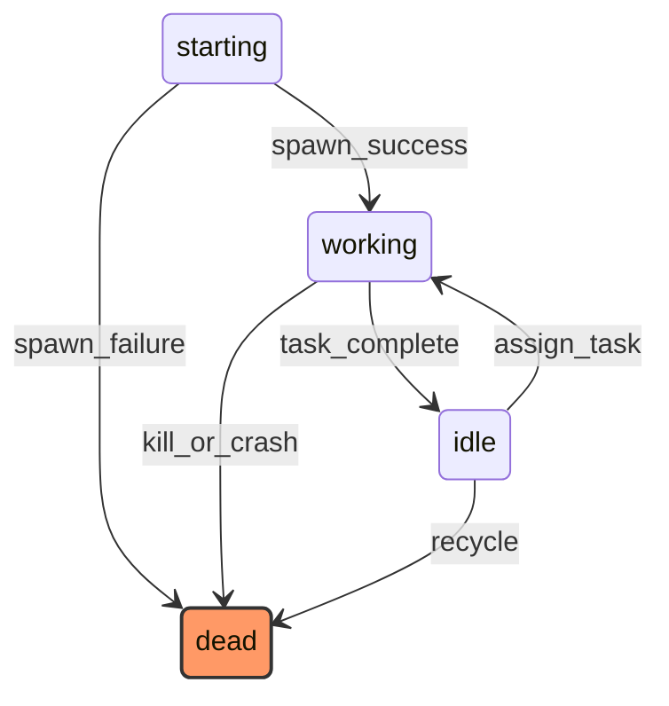

# Agent Lifecycle State Machine

## States

| State | Description | Terminal |
|-------|-------------|----------|
| starting | Agent process is spawning | No |
| working | Agent is executing a task | No |
| dead | Agent process has terminated | Yes |
| idle | Agent finished task, awaiting next assignment | No |

## Transitions

| From | To | Trigger |
|------|----|---------|
| starting | working | spawn_success |
| starting | dead | spawn_failure |
| working | idle | task_complete |
| working | dead | kill_or_crash |
| idle | working | assign_task |
| idle | dead | recycle |
