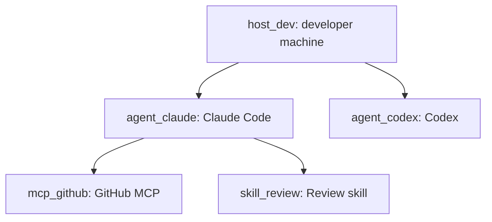

# Inventory topology

<!-- AUTO-GENERATED from tests/fixtures/govern/inventory-store.json. Do not edit by hand. -->

The committed reference render is **mermaid** — GitHub and MkDocs display it
without Graphviz. `bernstein govern inventory --render` also ships `dot` on
demand. CI fails when this fence drifts from
`render_inventory(fixture, "mermaid")`.

