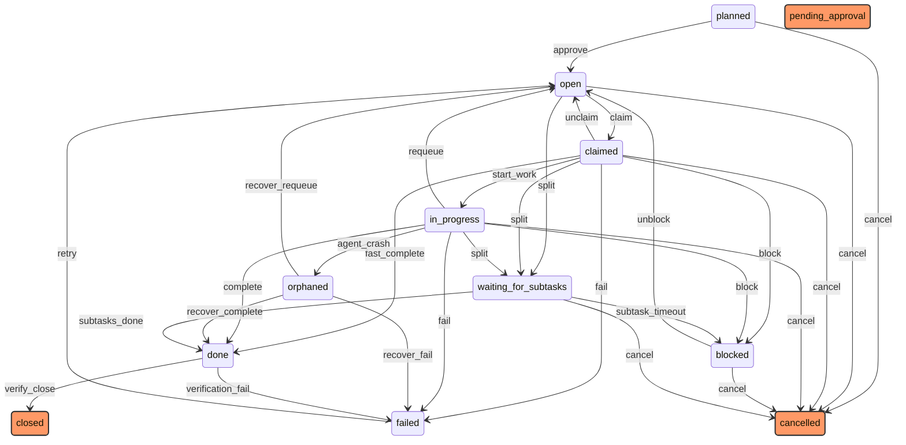

# Task Lifecycle State Machine

## States

| State | Description | Terminal |
|-------|-------------|----------|
| planned | Awaiting human approval before execution | No |
| open | Available for claiming by an agent | No |
| claimed | Assigned to an agent, not yet started | No |
| in_progress | Agent is actively working on the task | No |
| done | Task completed successfully | No |
| closed | Verified and archived | Yes |
| failed | Task execution failed | No |
| blocked | Waiting on external dependency | No |
| waiting_for_subtasks | Parent task waiting for children | No |
| cancelled | Task was cancelled | Yes |
| orphaned | Agent crashed mid-task, pending recovery | No |
| pending_approval | Completed, awaiting human approval | Yes |

## Transitions

| From | To | Trigger |
|------|----|---------|
| planned | open | approve |
| planned | cancelled | cancel |
| open | claimed | claim |
| open | waiting_for_subtasks | split |
| open | cancelled | cancel |
| claimed | in_progress | start_work |
| claimed | open | unclaim |
| claimed | done | fast_complete |
| claimed | failed | fail |
| claimed | cancelled | cancel |
| claimed | waiting_for_subtasks | split |
| claimed | blocked | block |
| in_progress | done | complete |
| in_progress | failed | fail |
| in_progress | blocked | block |
| in_progress | waiting_for_subtasks | split |
| in_progress | open | requeue |
| in_progress | cancelled | cancel |
| in_progress | orphaned | agent_crash |
| orphaned | done | recover_complete |
| orphaned | failed | recover_fail |
| orphaned | open | recover_requeue |
| blocked | open | unblock |
| blocked | cancelled | cancel |
| waiting_for_subtasks | done | subtasks_done |
| waiting_for_subtasks | blocked | subtask_timeout |
| waiting_for_subtasks | cancelled | cancel |
| failed | open | retry |
| done | closed | verify_close |
| done | failed | verification_fail |
