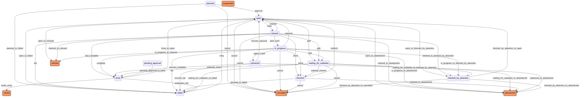

# Task Lifecycle State Machine

```mermaid
stateDiagram-v2
    planned : planned
    open : open
    claimed : claimed
    in_progress : in_progress
    done : done
    closed : closed
    failed : failed
    blocked : blocked
    waiting_for_subtasks : waiting_for_subtasks
    cancelled : cancelled
    orphaned : orphaned
    suspended : suspended
    pending_approval : pending_approval
    abandoned : abandoned
    blocked_by_abandon : blocked_by_abandon
    refused : refused

    planned --> open : approve
    planned --> cancelled : cancel
    planned --> failed : planned_to_failed
    open --> claimed : claim
    open --> waiting_for_subtasks : split
    open --> cancelled : cancel
    open --> failed : open_to_failed
    claimed --> in_progress : start_work
    claimed --> open : unclaim
    claimed --> done : fast_complete
    claimed --> failed : fail
    claimed --> cancelled : cancel
    claimed --> waiting_for_subtasks : split
    claimed --> blocked : block
    in_progress --> done : complete
    in_progress --> failed : fail
    in_progress --> blocked : block
    in_progress --> waiting_for_subtasks : split
    in_progress --> open : requeue
    in_progress --> cancelled : cancel
    in_progress --> orphaned : agent_crash
    orphaned --> done : recover_complete
    orphaned --> failed : recover_fail
    orphaned --> open : recover_requeue
    blocked --> open : unblock
    blocked --> cancelled : cancel
    blocked --> failed : blocked_to_failed
    waiting_for_subtasks --> done : subtasks_done
    waiting_for_subtasks --> blocked : subtask_timeout
    waiting_for_subtasks --> cancelled : cancel
    waiting_for_subtasks --> failed : waiting_for_subtasks_to_failed
    failed --> open : retry
    done --> closed : verify_close
    done --> failed : verification_fail
    done --> open : done_to_open
    open --> abandoned : open_to_abandoned
    claimed --> abandoned : claimed_to_abandoned
    in_progress --> abandoned : in_progress_to_abandoned
    waiting_for_subtasks --> abandoned : waiting_for_subtasks_to_abandoned
    blocked --> abandoned : blocked_to_abandoned
    orphaned --> abandoned : orphaned_to_abandoned
    open --> blocked_by_abandon : open_to_blocked_by_abandon
    claimed --> blocked_by_abandon : claimed_to_blocked_by_abandon
    in_progress --> blocked_by_abandon : in_progress_to_blocked_by_abandon
    waiting_for_subtasks --> blocked_by_abandon : waiting_for_subtasks_to_blocked_by_abandon
    blocked_by_abandon --> open : blocked_by_abandon_to_open
    blocked_by_abandon --> cancelled : blocked_by_abandon_to_cancelled
    blocked_by_abandon --> abandoned : blocked_by_abandon_to_abandoned
    open --> refused : open_to_refused
    claimed --> refused : claimed_to_refused
    in_progress --> refused : in_progress_to_refused
    pending_approval --> done : pending_approval_to_done

    classDef terminal fill:#f96,stroke:#333,stroke-width:2px
    class closed terminal
    class cancelled terminal
    class suspended terminal
    class abandoned terminal
    class refused terminal
```

## States

| State | Description | Terminal |
|-------|-------------|----------|
| planned | Awaiting human approval before execution | No |
| open | Available for claiming by an agent | No |
| claimed | Assigned to an agent, not yet started | No |
| in_progress | Agent is actively working on the task | No |
| done | Task completed successfully | No |
| closed | Verified and archived | Yes |
| failed | Task execution failed | No |
| blocked | Waiting on external dependency | No |
| waiting_for_subtasks | Parent task waiting for children | No |
| cancelled | Task was cancelled | Yes |
| orphaned | Agent crashed mid-task, pending recovery | No |
| suspended | suspended | Yes |
| pending_approval | Completed, awaiting human approval | No |
| abandoned | abandoned | Yes |
| blocked_by_abandon | blocked_by_abandon | No |
| refused | refused | Yes |

## Transitions

| From | To | Trigger |
|------|----|---------|
| planned | open | approve |
| planned | cancelled | cancel |
| planned | failed | planned_to_failed |
| open | claimed | claim |
| open | waiting_for_subtasks | split |
| open | cancelled | cancel |
| open | failed | open_to_failed |
| claimed | in_progress | start_work |
| claimed | open | unclaim |
| claimed | done | fast_complete |
| claimed | failed | fail |
| claimed | cancelled | cancel |
| claimed | waiting_for_subtasks | split |
| claimed | blocked | block |
| in_progress | done | complete |
| in_progress | failed | fail |
| in_progress | blocked | block |
| in_progress | waiting_for_subtasks | split |
| in_progress | open | requeue |
| in_progress | cancelled | cancel |
| in_progress | orphaned | agent_crash |
| orphaned | done | recover_complete |
| orphaned | failed | recover_fail |
| orphaned | open | recover_requeue |
| blocked | open | unblock |
| blocked | cancelled | cancel |
| blocked | failed | blocked_to_failed |
| waiting_for_subtasks | done | subtasks_done |
| waiting_for_subtasks | blocked | subtask_timeout |
| waiting_for_subtasks | cancelled | cancel |
| waiting_for_subtasks | failed | waiting_for_subtasks_to_failed |
| failed | open | retry |
| done | closed | verify_close |
| done | failed | verification_fail |
| done | open | done_to_open |
| open | abandoned | open_to_abandoned |
| claimed | abandoned | claimed_to_abandoned |
| in_progress | abandoned | in_progress_to_abandoned |
| waiting_for_subtasks | abandoned | waiting_for_subtasks_to_abandoned |
| blocked | abandoned | blocked_to_abandoned |
| orphaned | abandoned | orphaned_to_abandoned |
| open | blocked_by_abandon | open_to_blocked_by_abandon |
| claimed | blocked_by_abandon | claimed_to_blocked_by_abandon |
| in_progress | blocked_by_abandon | in_progress_to_blocked_by_abandon |
| waiting_for_subtasks | blocked_by_abandon | waiting_for_subtasks_to_blocked_by_abandon |
| blocked_by_abandon | open | blocked_by_abandon_to_open |
| blocked_by_abandon | cancelled | blocked_by_abandon_to_cancelled |
| blocked_by_abandon | abandoned | blocked_by_abandon_to_abandoned |
| open | refused | open_to_refused |
| claimed | refused | claimed_to_refused |
| in_progress | refused | in_progress_to_refused |
| pending_approval | done | pending_approval_to_done |
