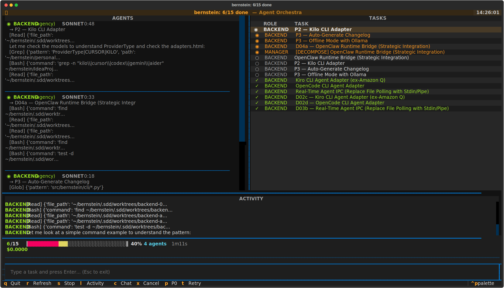

# Bernstein

**Orchestrate any AI coding agent. Any model. One command.**



---

Bernstein takes a goal, breaks it into tasks, assigns them to AI coding agents running in parallel, verifies the output, and merges the results. You come back to working code, passing tests, and a clean git history.

No framework to learn. No vendor lock-in. Agents are interchangeable workers — swap any agent, any model, any provider. The orchestrator itself is deterministic Python code. Zero LLM tokens on scheduling.

```bash
pip install bernstein
bernstein -g "Add JWT auth with refresh tokens, tests, and API docs"
```

## Quick links

- [Getting Started](GETTING_STARTED.md) — install and run your first orchestration
- [Architecture](ARCHITECTURE.md) — how Bernstein works under the hood
- [Configuration](CONFIG.md) — bernstein.yaml reference
- [Adapter Guide](ADAPTER_GUIDE.md) — supported agents and how to add your own
- [API Reference](openapi-reference.md) — task server REST API
- [Changelog](CHANGELOG.md) — what's new

## Links

- [GitHub](https://github.com/chernistry/bernstein)
- [PyPI](https://pypi.org/project/bernstein/)
- [npm](https://www.npmjs.com/package/bernstein-orchestrator)
- [Author — Alex Chernysh](https://alexchernysh.com)
