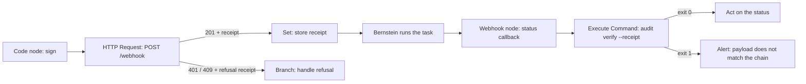

# n8n

Start Bernstein runs from an n8n workflow and act on chain-anchored results.
This page is the copy-paste recipe; see the
[automation bridge reference](automation-bridge.md) for the receipt and proof
schemas.

## Prerequisites

- A reachable Bernstein server.
- `BERNSTEIN_WEBHOOK_SECRET` set on the server. Store the same value as an n8n
  credential; the recipe below reads it from `$env`.

## 1. Trigger a run

Add an **HTTP Request** node.

| Setting | Value |
| --- | --- |
| Method | `POST` |
| URL | `https://bernstein.example.com/webhook` |
| Body Content Type | `JSON` |
| Send Headers | on |

Body:

```json
{
  "title": "{{ $json.title }}",
  "description": "{{ $json.description }}",
  "role": "dev",
  "priority": "2"
}
```

Headers:

| Name | Value |
| --- | --- |
| `Content-Type` | `application/json` |
| `X-N8n-Execution-Id` | `{{ $execution.id }}` |
| `X-Bernstein-Timestamp` | `{{ Math.floor(Date.now() / 1000) }}` |
| `X-Bernstein-Webhook-Signature-256` | see below |

The execution id is what gives you replay protection: re-running the same
execution is refused rather than silently starting a second run.

### Signing the request

The signature is `sha256=` plus the hex HMAC-SHA256 of
`f"{timestamp}.".encode() + body` under the shared secret. Put a **Code** node
in front of the HTTP Request node:

```javascript
const crypto = require('crypto');

const timestamp = Math.floor(Date.now() / 1000);
const body = JSON.stringify({
  title: $json.title,
  description: $json.description,
  role: 'dev',
  priority: '2',
});

const signature = crypto
  .createHmac('sha256', $env.BERNSTEIN_WEBHOOK_SECRET)
  .update(`${timestamp}.${body}`)
  .digest('hex');

return [{ json: { body, timestamp, signature: `sha256=${signature}` } }];
```

Then set the HTTP Request node's body to `{{ $json.body }}` (raw, not JSON) and
its headers to `{{ $json.timestamp }}` and `{{ $json.signature }}`.

The timestamp must be within five minutes of server time, and it must be the
same value you signed.

## 2. Store the receipt

The response body carries `task` and `receipt`. Persist the whole `receipt`
object next to whatever record this workflow owns (a database row, an issue
comment, a Google Sheet cell). A **Set** node is enough:

| Name | Value |
| --- | --- |
| `bernstein_task_id` | `{{ $json.task.id }}` |
| `bernstein_receipt` | `{{ JSON.stringify($json.receipt) }}` |

That stored receipt is the proof of what this workflow asked for. Keep it for as
long as you would keep the audit trail it belongs to.

### Handling refusals

| Status | Meaning | Suggested branch |
| --- | --- | --- |
| `201` | Admitted; `receipt.outcome` is `admitted` | Continue |
| `401` | Authentication failed; `receipt.refusal_reason` says why | Alert; check the secret and clock skew |
| `409` | This execution id was already admitted | Stop; the run already exists |
| `503` | The endpoint has no secret configured | Alert the operator |

Enable **Always Output Data** on the HTTP Request node and add an **If** node on
`{{ $json.receipt.outcome }}` so a refusal takes its own branch instead of
failing the workflow opaquely. Store refusal receipts too: they are the record
that the trigger was turned away.

## 3. Receive the callback

Add a **Webhook** node (method `POST`) and note its production URL. On the
Bernstein side, configure a notification sink:

```yaml
sinks:
  - id: n8n-callback
    kind: webhook
    url: https://n8n.example.com/webhook/bernstein-status
```

The body arrives in the shape the sink always sent, plus an
`automation_bridge_proof` key. Existing n8n workflows reading `title`,
`severity`, or `details` keep working unchanged.

## 4. Verify before you act

Do not branch on `severity` or `details.status` directly if the decision
matters. Verify first.

Add an **Execute Command** node after the Webhook node:

```bash
echo '{{ JSON.stringify($json) }}' > /tmp/callback.json \
  && bernstein audit verify --receipt /tmp/callback.json
```

Exit code 0 means the status is the one the chain recorded. Any other exit code
means the payload does not match the chain, and the command prints the
chain-recorded status. Branch on the exit code, not on the payload.

To verify a stored trigger receipt later:

```bash
bernstein audit verify --receipt receipt.json
```

## Full round trip


