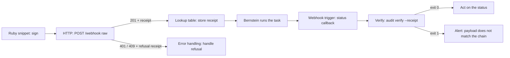

# Workato

Start Bernstein runs from a Workato recipe and act on chain-anchored results.
This page is the copy-paste recipe; see the
[automation bridge reference](automation-bridge.md) for the receipt and proof
schemas.

## Prerequisites

- A reachable Bernstein server.
- `BERNSTEIN_WEBHOOK_SECRET` set on the server, and stored in Workato as an
  account property (for example `BERNSTEIN_WEBHOOK_SECRET`) so it never appears
  in the recipe body.

## 1. Sign the request

Add a **Ruby snippet** action (or an equivalent step in your connector) before
the HTTP call:

```ruby
require 'openssl'
require 'json'

timestamp = Time.now.to_i.to_s
body = {
  title: input['title'],
  description: input['description'],
  role: 'dev',
  priority: '2',
}.to_json

signature = OpenSSL::HMAC.hexdigest('SHA256', input['secret'], "#{timestamp}.#{body}")

{
  'body' => body,
  'timestamp' => timestamp,
  'signature' => "sha256=#{signature}",
}
```

Pass the secret in as `input['secret']` from the account property. The timestamp
must be within five minutes of server time, and it must be the same value you
signed.

## 2. Trigger a run

Add an **HTTP** connector action, **Send request**.

| Setting | Value |
| --- | --- |
| Request type | `POST` |
| URL | `https://bernstein.example.com/webhook` |
| Request format | `Raw` |
| Request body | the `body` datapill from the snippet |

Use **Raw**, not the JSON request format: the JSON format re-serialises the
body, which would invalidate the signature computed over exact bytes.

Headers:

| Name | Value |
| --- | --- |
| `Content-Type` | `application/json` |
| `X-Workato-Job-Id` | the recipe's job id datapill |
| `X-Bernstein-Timestamp` | the `timestamp` datapill |
| `X-Bernstein-Webhook-Signature-256` | the `signature` datapill |

The job id is what gives you replay protection: a rerun of the same job is
refused rather than silently starting a second run.

### Multi-step recipes

A recipe that drives several tasks can post a `steps` array; the bridge projects
one graph node per step, chained in list order:

```json
{
  "title": "Release train",
  "steps": [
    { "title": "run the test suite", "role": "qa" },
    { "title": "cut the release tag", "role": "dev" }
  ]
}
```

The projection is deterministic, so two operators posting the same array carry
receipts with the same `graph_digest`.

## 3. Store the receipt

The response carries `task` and `receipt`. Write the whole `receipt` object into
whatever record this recipe owns: a Workato lookup table, a database row, or a
field on the originating ticket.

That stored receipt is the proof of what this recipe asked for. Keep it for as
long as you would keep the audit trail it belongs to.

### Handling refusals

| Status | Meaning | Suggested branch |
| --- | --- | --- |
| `201` | Admitted; `receipt.outcome` is `admitted` | Continue |
| `401` | Authentication failed; `receipt.refusal_reason` says why | Alert; check the secret and clock skew |
| `409` | This job id was already admitted | Stop; the run already exists |
| `503` | The endpoint has no secret configured | Alert the operator |

Enable **Error handling** with a `Monitor` block on the HTTP step, and branch on
`receipt.outcome` so a refusal is handled rather than surfacing as an opaque HTTP
error. Store refusal receipts too: they are the record that the trigger was
turned away.

## 4. Receive the callback

Create a recipe with a **Webhook** trigger and note its URL, then configure a
Bernstein notification sink:

```yaml
sinks:
  - id: workato-callback
    kind: webhook
    url: https://webhooks.workato.com/webhooks/rest/v1/bernstein-status
```

The body arrives in the shape the sink always sent, plus an
`automation_bridge_proof` key. Declare it in the trigger's input schema as a
free-form object if you want the datapills; existing recipes reading `title`,
`severity`, or `details` keep working unchanged.

## 5. Verify before you act

Do not branch on `severity` or `details.status` directly if the decision
matters.

Workato cannot run the Bernstein CLI, so verification runs on a host that can
reach your `.sdd` directory. Point an **HTTP** action at a small internal
endpoint that runs:

```bash
bernstein audit verify --receipt callback.json
```

and returns the exit code, then branch the recipe on that response. Exit code 0
means the status is the one the chain recorded; any other exit code means the
payload does not match, and the command prints the chain-recorded status.

If gating every callback is more coupling than you want, store the raw callback
bodies and verify in a batch job instead:

```bash
for f in callbacks/*.json; do
  bernstein audit verify --receipt "$f" || echo "MISMATCH: $f"
done
```

Gate when a downstream step spends money or ships code on the strength of the
status; batch-verify otherwise.

To verify a stored trigger receipt:

```bash
bernstein audit verify --receipt receipt.json
```

## Full round trip


