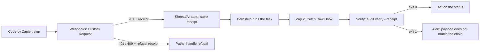

# Zapier

Start Bernstein runs from a Zap and act on chain-anchored results. This page is
the copy-paste recipe; see the
[automation bridge reference](automation-bridge.md) for the receipt and proof
schemas.

## Prerequisites

- A reachable Bernstein server.
- `BERNSTEIN_WEBHOOK_SECRET` set on the server. Zapier has no secret store for
  Code steps, so paste the secret into the Code step's **Input Data** rather
  than inlining it in the code body.

## 1. Sign the request

`Webhooks by Zapier` cannot compute an HMAC, so the signing happens in a
**Code by Zapier** step (`Run JavaScript`) placed before it.

Input Data:

| Key | Value |
| --- | --- |
| `secret` | your `BERNSTEIN_WEBHOOK_SECRET` |
| `title` | the field from your trigger step |
| `description` | the field from your trigger step |

Code:

```javascript
const crypto = require('crypto');

const timestamp = Math.floor(Date.now() / 1000);
const body = JSON.stringify({
  title: inputData.title,
  description: inputData.description,
  role: 'dev',
  priority: '2',
});

const signature = crypto
  .createHmac('sha256', inputData.secret)
  .update(`${timestamp}.${body}`)
  .digest('hex');

output = [{ body, timestamp: String(timestamp), signature: `sha256=${signature}` }];
```

The timestamp must be within five minutes of server time, and it must be the
same value you signed.

## 2. Trigger a run

Add a **Webhooks by Zapier** action, event **Custom Request**.

| Setting | Value |
| --- | --- |
| Method | `POST` |
| URL | `https://bernstein.example.com/webhook` |
| Data | `{{body}}` from the Code step |
| Unflatten | `no` |

Headers:

| Name | Value |
| --- | --- |
| `Content-Type` | `application/json` |
| `X-Zapier-Request-Id` | `{{zap_meta_id}}` |
| `X-Bernstein-Timestamp` | `{{timestamp}}` from the Code step |
| `X-Bernstein-Webhook-Signature-256` | `{{signature}}` from the Code step |

Use **Custom Request**, not **POST**: the plain POST action re-serialises the
body, which would invalidate the signature you just computed over exact bytes.

`X-Zapier-Request-Id` is what gives you replay protection. A replayed Zap run
carrying the same id is refused rather than silently starting a second run.

## 3. Store the receipt

The response carries `task` and `receipt`. Write the whole `receipt` object to
wherever this Zap keeps its record: a Google Sheets row, an Airtable field, a
database action. It is a JSON blob; a single long-text column is fine.

That stored receipt is the proof of what this Zap asked for. Keep it for as long
as you would keep the audit trail it belongs to.

### Handling refusals

| Status | Meaning | Suggested branch |
| --- | --- | --- |
| `201` | Admitted; `receipt.outcome` is `admitted` | Continue |
| `401` | Authentication failed; `receipt.refusal_reason` says why | Alert; check the secret and clock skew |
| `409` | This request id was already admitted | Stop; the run already exists |
| `503` | The endpoint has no secret configured | Alert the operator |

Zapier halts a Zap on a non-2xx response by default. If you want refusals
handled rather than halted, add a **Filter** or **Paths** step on
`receipt.outcome` after the request. Store refusal receipts too: they are the
record that the trigger was turned away.

## 4. Receive the callback

Create a second Zap with a **Webhooks by Zapier** trigger, event **Catch Raw
Hook**. Catch *Raw* Hook matters: the parsed variant reshapes the body, and the
proof is computed over the exact payload bytes.

Note the trigger's custom webhook URL, then configure a Bernstein notification
sink:

```yaml
sinks:
  - id: zapier-callback
    kind: webhook
    url: https://hooks.zapier.com/hooks/catch/123456/abcdef/
```

The body arrives in the shape the sink always sent, plus an
`automation_bridge_proof` key. Existing Zaps reading `title`, `severity`, or
`details` keep working unchanged.

## 5. Verify before you act

Do not branch on `severity` or `details.status` directly if the decision
matters.

Zapier cannot run the Bernstein CLI, so verification runs on a host that can
reach your `.sdd` directory. Two options:

**Option A - verify on your own host.** Have the Zap forward the raw body to a
small endpoint you control, which runs:

```bash
bernstein audit verify --receipt callback.json
```

and returns the exit code. Branch the Zap on that response.

**Option B - verify after the fact.** Store the raw callback body alongside the
trigger receipt, and verify in a batch job:

```bash
for f in callbacks/*.json; do
  bernstein audit verify --receipt "$f" || echo "MISMATCH: $f"
done
```

Option A gates the workflow; Option B catches disputes later. Pick A when a
downstream step spends money or ships code on the strength of the status.

Exit code 0 means the status is the one the chain recorded. Any other exit code
means the payload does not match, and the command prints the chain-recorded
status.

To verify a stored trigger receipt:

```bash
bernstein audit verify --receipt receipt.json
```

## Full round trip


