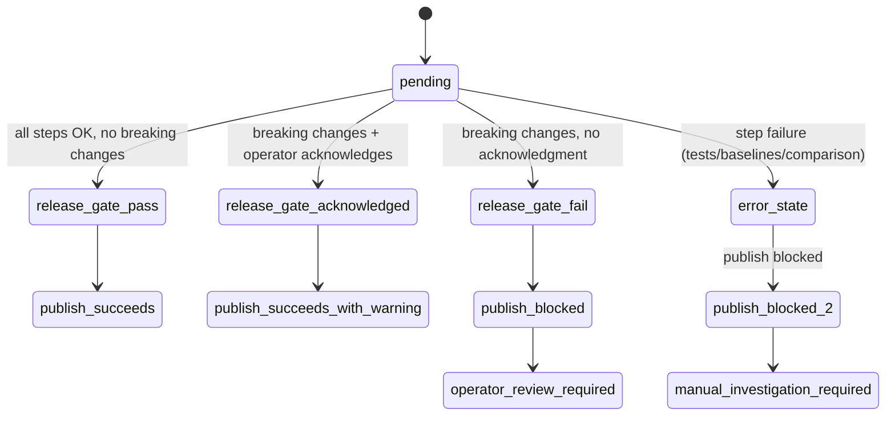

# WORKFLOW: Release Breaking Change Detection

**Version**: 0.1
**Date**: 2026-03-29
**Author**: Workflow Architect
**Status**: Draft
**Implements**: Task 5ac221ec4f7f — Protocol Compatibility Matrix — CI-Enforced Interop Testing

---

## Overview

This workflow runs during the release process (triggered by git tag `v*`) and detects whether any protocol compatibility has regressed since the last release. It blocks the release if breaking changes are found, forcing the release engineer to either fix the incompatibility or explicitly acknowledge the breaking change in the release notes.

---

## Actors

| Actor | Role in this workflow |
|---|---|
| GitHub Actions (publish workflow) | Triggers this check before releasing to PyPI |
| Compatibility check engine | Compares current test results against last-released baseline |
| Release engineer | Reviews breaking change report and decides whether to proceed |

---

## Prerequisites

- Tag `v*` was created on main branch
- Previous release tag exists with baseline compatibility data
- `tests/protocol/compatibility-baseline.json` exists in repo
- `scripts/compare_compatibility_baseline.py` exists and is executable
- GitHub Actions has read access to release notes

---

## Trigger

**When**: `git push` with tag matching `v*`
**How**: GitHub Actions trigger on `push` event with `tags: [v*]`
**Endpoint**: `.github/workflows/publish.yml` (existing, modified to call this check)

---

## Workflow Tree

### STEP 1: Determine Previous Release Tag
**Actor**: GitHub Actions (bash script)
**Action**:
1. Run current test suite to get current compatibility results: `uv run pytest tests/protocol/ -v`
2. List all tags: `git tag --sort=-version:refname --list 'v*'`
3. Filter out current tag and get previous: `PREV_TAG=$(git tag --sort=-version:refname --list 'v*' | grep -v $(git describe --tags) | head -1)`
4. If no previous tag, mark as "first release" and skip breaking change check

**Timeout**: 120s (includes protocol testing)
**Input**: `{ current_tag: str }`
**Output on SUCCESS**: `{ current_results: dict, previous_tag: str | "none", is_first_release: bool }` → GO TO STEP 2
**Output on FAILURE**:
- `FAILURE(tag_parse)`: Cannot parse version tags → [recovery: log warning, treat as first release, continue]
- `FAILURE(test_timeout)`: Protocol tests exceed 120s → [recovery: mark with warning "Tests timed out", continue with caution]

**Observable states during this step**:
- Operator sees: Test execution in release CI
- Logs: `[release] Current tag: v1.0.1` → `[release] Previous tag: v1.0.0` → `[release] Running compatibility tests for v1.0.1...`

---

### STEP 2: Fetch Previous Release Baseline
**Actor**: GitHub Actions (git operations)
**Action**:
1. If previous tag exists:
   - Checkout compatibility baseline from previous tag: `git show PREV_TAG:tests/protocol/compatibility-baseline.json`
   - Store as `baseline-previous.json`
2. Get current baseline from HEAD: copy `tests/protocol/compatibility-baseline.json` → `baseline-current.json`
3. Compare structure to ensure format compatibility

**Timeout**: 30s
**Input**: `{ previous_tag: str }`
**Output on SUCCESS**: `{ baseline_previous: dict, baseline_current: dict, format_ok: bool }` → GO TO STEP 3
**Output on FAILURE**:
- `FAILURE(baseline_not_found)`: Previous tag doesn't have baseline file → [recovery: skip to STEP 4 (cannot compare), log "Previous baseline not available"]
- `FAILURE(format_mismatch)`: Baseline formats don't match → [recovery: log warning, continue with caution]

**Observable states during this step**:
- Logs: `[release] Fetching baseline from v1.0.0...` → `[release] Baseline comparison format: OK`

---

### STEP 3: Compare Against Baseline
**Actor**: Python script (`scripts/compare_compatibility_baseline.py`)
**Action**:
1. Read baselines: `baseline-previous.json`, `baseline-current.json`
2. For each protocol version pair (python + mcp + a2a):
   - If `status` changed from PASS → FAIL: **BREAKING_CHANGE**
   - If `status` changed from FAIL → PASS: **FIXED**
   - If `status` unchanged: **NO_CHANGE**
3. Generate report:
```json
{
  "breaking_changes": [
    { "python": "3.12", "mcp": "1.0", "a2a": "0.3", "previous_status": "pass", "current_status": "fail", "error": "timeout" }
  ],
  "fixed": [
    { "python": "3.13", "mcp": "1.1", "a2a": "0.2", "previous_status": "fail", "current_status": "pass" }
  ],
  "summary": { "breaking_changes": 1, "fixed": 1, "new_incompatibilities": 0 }
}
```

**Timeout**: 10s
**Input**: `{ baseline_previous: dict, baseline_current: dict }`
**Output on SUCCESS**: `{ breaking_changes: list, fixed: list, summary: dict }` → GO TO STEP 4
**Output on FAILURE**:
- `FAILURE(comparison_error)`: Script raises exception → [recovery: log error, fail workflow with "Comparison failed"]

**Observable states during this step**:
- Logs: `[compat-check] Comparing v1.0.0 vs v1.0.1...` → `[compat-check] Found 1 breaking change: py3.12/mcp1.0/a2a0.3 regression`

---

### STEP 4: Decide Release Gate
**Actor**: GitHub Actions (status check)
**Action**:
1. If breaking_changes list is empty:
   - Set `RELEASE_GATE=PASS`
   - Log "No breaking changes detected"
   - Proceed to publish
2. If breaking_changes list is NOT empty:
   - Set `RELEASE_GATE=FAIL`
   - Create detailed error message with each breaking change
   - Check release notes for acknowledgment keyword (e.g., "BREAKING" or "ACKNOWLEDGE_BREAKING_CHANGES")
   - If keyword found AND operator is repo owner:
     - Set `RELEASE_GATE=ACKNOWLEDGED` (proceed with warning)
     - Log operator-acknowledged breaking changes
   - Else:
     - Set `RELEASE_GATE=FAIL` (block release)
     - Create GitHub issue for operator review

**Timeout**: 15s
**Input**: `{ breaking_changes: list, release_notes: str | null, operator: str }`
**Output on SUCCESS**: `{ gate_status: "pass" | "acknowledged" | "fail", message: str }` → GO TO STEP 5
**Output on FAILURE**:
- `FAILURE(decision_logic)`: Script error → [recovery: default to FAIL (conservative)]

**Observable states during this step**:
- GitHub UI: Workflow step "Release Gate" shows ✓ or ❌
- Logs: `[gate] RELEASE_GATE=FAIL: Found 1 breaking change. Operator acknowledgment required.`
- If FAIL: GitHub issue created with title `[release-gate] Breaking changes in v1.0.1 — please review`

---

### STEP 5: Report Findings (Publish-Blocking Gate)
**Actor**: GitHub Actions (final status)
**Action**:
1. If `RELEASE_GATE=PASS`:
   - Exit with status 0 (allow publish to proceed)
   - Log "✓ All protocol compatibility checks passed"
2. If `RELEASE_GATE=ACKNOWLEDGED`:
   - Exit with status 0 (allow publish)
   - Add GitHub workflow warning (visible in Actions UI)
   - Log "⚠️ Operator acknowledged breaking changes. Release proceeding."
3. If `RELEASE_GATE=FAIL`:
   - Exit with status 1 (block publish)
   - Fail workflow with detailed error message
   - Create GitHub issue for operator review
   - Log all breaking changes with error codes

**Timeout**: 10s
**Input**: `{ gate_status: str, breaking_changes: list, message: str }`
**Output on SUCCESS**: Workflow succeeds or fails based on gate_status
**Output on FAILURE**: N/A (gate status determines success/failure)

**Observable states during this step**:
- GitHub: Publish workflow status ✓ (if gate passes) or ❌ (if gate fails)
- GitHub Issues: If FAIL, new issue created requiring operator attention
- GitHub Annotations: Warnings or errors visible in Checks section
- Logs: `[gate] FINAL_STATUS: PASS — proceeding with publish`

---

## State Transitions



---

## Handoff Contracts

### Current Workflow (Protocol Tests) → This Workflow (Gate Check)
**Endpoint**: Implicit (test results in artifact)
**Payload**: Protocol test results from Step 1 execution
**Expected**: `{ python: str, mcp: str, a2a: str, status: "pass" | "fail", error: str | null }`
**Timeout**: 120s (test execution timeout)

---

### Baseline Comparison → Release Gate Decision
**Endpoint**: Python script comparison output
**Payload**:
```json
{
  "breaking_changes": [
    {
      "python": "3.12",
      "mcp": "1.0",
      "a2a": "0.3",
      "previous_status": "pass",
      "current_status": "fail",
      "error": "timeout in heartbeat",
      "severity": "high"
    }
  ]
}
```
**Success response**: Comparison completes
**Failure response**: Script error (exception logged)
**Timeout**: 10s

---

### Release Gate → GitHub Actions Publish Workflow
**Status**: Workflow success (exit 0) or failure (exit 1)
**If FAIL**: GitHub issue created with details
**If ACKNOWLEDGED**: Workflow warning annotation added

---

## Cleanup Inventory

| Resource | Created at step | Destroyed by | Destroy method |
|---|---|---|---|
| Test results (temporary) | Step 1 | GitHub Actions | Auto cleanup after job |
| Baseline files (temporary) | Step 2 | GitHub Actions | Auto cleanup after job |
| GitHub issue (if FAIL) | Step 4 | Operator (manual close) | Manual closure or auto-close on next passing release |
| Workflow logs | Steps 1-5 | GitHub Actions | Per retention policy (90 days) |

---

## Reality Checker Findings

| # | Finding | Severity | Spec section affected | Resolution |
|---|---|---|---|---|
| RC-1 | `scripts/compare_compatibility_baseline.py` does not exist | High | Step 3 | Must create this script as part of task completion |
| RC-2 | Release notes acknowledgment keyword not currently used | Medium | Step 4 | Operator must add keyword to release notes to acknowledge breaking changes |
| RC-3 | `.github/workflows/publish.yml` does not call this gate check | High | All steps | Must modify publish.yml to integrate this workflow |
| RC-4 | No precedent for operator-acknowledged breaking changes | Low | Step 4 | First use will establish precedent; document in CHANGELOG |

---

## Test Cases

| Test | Trigger | Expected behavior |
|---|---|---|
| TC-01: Happy path (no breaking changes) | New release with all compatibility passed | Gate passes, publish proceeds |
| TC-02: Breaking change detected (no acknowledgment) | Protocol version compatibility regresses, operator doesn't acknowledge | Gate fails, publish blocked, issue created |
| TC-03: Breaking change detected (with acknowledgment) | Operator adds "ACKNOWLEDGE_BREAKING_CHANGES" to release notes | Gate passes with warning, publish proceeds |
| TC-04: First release (no previous baseline) | Tag v0.1.0, no previous release exists | Gate skipped (comparison not possible), publish proceeds |
| TC-05: Previous tag not found | Tag parsing fails or previous tag missing | Gate logs warning, treats as first release equivalent, proceeds |
| TC-06: Baseline format mismatch | Previous baseline structure differs from current | Gate logs warning, skips strict comparison, proceeds with caution |
| TC-07: Multiple breaking changes | 3 protocol version combinations regressed | All 3 listed in report, gate fails unless all acknowledged |
| TC-08: Fixed incompatibilities | Previous failure now passes | Gate notes fix, passes |
| TC-09: Publish without tag | Regular push to main (no tag) | Gate workflow not triggered |
| TC-10: Malformed baseline | Baseline JSON corrupted | Comparison script fails, gate blocks release, operator must fix |

---

## Assumptions

| # | Assumption | Where verified | Risk if wrong |
|---|---|---|---|
| A1 | Previous release tag exists and contains baseline compatibility data | Git tag history | First release has no previous tag; mitigation: skip baseline comparison |
| A2 | Release notes are accessible to GitHub Actions workflow | GitHub Actions documentation | Cannot check for operator acknowledgment; mitigation: require explicit flag/env var |
| A3 | Operator can acknowledge breaking changes by adding keyword to release notes | Not yet verified | Operator unaware of keyword; mitigation: document in release guide |
| A4 | Git tag format is semantic versioning (v1.0.0) | Git history | May break on non-standard tags; mitigation: filter with regex |
| A5 | Publish workflow (`publish.yml`) can be modified to call this gate | Code inspection | Cannot integrate; mitigation: separate gate workflow called as dependency |

---

## Open Questions

- Should breaking changes in patch releases (v1.0.0 → v1.0.1) be handled differently from minor/major releases?
- What's the policy for deprecated protocol versions — should dropping support require acknowledgment?
- Should the gate also check for new incompatibilities (versions newly discovered to be incompatible)?
- How should the gate interact with pre-release tags (e.g., v1.0.0-rc1)?

---

## Spec vs Reality Audit Log

| Date | Finding | Action taken |
|---|---|---|
| 2026-03-29 | Initial spec created | — |
| (pending) | Reality Checker pass | TBD |

