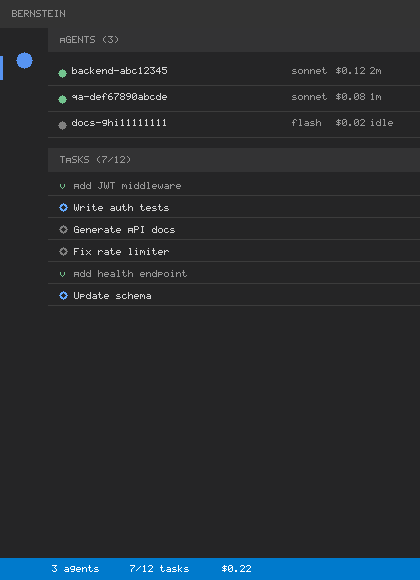
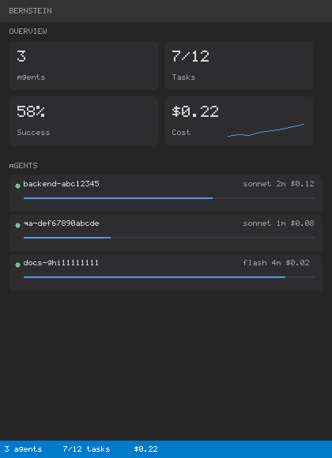
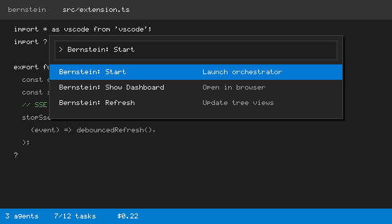

# Bernstein — Multi-Agent Orchestration

Orchestrate parallel AI coding agents from your editor. Monitor tasks, agents, and costs in real-time.

## Screenshots





## Overview

Bernstein spawns teams of specialized coding agents to tackle complex development goals in parallel. Built for professional software engineering — not a toy for prompting experiments.

- **Parallel execution** — multiple agents work simultaneously
- **Task-driven** — break goals into concrete tasks, track completion
- **Model routing** — assign agents by role and capability
- **Cost tracking** — real-time spend visibility per agent and task
- **Integrated monitoring** — dashboard, tree views, status bar all in VS Code

## Quick Start

1. **Start Bernstein** from the command palette: `Bernstein: Start`
   - Launches the orchestrator on `http://127.0.0.1:8052`
   - Extension auto-connects when detected

2. **View the dashboard**
   - Click the Bernstein icon in the activity bar
   - See agents, tasks, and cost in real-time
   - Or open the full dashboard: `Bernstein: Show Dashboard`

3. **Control agents**
   - Right-click any agent to kill it or inspect logs
   - Click a task to view the diff or output
   - Close VS Code — agents keep running if you don't kill them

## Requirements

- VS Code **1.100+** (or Cursor, VSCodium, or any VS Code fork)
- **Bernstein server** running locally (`bernstein run` from the Bernstein repository)

## Configuration

Open VS Code settings and search for "Bernstein":

```json
{
  "bernstein.apiUrl": "http://127.0.0.1:8052",
  "bernstein.apiToken": "",
  "bernstein.refreshInterval": 5
}
```

- **apiUrl** — where Bernstein orchestrator is running (default: localhost:8052)
- **apiToken** — optional bearer token if your orchestrator requires auth
- **refreshInterval** — how often to poll for updates (seconds)

## Features

### Activity Bar Icon
Navigate to the Bernstein panel to see:
- **Agents** — current team composition, status, cost
- **Tasks** — open, claimed, completed, and failed
- **Dashboard** — overview stats and alerts

### Status Bar
At the bottom of VS Code:
```
🎼 3 agents · 7/12 tasks · $0.42
```
Click to open the dashboard.

### Commands
- `Bernstein: Refresh` — force update the tree views
- `Bernstein: Show Dashboard` — open the dashboard in a new panel
- `Bernstein: Kill Agent` — terminate an agent (right-click menu)
- `Bernstein: Show Agent Output` — view agent's execution logs (right-click menu)

## How Bernstein Works

1. **Define a goal** in your Bernstein config or via CLI
2. **Orchestrator decomposes** the goal into concrete tasks
3. **Agents spawn** for their assigned tasks (parallel execution)
4. **Real-time tracking** in VS Code shows progress, output, cost
5. **Verification** — Bernstein auto-verifies results before marking done
6. **Self-evolution** — Bernstein ships the code and improves itself

## For Cursor Users

Bernstein works seamlessly in Cursor. Install from the Open VSX registry:
- Search for "bernstein" in Cursor's extensions panel
- Or install manually: `code --install-extension chernistry.bernstein`

## Privacy & Data

- Extension only connects to your local Bernstein server (default: `localhost:8052`)
- No telemetry, no tracking, no external calls
- All agent execution happens on your machine

## Support

- **Issue tracker** — [GitHub issues](https://github.com/chernistry/bernstein/issues)
- **Documentation** — [chernistry.github.io/bernstein](https://chernistry.github.io/bernstein/)
- **Source code** — [github.com/chernistry/bernstein](https://github.com/chernistry/bernstein)

## License

Apache License 2.0 — see [LICENSE](https://github.com/chernistry/bernstein/blob/main/LICENSE) for details.
