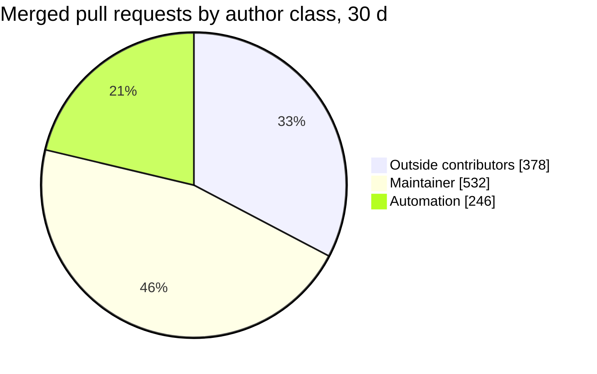

# Project pulse

Median time from pull request opened to merged over the last 30 days: **2.6 h**.

<picture>
  <source media="(prefers-color-scheme: dark)" srcset="https://raw.githubusercontent.com/sipyourdrink-ltd/bernstein/project-pulse/pulse-dark.svg?v=2026-09-07">
  
</picture>

> [!TIP]
> [Issues that are free to pick up](https://github.com/sipyourdrink-ltd/bernstein/issues?q=is%3Aissue+is%3Aopen+label%3Aup-for-grabs+no%3Aassignee): 56 unassigned of 58 labelled up-for-grabs, 34 unassigned good first issues.

## Review and merge

| Metric | Value |
| --- | --- |
| Median PR merge lag (30 d) | 2.6 h |
| Merged within 24 h (30 d) | 90.5% |
| Merged PRs (30 d) | 1156 |
| Median issue open to close (30 d) | 24.2 h |
| Issues closed (30 d) | 687 |

## Who merges what

Counts only, by account class. Outside contributions are everything that is neither the
maintainer account nor an automation account, so the outside number is never flattered.

Distinct outside authors with a merged PR in the last 90 days: **80**.

## Work you can pick up

| Label | Open | Unassigned |
| --- | --- | --- |
| up-for-grabs | 58 | 56 |
| good first issue | 34 | 34 |

## Project state

| Metric | Value |
| --- | --- |
| Commits to main (7 d) | 361 |
| Days since last commit | 0 |
| Adapters in the registry | 54 wired in, 52 selectable |
| Latest release | v3.19.1 (2026-09-03) |
| Translated READMEs | 23 in sync, 0 stale, of 23 |

How this page is made

Generated 2026-09-07 from the public GitHub API and this repository's own tree.
Aggregates only: no individual logins, no per-person ranking, no data that is not already public.
The card, the charts and the weekly history on the `project-pulse` branch are projections of the
same ten fields. Regenerate with `scripts/project_pulse.py`; the field allow-list is documented at
the top of that file and in [docs/project-pulse.md](https://github.com/sipyourdrink-ltd/bernstein/blob/main/docs/project-pulse.md).

