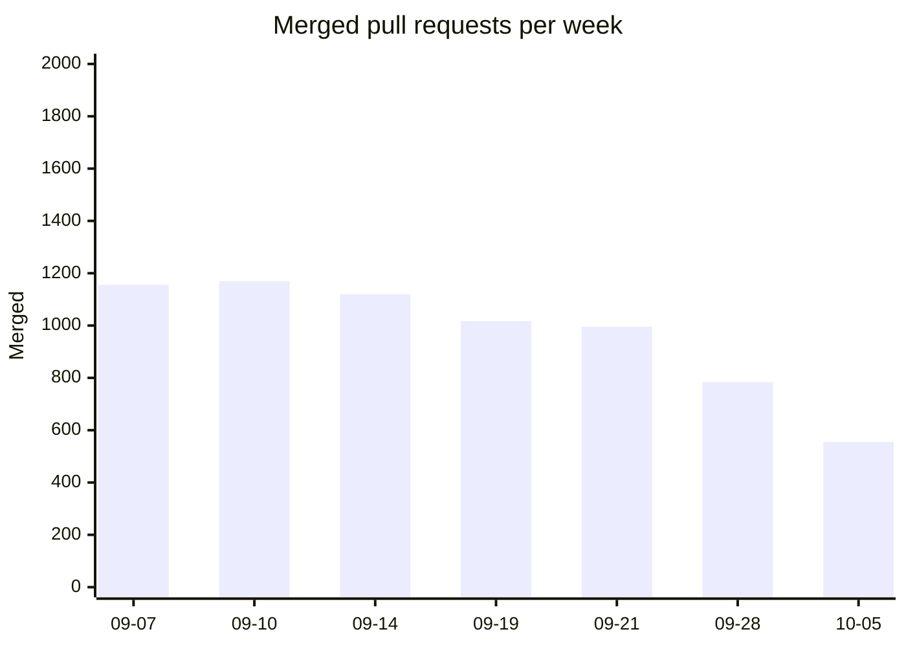
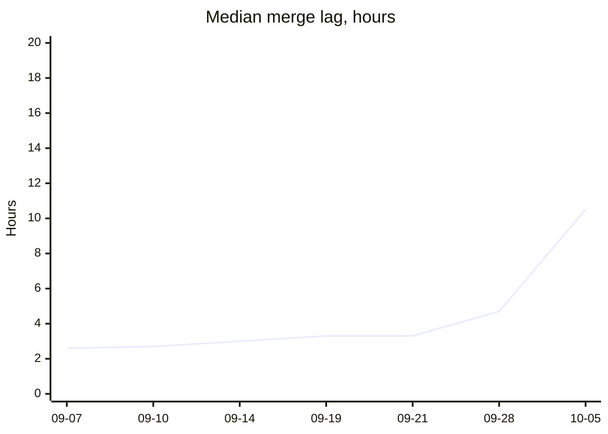
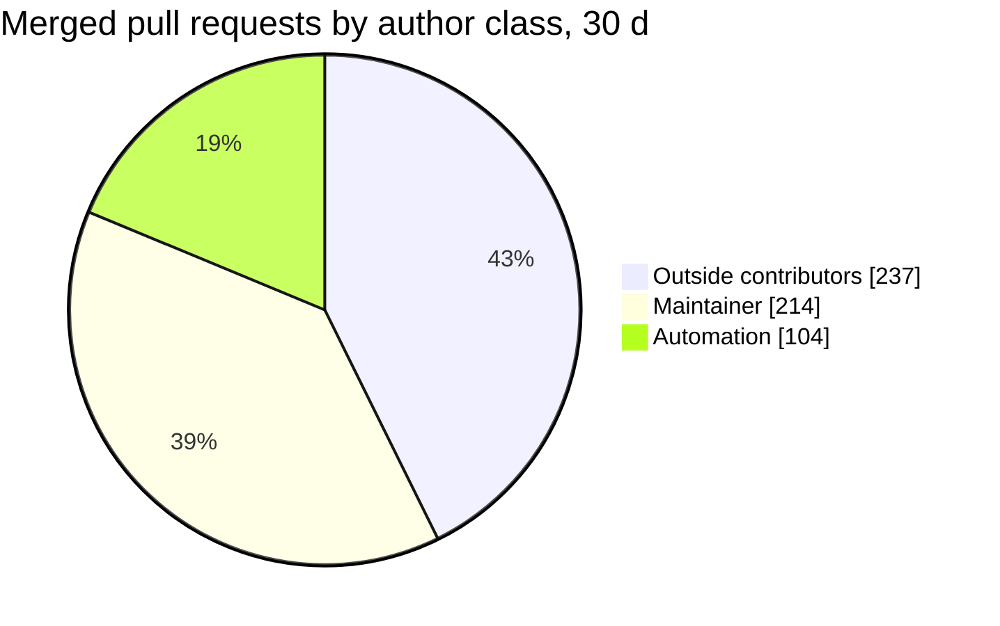

# Project pulse

Median time from pull request opened to merged over the last 30 days: **10.5 h**.

<picture>
  <source media="(prefers-color-scheme: dark)" srcset="https://raw.githubusercontent.com/sipyourdrink-ltd/bernstein/project-pulse/pulse-dark.svg?v=2026-10-05">
  
</picture>

> [!TIP]
> [Issues that are free to pick up](https://github.com/sipyourdrink-ltd/bernstein/issues?q=is%3Aissue+is%3Aopen+label%3Aup-for-grabs+no%3Aassignee): 4 unassigned of 4 labelled up-for-grabs, 4 unassigned good first issues.

## Trend

The last 7 weekly collections. The full series is `history.json` on the
`project-pulse` branch.

```mermaid
xychart-beta
    title "Merged pull requests per week"
    x-axis ["09-07", "09-10", "09-14", "09-19", "09-21", "09-28", "10-05"]
    y-axis "Merged" 0 --> 2000
    bar [1156, 1170, 1120, 1017, 996, 784, 555]
```

```mermaid
xychart-beta
    title "Median merge lag, hours"
    x-axis ["09-07", "09-10", "09-14", "09-19", "09-21", "09-28", "10-05"]
    y-axis "Hours" 0 --> 20
    line [2.6, 2.7, 3.0, 3.3, 3.3, 4.7, 10.5]
```

## Review and merge

| Metric | Value |
| --- | --- |
| Median PR merge lag (30 d) | 10.5 h |
| Merged within 24 h (30 d) | 59.5% |
| Merged PRs (30 d) | 555 |
| Median issue open to close (30 d) | 8.4 d |
| Issues closed (30 d) | 275 |

## Who merges what

Counts only, by account class. Outside contributions are everything that is neither the
maintainer account nor an automation account, so the outside number is never flattered.

```mermaid
pie showData
    title Merged pull requests by author class, 30 d
    "Outside contributors" : 237
    "Maintainer" : 214
    "Automation" : 104
```

Distinct outside authors with a merged PR in the last 90 days: **88**.

## Work you can pick up

| Label | Open | Unassigned |
| --- | --- | --- |
| up-for-grabs | 4 | 4 |
| good first issue | 4 | 4 |

## Project state

| Metric | Value |
| --- | --- |
| Commits to main (7 d) | 147 |
| Days since last commit | 0 |
| Adapters in the registry | 56 wired in, 54 selectable |
| Latest release | v3.21.0 (2026-10-05) |
| Translated READMEs | 23 in sync, 0 stale, of 23 |

How this page is made

Generated 2026-10-05 from the public GitHub API and this repository's own tree.
Aggregates only: no individual logins, no per-person ranking, no data that is not already public.
The card, the charts and the weekly history on the `project-pulse` branch are projections of the
same ten fields. Regenerate with `scripts/project_pulse.py`; the field allow-list is documented at
the top of that file and in [docs/project-pulse.md](https://github.com/sipyourdrink-ltd/bernstein/blob/main/docs/project-pulse.md).

